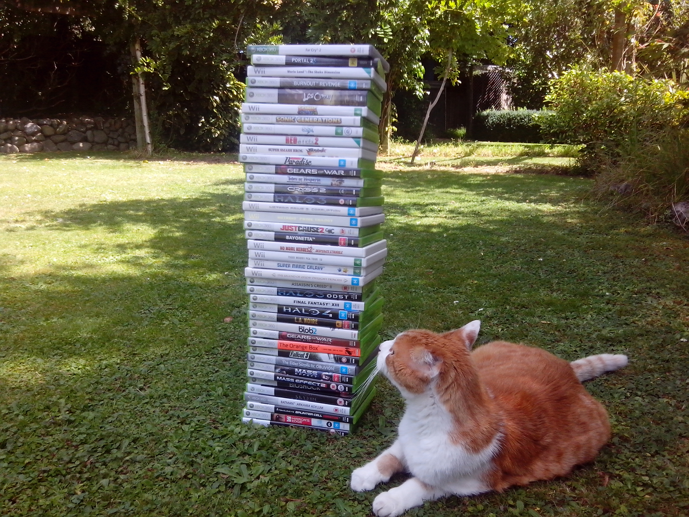

_**Update**: A video portion of this article is now available. I hope this better clarifies the point I'm trying to make. Sorry about the slurring, it's late at night!_

https://youtu.be/6uHF8dFK9s0

There has been a long debate over what constitutes a positive review score for a game here at IGN. With the recent overhaul of the review system, [extensive detail](http://www.ign.com/wikis/ign/Game_Reviews) has been added to how the rubric is used and what defines each score range. But for most people who buy and play games, does the system work in the real world?

<!-- more -->

The first big controversy was back in 2003 when IGN's Admiral [Fran Mirabella](http://people.ign.com/fran-ign) gave the Gamecube's [Mario Kart: Double Dash!! a 7.9](http://www.ign.com/articles/2003/11/11/mario-kart-double-dash-2?page=1) - a score lower than what many fans expectations were prior to launch. Often this debate is reignited every time a highly anticipated game gets a score in this range. More recently, Beard-in-Chief [Casey Lynch](http://people.ign.com/kamicasey) gave [Dead Space 3 a 7.8](http://www.ign.com/articles/2013/02/07/dead-space-3-review), a score sparking much debate that he has gone on to defend in the reviews comment section that has over one thousand posts.

_With so much Great, why settle for Good?_

Over the past three years, IGN has annually awarded an average of 28 Playstation 3 and Xbox 360 games a score greater than 8.0. It might seem abstract to set 8.0 as the mark, but the games above this score represent enough variety to ensure a handful of titles to suit most peoples likes. Some people are fans of franchises or genres, but others (myself included) don't have extensive preferences for playing games. I personally struggle for time to play all the Amazing and Great games that I'm interested in without concerning myself with Good ones. And with most games selling for $60, a new game every two weeks is a bit much for consumers to stomach.

While a review score is never the only thing you should when deciding to buy a game, it is a definite guideline. Scores are used for a reason, IGN displays them using a large, bold font prominently on a review page to draw the readers attention. Even if Colin Moriarty might disagree, they are a consistent way to determine a ranking of what games are worth your time.

It's doubtful that Electronic Arts were popping Champaign corks when Dead Space 3 got a 'Good' score. Every big budget, AAA game strives for excellence and it's no doubt a disappointment when it isn't reflected in a review.

Following the buzz around his Dead Space 3 review, Casey tweeted saying that ['IGN does not have a 3 point review scale of 10, 9, and total shit'](https://twitter.com/lynchtacular/status/298891991327076353). Using the review guide, 7.8 might equate to a 'Good' game, but why settle for that when there is an abundance of titles that are Great, or even better? Even being selective in genre preferences, there is still an ample amount of games coming out. It might not be 'shit', but it still might not be worth your time and money.

_** With so many great games being released, 'Good' just may no longer be Good Enough.**_
