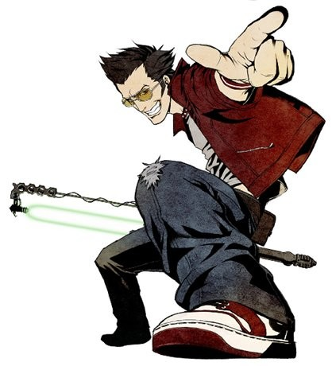
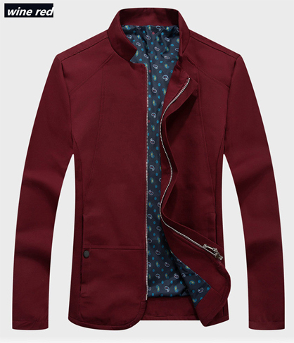

Ugh.

I'm endeavouring to put something here once a week. Be assured that it won't all be sympathy seeking tales from my personal life. Expect games, TV and movie related topics to be featured. The Netflix series [13 Reasons Why](https://www.netflix.com/nz/title/80117470) is incredibly compelling and scarily relatable, I'll discuss that when I've seen it all.

_This guy isn't surviving._

But this past week has been something else, a cascade of failures.

* I got stood up. I think? I'm new to this. Wasn't pleasant.
* I had no work all week. [When you're unemployed there's no vacation.](https://youtube.com/watch?v=WUAcN9UCnbU?t=162)
* I self sabotaged an opportunity to be pals with someone cool and fun. My extreme stubbornness gets the blame for this one.
* I realised how insignificant I am as a person. Most people have this epiphany in their teens.

And that's just the cliff notes. I'm hanging the noose from the rafters now.

But moving on, as the title indicates the point of this post is to talk about something new to me: Style.

In a group or other social scenario I can become renowned for the following things:

* Being very anxious
* Talking a whole lot of crap
* Being very… inexperienced
* Having interests and hobbies others don't share
* Living in a small, backwards town
* Being King of the introverts

While trying to mitigate these attributes is something I'm always trying to do (see last week's entry) I can also take another approach.

A Red Jacket.

In this part of the world no one seems to wear much red, but at the same time a Red Jacket doesn't scream attention grabbing or extreme eccentricity. But it can still be something memorable. After an encounter when a descriptive attribute is needed I can be “the guy in the Red Jacket” rather than “the awkward guy” or “the guy who talked shit”. This won't solve my problems, but right now I'm taking any help that I can get.

I took the time to research what jacket to select. I didn't want some extreme red leather motorcycle piece loaded with 50 zippers, [Travis Touchdown](http://nomoreheroes.wikia.com/wiki/Travis_Touchdown) is the only guy who will ever pull that off.

_Strawberry on the Shortcake. If I could pull that off I would._

I also don't want a casual hooded sweatshirt, I'm not a rat. I browsed my favourite clothing retailer for options and after thousands of choices I went for this.

_Don't mind the lining._

Wine Red! Sounds Italian. It might be a little on the formal side, but better then something overly casual. I don't do casual.

So have I finally gone bonkers? Will this cheap red jacket solve all my social problems? Will the ladies be jumping me on every corner? Place your bets now. Comment below, [buzz me on Twitter](http://twitter.com/aaronights) or email aaronights at gmail.
