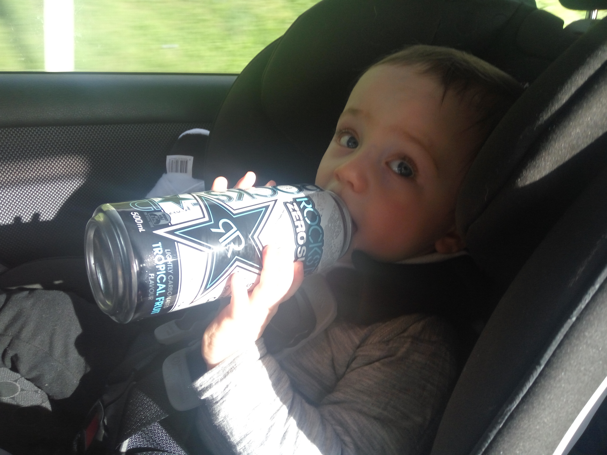

Train? Bus? Nope. In the party wagon with this guy.

_That stuff is good for him, right?_

This week is the week. I can sense it in my feet! The waves are breaking to my right and the mountains are climbing to the left. The sun is slowly starting to set over the ocean. What a beautiful Sunday afternoon to travel. My brother in law is driving though; he wears two tonne shoes made of lead. I guess fuel economy isn't a top priority in this 2003 Toyota.

I have been contemplating what my ideal role would be. I thought keeping my options open would be a smart idea, but perhaps targeting something specific would give me more focus.

Something I think I'd be well suited to would be in house technical support for a small to medium sized business. I like the prospect of integrating into a tight workplace to be the technical support guy, or part of a team, ensuring that all computer systems, terminals and infrastructure are functioning at their best.

I really do want to be part of an organisation. While call centre tech support does have its place and could even be a great role, I would ideally want to have face to face contact with people I deal with on a daily basis. My interpersonal skills are outstanding! I would absolutely strive to be a pleasant and cooperative gear in a well oiled business. I may even bake cookies semi-regularly to ensure the people around me don't get too frustrated when Windows 10 or a Cisco router isn't behaving.

I wish people would get back to me quicker. Busy people have busy lives! But I remember good things come to those that wait.
