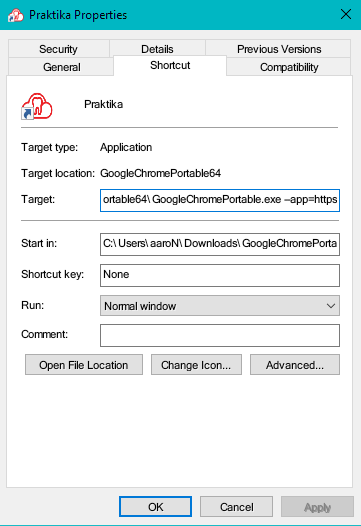
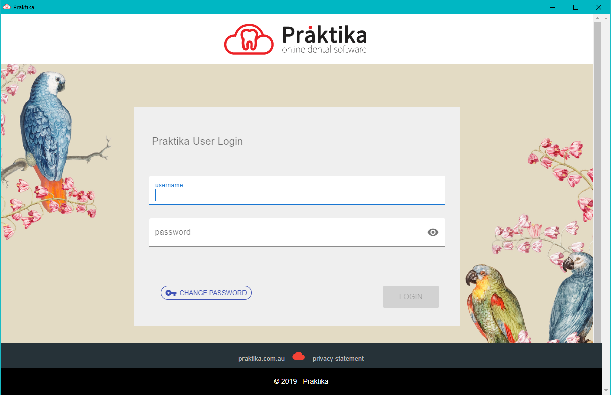

Browser-based apps have progressed a lot since the laggy and unresponsive experience that Google Docs was when it launched over a decade ago. Thanks to the power of HTML5, tasks from office suites to video editing now perform well enough that the browser can be a viable app platform for daily use.

However, having all this functionality tied to a tab in your Chrome or Opera browser can make it somewhat inelegant, especially if you're like me and many tabs open. Additionally, the address and navigation bars  just aren't needed for most web apps, and take up valuable screen space unnecessarily.

Thankfully, there is a feature in Chrome that can allow you to setup a web app to behave more like a traditional Windows program - app mode. This mode takes away the navigation, address and settings controls that most browsers have, and leaves you with a clean, dedicated window for your browser based apps.

Setting up is easy. Make a new shortcut to the Chrome browser, and add in the “--app” modifier along with the address of the web app you want to use.

Changing the shortcut target from:

```
C:\GoogleChromePortable64\GoogleChromePortable.exe
```

To

```
C:\GoogleChromePortable64\GoogleChromePortable.exe --app=https://docs.google.com
```

[](../../assets/images/blog/portableshortcut.png)
_Shortcut menu, accessed by right clicking the shortcut and going into properties._

This trick also works with an offline website - just use the Windows file path of the home page in the Chrome shortcut, rather than a web address.

Running Chrome in app mode also changes the icon that displays in the taskbar. It no longer displays the Chrome compass, but instead uses the favicon.ico of the website. This goes a long way to hiding completely that the program is a browser-based app, making it seem more like a standard Windows program to the user.

If you're using a browser-based web app for anything mission critical or where security is a requirement, you can also have an independent instance of the Chrome browser specifically for running an app. This can be on the same machine as a standard Chrome installation without making any unwanted changes to your installed Chrome browser. To do this, just install **[the PortableApps version of the Chrome browser](https://portableapps.com/apps/internet/google_chrome_portable)** to a local directly on the machine. After it's installed just right click on the Chrome executable, click “Send To”, then click “Desktop (create shortcut)”. Now add the app parameter to your newly created desktop icon. Before doing this, you can run the portable version of Chrome normally and tweak any settings you want the webapp's browser environment to have - ideal if you want to completely lock it down for security, such as never remembering passwords, only accepting specific security certificates, or flushing all saved and cached data when exiting the app.

[](../../assets/images/blog/browser.png)
_A clean experience, you might not know it's a browser based app!_

You can install as many instances of the PortableApps version of Chrome as you need, and perform the same shortcut trick for each one. If you have several browser-based web apps in use, and want them all completely independent from other browsing activities, you can deploy the portable version of Chrome as many times as required.

Using this PortableApps method also allows you to use a different account for each installed copy. This can be very useful: you can have access to both a personal and a business Google Docs suite in two different windows without having to cycle between logins.

There are some other modifiers you can add to the shortcut to further tweak the way the webapp works. Adding --incognito will make the browser run in, as you'd expect, incognito mode. You can also enter chrome://flags into the address bar while the browser is running in normal mode to get access to an extensive range of additional settings.
