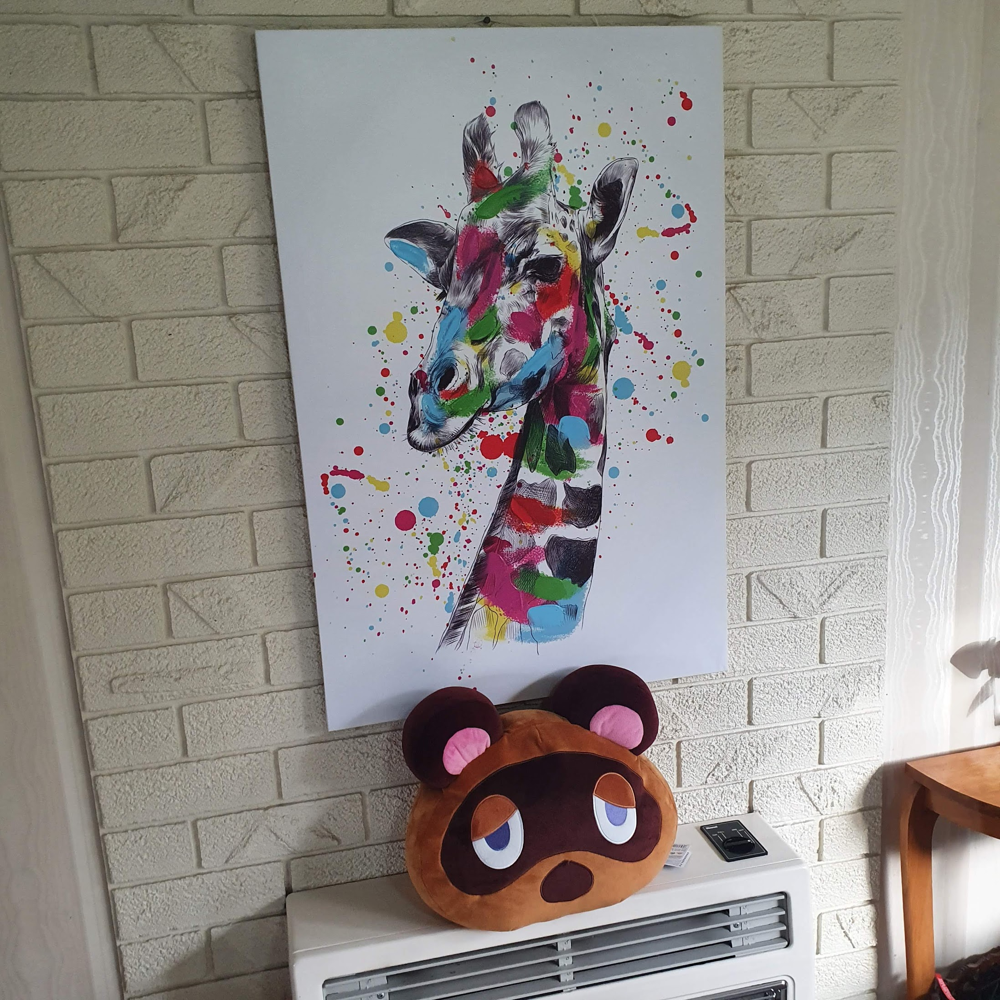
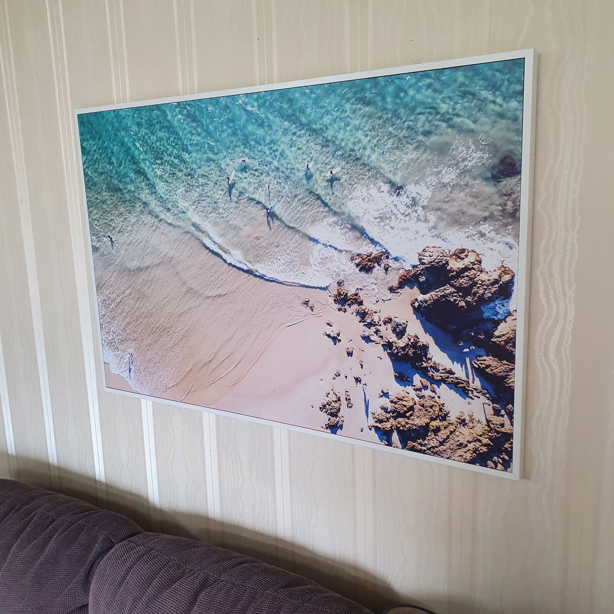
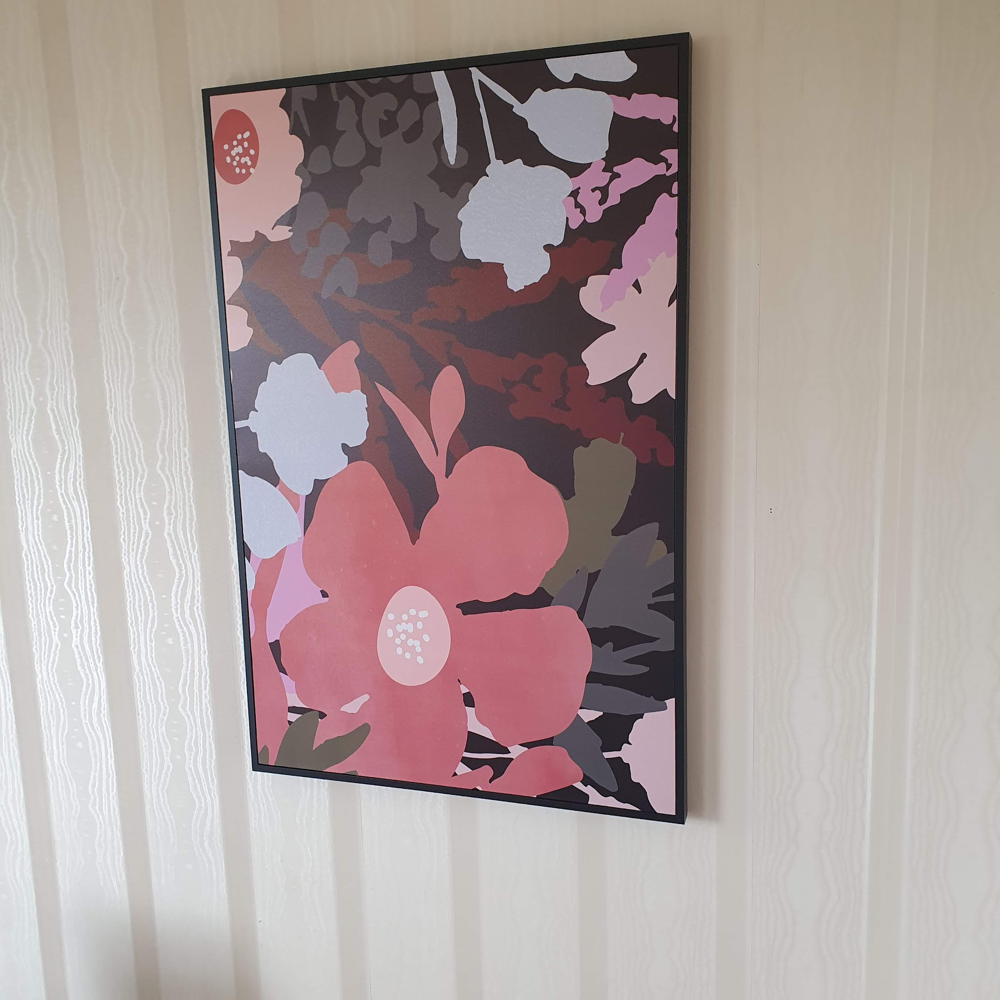
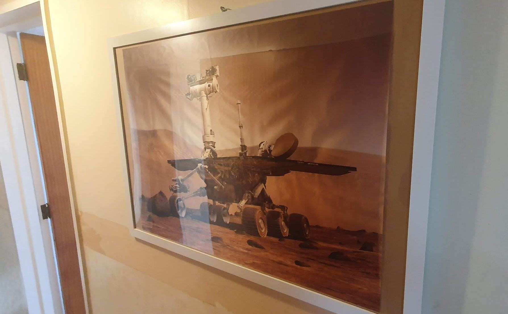
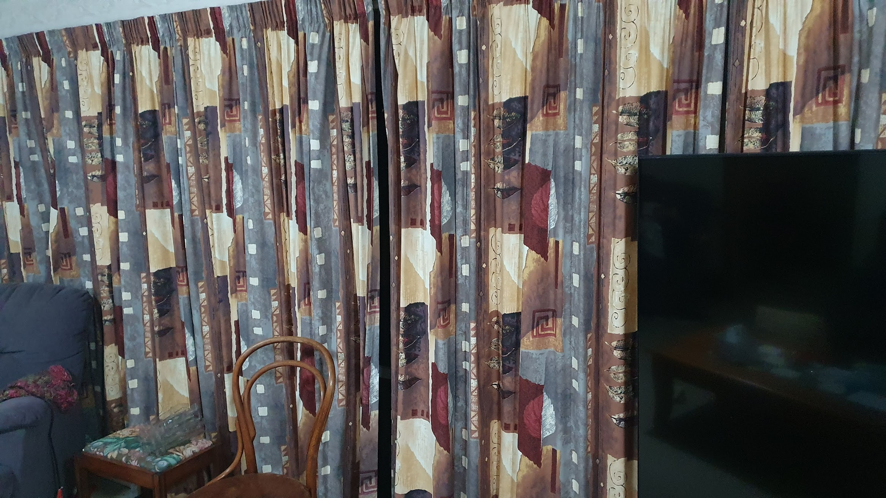

Just a brief update today - talking about style!

I've been arting up my house. I'm really keen to paint and renovate this place extensively, but there just isn't anyone available to do it. I got told I had a one year lead time on getting a new kitchen renovated and installed. I very much want to paint and redecorate my entire house - it's the best investment I can make!

So, while I wait for tradespeople to be available, I'm getting into… art.

_I'm glad I don't have to repay more debt to this guy!_

You've already seen my coloured giraffe, but now Tom Nook sits below him! It's a cool cushion, and as the summer months get here and the old gas heater is never used, he'll be a nice decoration for the unused appliance.

_Surf's up._

The beach! It's a nice canvas print, and adds a bit of spice to the room.

Dark Flowers._

In the dining room I've got a dark floral print. It's flowers without being flowery! I like the tone; it contrasts well with the afternoon sun that shines in.

_Oppotunity._

Finally, it's Opportunity! The Mars Rover is in the hallway. It's a fabric print - I'm not too pleased with how it looks framed, so I'll try to find a better solution sometime.

The next thing I want to do is overhaul all my curtains. Here in the living room they're very… brown. Plastering and painting might be a year away, but I'm sure I can fit new curtains myself!

_Anything would be an improvement over this!_

Any tips? What's the best place to shop for curtains in the area? I want something notable. Striking, even! Much less brown, much more impact.

I sold my old car today. It's good to finally have it gone! It was never getting use now that I have the company car, and it's nice to be able to cancel the insurance. That green machine was the last car my dad bought and even drove, so it's a little bit of personal history that has gone. With work I spent a lot of time in that car, and even had some fun in it. Oh, the fun! But those details aren't things I can share here. Use your imagination.

So, give me your curtain suggestions! All suggestions related to design and colour are appreciated - I have no trust in my own skills in this area. I’ll be having a go at stripping and painting the house, starting with the living room, but if anyone knows someone that can remove and install a kitchen? Send them my way!
