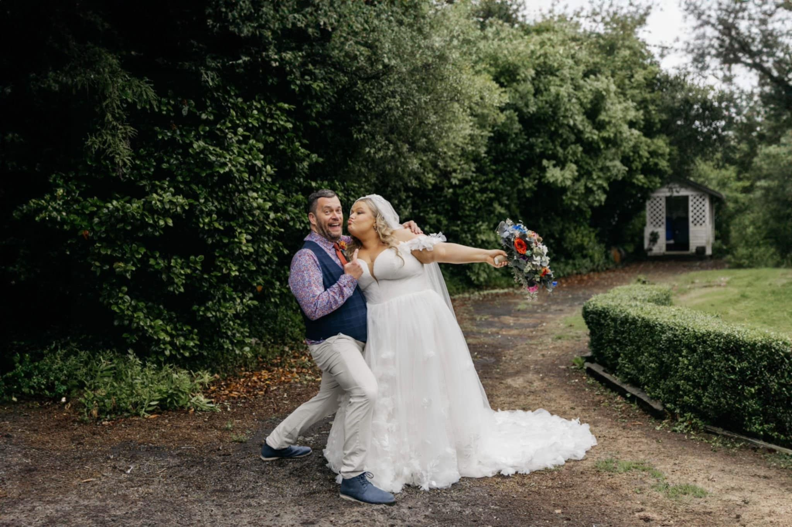
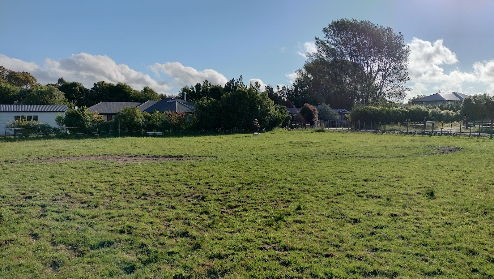
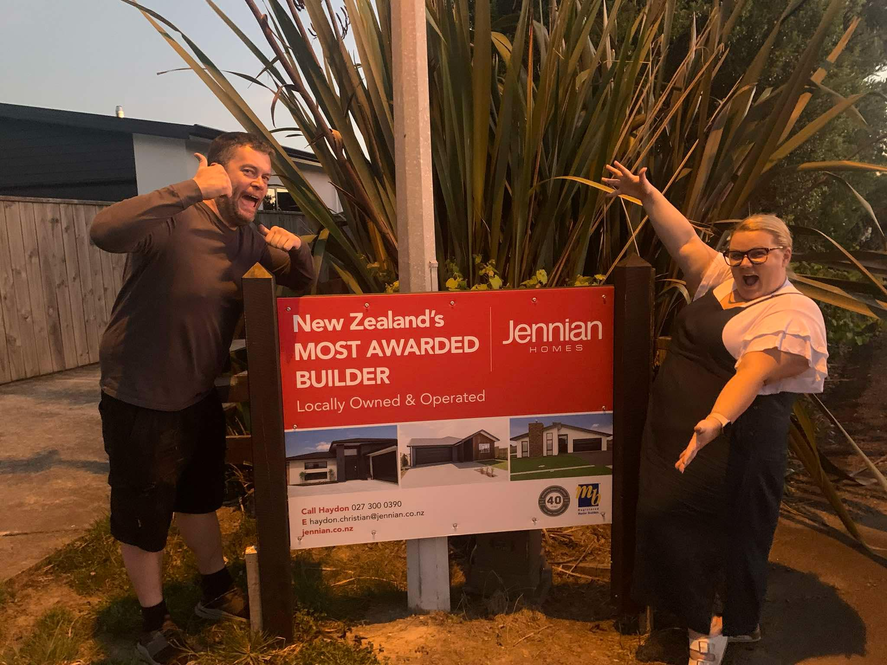
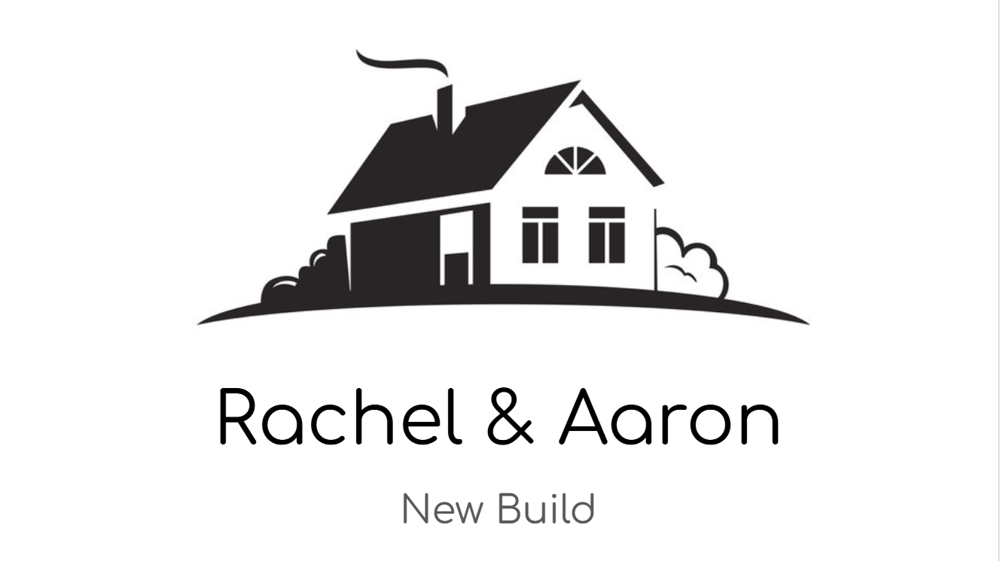
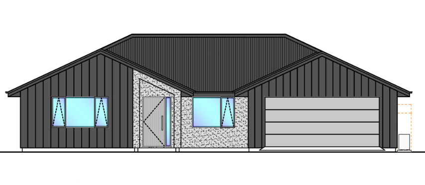
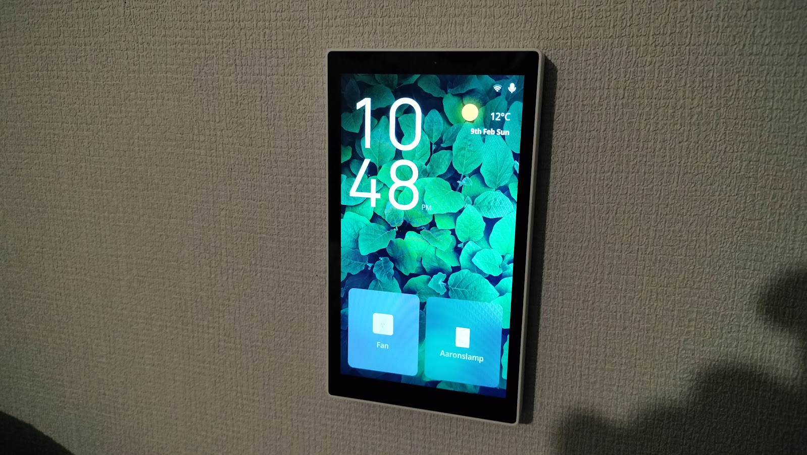

In a life update no one expected, I got married!

But first, I've got to give huge thanks to my best friend and best man Mark. Not only was he the rock of stability on my wedding day, but has also worked his magic to get this site back up in running. It's been migrated from Gridsome to Astro - a platform that's well supported and should keep this place running for many years.

It sure has been a long time since I’ve flexed this writing muscle, but now there is actually a purpose. We got married - the wedding was amazing! But the main topic of discussions here is just as intense:

We are building a house!

Yep, my residence for nearly 20 years in Levin has been sold off, and now we are deep into the build process for our new long term home. It’s a big process, and I’m really eager to document it for posterity.

_This Levin house was home for a very long time._

It's been a long road, and we haven't taken any shortcuts.

Buying rather than building was an option we considered. This whole process started when we went to an open home early last year, just to be curious. It sparked the fire to look into our next steps, but that pathway didn't really lead to anything. Newer homes tended to be nice houses crammed on to a very small section with minimal outdoor space. Older houses always needed some work done to them, and none of them had an ideal layout. Some houses were also just outright terrible.

Ultimately the value wasn't there. Buying a house didn't have close enough to what we wanted, and the price was just too high. We were even open to a bit of a renovation project, for the right property, but we just couldn't find anything in our local area.

All throughout this process, in parallel, we were investigating the build option.

And oh boy, did we investigate! Our process of seeking out a section and a builder was a big job. It'll be the biggest purchase of our lives so it's worth all the effort and, besides, Rachel loves it. She has such a strong passion for the whole process, and did a huge job helping me navigate through everything.

First, the section.

There are many new and growing subdivisions coming on the market around where we live. The council developed a big chunk of land on the outskirts of Palmerston North called Tamakuku Terraces. It's really nice, complete with amazing lakeside views. Unfortunately it shared a common issue with nearly every new subdivision we found: size. Just like when we looked at newer houses, section size has trended smaller in recent years. To stay within something we could remotely afford, we had to push our search outside of Palmy a bit.

Feilding was an option we looked at closely, as the value there was a bit better. There's a whole quadrant of town that seems to be endless fields of new subdivisions. It was looking like our best option, but then a real curveball came along.

Ashhurst! It's a tiny village about 15 minutes out of Palmerston North. It wasn't a new subdivision that caught our attention here, just an empty section in an already established area. Finally, something with the size that we wanted. Plenty of room to dance in, plus the prospect of subdividing down the road. We absolutely pushed our budget for the section out to the maximum the bank would lend us. Through intense back and forth offers, we were able to snatch up a small town plot for a very good deal.

_It's a bit empty - for now!_

Having land is great, but the real games began when we went to find a builder. Just note that the story here isn’t in chronological order - we were seeking out builders and a section simultaneously.

When you actually start making a list, there are a huge number of building companies operating in the Manawatu. We did try to meet with all of them, but with all the effort in the world we still missed a few.

It was a very rocky road, and at times it wasn’t overly fun.

We met with the manager of a local company that ended up being such a low energy, depressing experience. To put it mildly, the meeting lacked enthusiasm. Another consultation we had was very manipulative. The building company had very clear motives to push their own agenda, wanting us to build on land they had for sale, and making all other options appear out of reach.

So what is the most important thing when selecting a builder? He tangata, he tangata, he tangata - it is the people. If you don't vibe and enjoy meeting with the team you build with, the process will be intolerable. I can't emphasise that enough!

After the long process, Rachel and I very proudly chose the fine folk at Jennian Manawatu.

_Our children will be named Jenn and Ian._

We met Jennian head honcho Haydon at their showhome, and I fully expected Rachel to be the one asking the questions. Nope! Turns out I was the excited one, hyped about the electrical, heating and smart technologies in the showhome.

More on that later.

Now we had to decide exactly what we wanted. Rachel loves documentation, but this time it wasn't a spreadsheet or a pdf. She put together a big PowerPoint presentation, full of slides outlining all aspects of what we wanted in a home. She also found a free online CAD program and went to town designing a provisional layout. Her patience was tested with my hesitance and indecisiveness. I'm not great at grasping and evaluating things, like how much I like a house design, from looking at a plan.

_The first of many, many Powerpoint slides._

We went into this with the expectation that we would be modifying an existing stock plan, rather than designing one from scratch. It just seemed to be the way most things are done.

At the first office meeting we had with Haydon, he had fully printed out all of Rachel's extensive documentation work. He was very eager to work with what we had down, and make our wants a reality.

This is where a key factor comes in: Trust.

This isn't trust in the build quality, or that the house will be completed on schedule. Nope, it's much more than that. We had to trust that the Jennian team would call us out if we had terrible ideas. That safety net was extremely important. Here we are, coming into this with all our designs with no experience or any grasp of whether our ideas were remotely good.

Haydon worked with us, taking our plan and modifying it to make it both more cost effective and… for lack of a better word, better. Much better. It was great to go through this process with the confidence of knowing that all the ugly, impractical or overly expensive ideas we had were going to be called out. The customer is not always right! I often have wildly bad ideas, and they need to be called out.

The only big trust issue we had? Trusting that the big candy bowl in the Jennian offices would always be full.

The last step before signing on was to finalise all the design aspects of the house: colours, finish, cladding and all the details. We had a long meeting with our designer and project manager Kylie, who took us through it all. I wanted bold, vibrant colours - a bright yellow house! Thankfully, Rachel and Kylie overruled my bombastic plans.

_The view from the street._

We were upfront with our budget, especially after we’d stretched to our maximum budget on the section. Everyone we worked with on the Jennian team really put the work in to maximise the things we wanted, while saving on stuff that wasn’t as much of a priority.

It was fascinating to discover the costs behind different things. Here are a few highlights:
* We’ve gone for a raised and vaulted ceiling in the main living area, and that was far more cost effective than I would have guessed.
* Opting for a design that reduces the amount of exterior cladding can help save money.
* Certain types of cladding are cheaper than others, but you can use a more premium option as a feature in key areas.
* There’s a huge range of price points in kitchen appliances, and it was useful to figure out what features you’d actually use, rather than spend more on stuff you don’t need.

And that’s where we are today! We’ve signed on the dotted line, and work is scheduled to start next month. We’re both excited, and also very proud of the house design and the land we’ve locked in.

Remember that I said I was excited about all the smart tech when we went to the Jennian showhome? Well, I’ve spent a lot of time doing extensive research, testing and documentation into all the different protocols, technologies and hardware to help me put together the smartest of smart homes around. It’ll be great! A little goal I’ve set is to best the professionals - to design and implement a better smart home than the showhome we first visited, way back when.

_It's a Smart Home Panel._

It’s good to have ambition!

