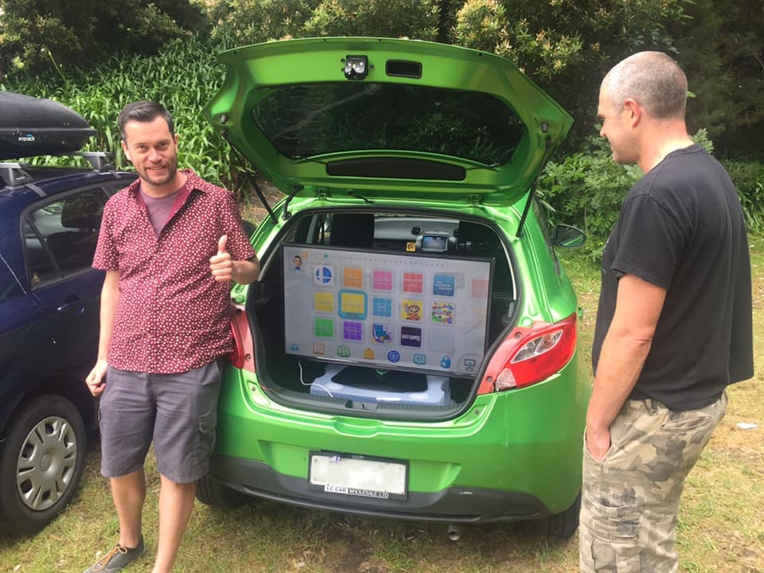
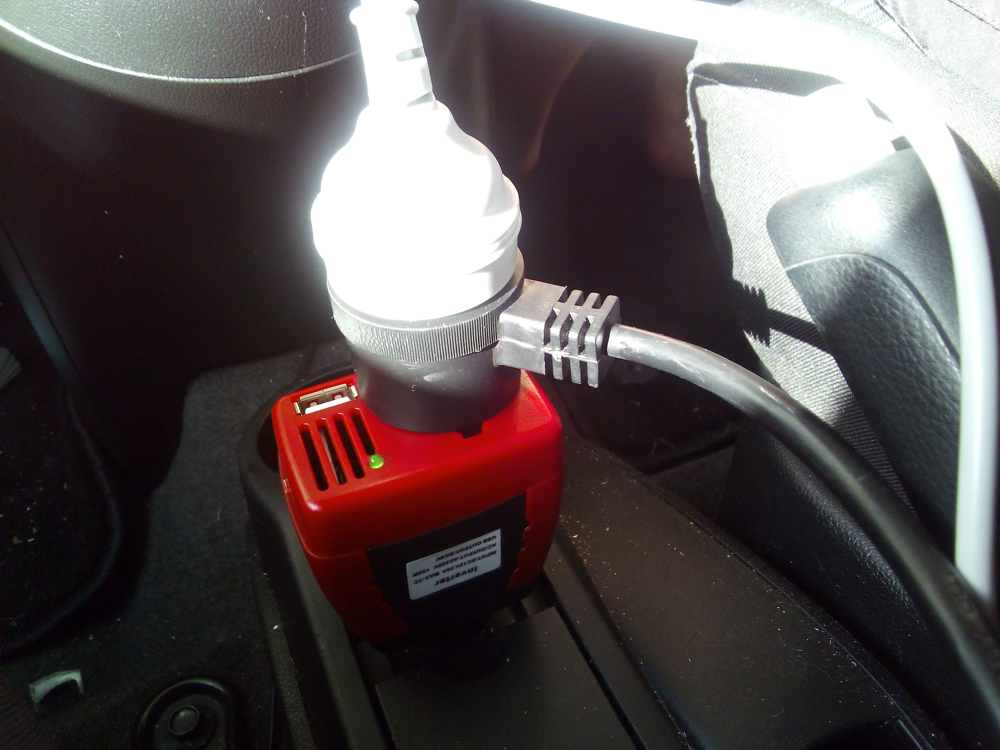
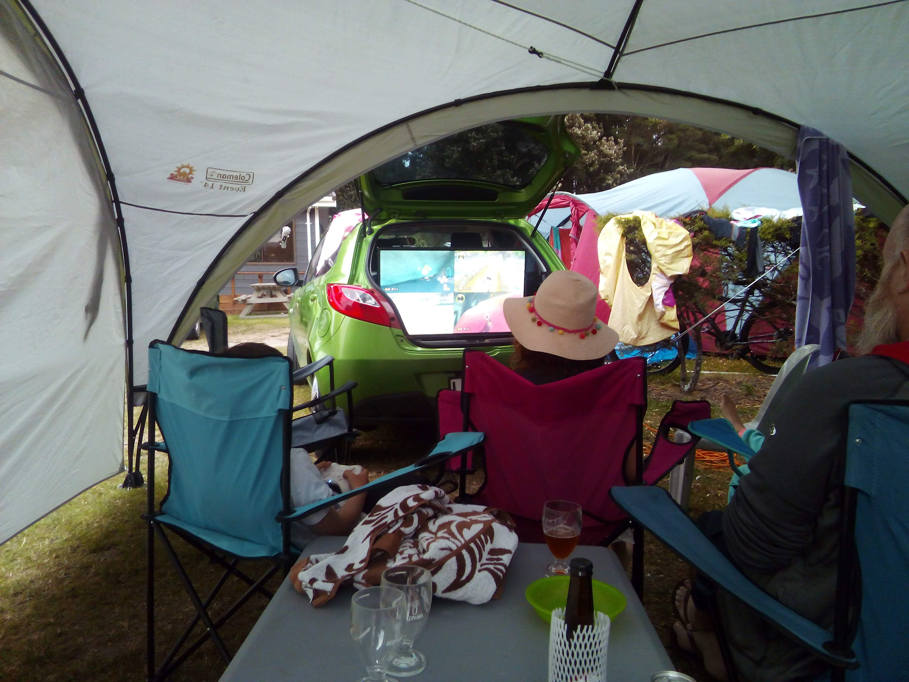
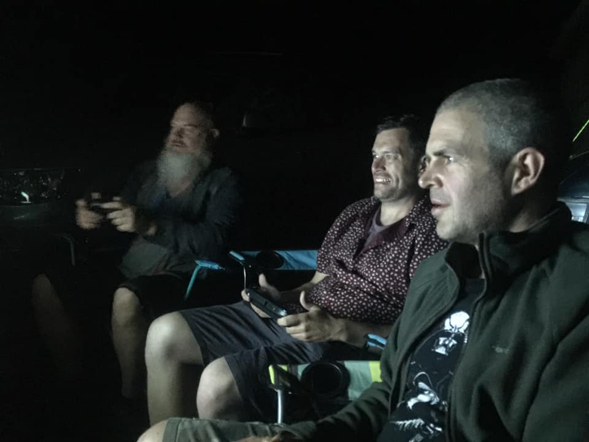

Over the New Year's vacation I got invited by a friend to visit him and his family while they were camping at a nearby site. It was the real deal! Extra large tents, barbeques, mosquitoes - the works. There might have been a plug to charge a phone, but that'd be about it. Hipsters could call it a digital detox. The idea of a whole week without screens, games and lines of code made him shiver.

He's a camper to the core, though. Play Halo or any other shooter and he likes to find a spot with something Sniper-able and camp until dawn.

So how does one cope with such a strong technology withdrawal? You don't!

I got together a plastic box and some bungee cords, and mounted my old 40 inch display and a Wii U in the back of my Mazda 2.

_I'm the goofy thumbs up guy, if you wondered._

I used the Wii U rather than my Xbox One or PC just due to its low power use. Reports claim that a Wii U nominally draws around 34 watts. I could manage that off the car's starting battery for an hour or so, but the 150-plus watts that an alternative system would demand just wouldn't last.

The TV is the LED backlit LCD panel I was using prior to Black Friday. It's unbranded and lacks any extra features - and that's ideal! I'm sure some kind of fancy image processing or smart user interface would just drive up the power draw. Ths sticker on the back says it'll use a maximum of 58 watts - very reasonable considering its size.

Both the Wii U and the display do run off DC. If I wanted extreme efficiency I could have rectified a smooth 15v rail to go directly into the Wii U and build a little power box to provide both the 5 and 12 volt rails the TV uses internally. But I wasn't going to be that pedantic! I purchased a cheap inverter online that connects to a standard car accessory socket. It claimed to be able to provide a constant 150 watt output - impressive considering its only cooling was a tiny fan. No doubt the power coming out of it wasn't very smooth, undoubtedly a crude stepped AC sine wave. I was a little hesitant to plug everything together, mildly concerned about potential damage. Thankfully there were no such issues.

_Now you're playing with Power!_

Everyone loved it! The adults enjoyed playing a few rounds of Mario Kart, and enjoyed it even more when the kids sat still for an hour or two and did the same. A few other hits were 7-player Smash Bros (where no one actually could tell what was going on) and the Artwork mode of Game and Wario.

_This is how it's done, kids!_

I partook of some non-digital activities too. Mountain biking to a little artisan brewery and turning tomato red swimming all afternoon were highlights. Overall it was a fun time! I'm just glad I got to drive home, just up the road, to my nice normal bed every night.

[]
(../../assets/images/blog/InDark.jpg)
_It's not like I was winning or anything._

Not to drag things down, but I did have somewhat of a rough time over the holiday break. Nothing important! It was something of my own making. My head got a bit worked up and let something trivial and unimportant get to me. It's all over now, dead and buried. I just feel bad that I got so down while everyone around me was enjoying their vacation.

In the future? [I ain't gonna let it get to me.](https://www.youtube.com/watch?v=vxL_r-0VC1k)
