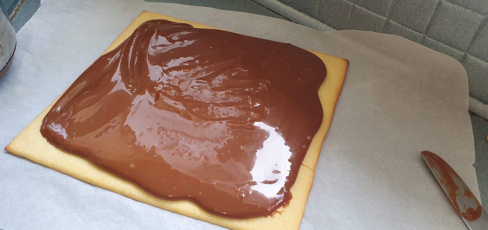
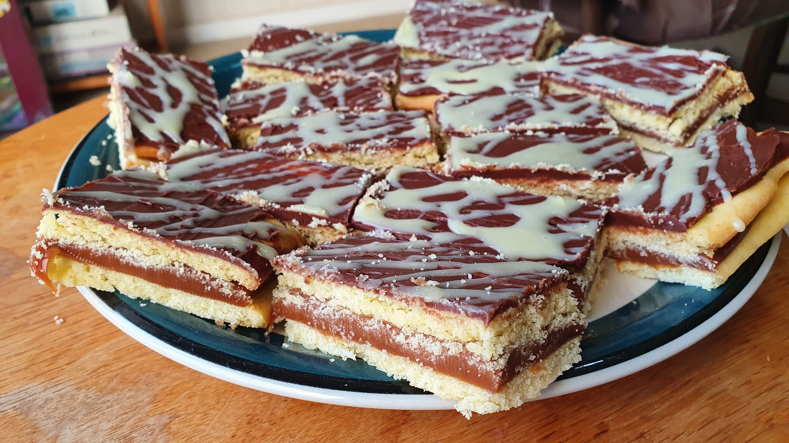

As some of you may already know, I have a vendetta: The quality of caramel slices in this country is appalling.

As a “hobby”, to keep me sane during my long working days (which involve a lot of driving), I've been stopping off at bakeries and cafes around the area and sampling the caramel slice available. I got into caramel slice last year when I curated a range from all over the region to put together gift packages! It was very interesting just to see how diverse the offerings are.

So far, Dannevirke has won. One bakery there had a gooey, oozy caramel in a crunchy and yum slice. But other places? Horrific. Wanganui, Palmerston North, Hunterville, Foxton, Eketahuna - all terrible, and definitely below par. Sometimes it's crumbly and old, and at other times it just… tastes like porridge.

No more! It's very clear that I need to show people how it's done.

<iframe width="560" height="315" src="https://www.youtube.com/watch?v=videoseries?list=PL108VewJBdOA_OfLkchSuUgJumDqZTGPe" title="YouTube video player" frameborder="0" allow="accelerometer; autoplay; clipboard-write; encrypted-media; gyroscope; picture-in-picture" allowfullscreen></iframe>

Oh, I'm not an expert - I just like talking big. I'm going to ride that hype train! I'd rather boost myself up and let you, my readers, be disappointed. I will set your hopes way too high. But maybe, this one time, you should trust me.

First, put caster sugar and water into a giant pot. Yes, that's right: White sugar and water. No butter, no brown sugar. Trust me here.

Let that bubble away on a medium heat for about 10 minutes, stirring all the time. It'll develop a nice dark brown colour. Be careful: The colour will change very quickly! Pay attention, and don't let it get away on you.

Now, pour in some cream. Not too much! Be careful, as the sugar solution will bubble up and put on quite a show. Remember to keep stirring. It'll eventually settle down, and you'll be left with a very concentrated brown caramel solution.

Next, add a can of condensed milk. Turn the heat down to low, and keep stirring. At this point you're reducing the moisture and caramelising the sugars from the condensed milk. Here it's all about the consistency you want - the longer you simmer it for, the thicker and harder the caramel will set. For slices you don't want it to be very runny, but if you were making this as a sauce you'd simmer it for a shorter time.

_Ooooooooh._

And then it's done! Wasn't that easy? It's a gooey caramel, full of flavour. You'll love it, I promise.

With this batch, I put together a caramel slice. I sandwiched a thick layer of caramel between two vanilla cookie sheets, and then covered it with a thin layer of a dark chocolate and butter icing.

_It looks a bit... messy, but this would blow your mind!_

I swear I'm a humble person - sometimes - but this is just an order of magnitude better than most of the caramel based bakery treats I've had over the past year. The flavour is just amazing, and it's got that ultimate smooth, gooey toffee texture. I may be hopeless at so many things, but this time? I've won!
