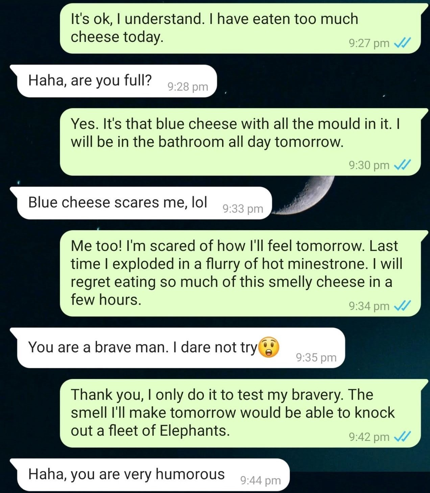
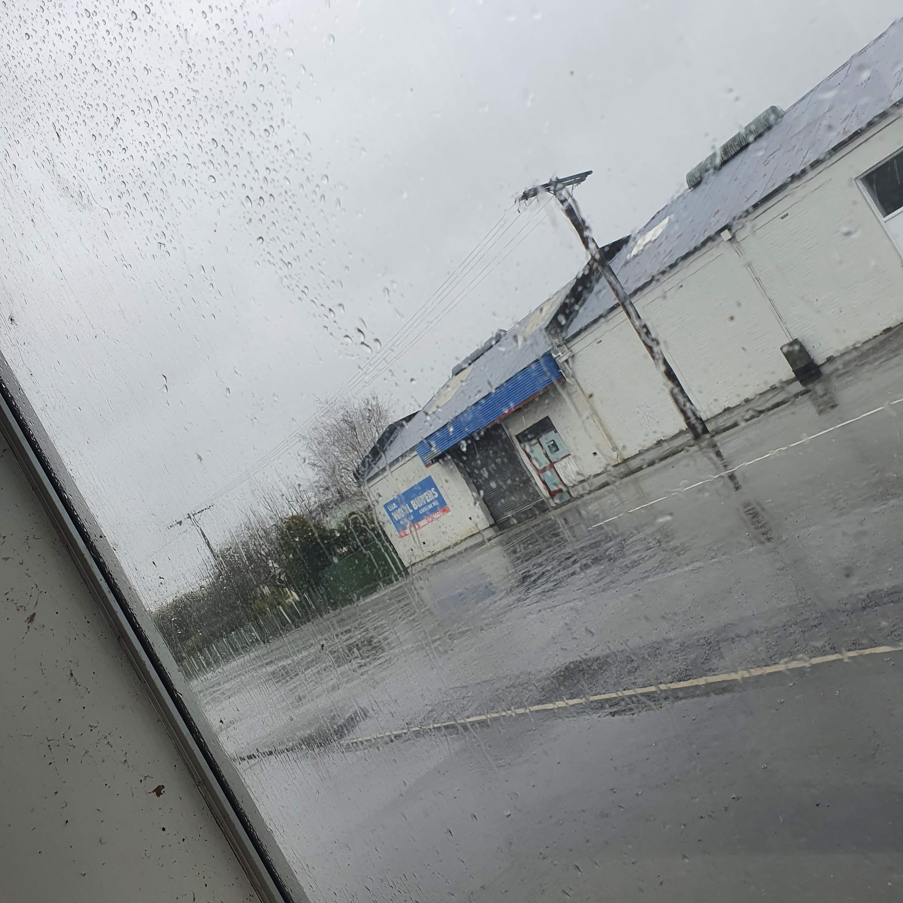

Well, this was interesting.

I was messaged, via my phone number, by someone asking for someone called Frankie. It was a cute girl in the profile image, so my heart raced and I reached the obvious conclusion.

It was a scam.

But I wasn't busy at the time, so I went spelunking down the rabbit hole.

_A flurry of hot minestrone. Frankie has a way with words._

I was Frankie! And I was glad she messaged me. The only issue I had right now was eating too much cheese. You know, that blue cheese artistically crafted to permeate the odour of foam sandals oozing with toe jam, then brewed in a concentrate of vinegar and broccoli?

Because Frankie is such an open and free guy, he didn't hold back from any detail. His fear of spending tomorrow welded to the toilet flushing out dairy and mould was a clear and present danger.

She didn't seem dissuaded by the rancid volcano Frankie had brewing in his blue vein intestines. Eventually the scam came though - click this dodgy link to proceed! Frankie was too overwhelmed from all the cheese to muster the energy to do that, thankfully.

**[Read the entire exchange here.](https://aarond.me../../assets/images/blog/cheese.jpg)**

In other breaking news, I've got my sister and her family living with me for a few weeks. It's… intense. I've gone from one human being, me, living in a house, to three humans, two dogs and a cat. Things are working out though. The biggest issue I'm having is the lack of attention paid to cleaning up the dog poop. I don't want a festering fecal lawn. It's probably a good experience for me to feel like a guest in my own house. It'll teach me a life lesson. Plus it's nice to come home late from work to have the house all lit up and warm.

My nephew will never want to leave, though. He has this insane idea that I'm incredibly awesome and fun! He'll have that illusion broken as he gets older, but I'll keep that fantasy alive as long as I can.

My friend informed me the other day that I'm apparently very good with kids. It's surprising! Maybe it's my wild lack of maturity. I had plans and names for my own kids lined up not that long ago, but… circumstances changed. I'm not entirely against the idea now, but it'd very much depend on the situation. It doesn't just take two to tango - it also can take a village to raise a human being well. Right now I don't have either of those, but who knows what exciting prospects lay ahead.

Kids are easy to get along with, they just require extensive energy. I think my nephew has a small nuclear reactor firing up inside of him, given the amount of energy he always seems to have.

Today is one of those days for me! Like riding an ocean, you get the highs and then the lows. It's at a low right now, but for no obvious reason. Stuff is good. Except for starting work at 6.30 this morning, I shouldn't have a reason to complain!

But here I am.

_In Pahiatua. The weather doesn't help._

I'll be fine, I'm getting better at understanding more about myself, and about the human condition in general. You can survive and prosper by riding the ups and downs like a surfer, rather than stubbornly fighting them. I wish I had reached that epiphany when I was at my all time low earlier this year. It might have helped. When things are bad, it's hard to maintain a perspective on reality that things won't always stay that way - especially when you reach that low after coming off of an...

https://www.youtube.com/watch?v=nn4TA-CBT4Y

All Time High.
