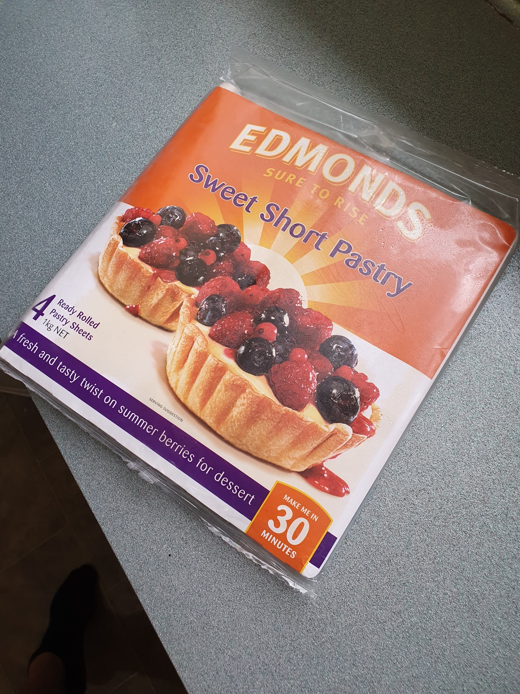

Eat your heart out, Toffee Pops.

As promised, I'm going to start sharing my baking experiences. This sure makes a nice change from emotional heartbreak and despair - I'm branching out!

I'm not sure I'm good enough to have a signature dish, but this would be the closest thing I have. It's my take on Toffee Pops, but turned up to 11.

_In two styles._

You'll need:

* Sweet Short Pastry
* Condensed Milk
* Butter
* Brown Sugar
* Compound chocolate of your choice
* Any toppings for extra flair

First, here is my best cheat ever. Rather than making a biscuit from scratch, I just use a cookie cutter on sheets of frozen sweet short pastry. It doesn't come out anything like what you'd expect pastry to be; it's a crumbly crunchy cookie base.

_This works. Don't question me!_

Take your sheet, cut it into small circles and place it on a lined baking tray. Bake it at 200 degrees celsius for 10 minutes. After 10 minutes they might still look underdone, but this is deceptive! They'll firm up and set while they're cooling. If you bake them for much longer, you'll end up with a horrible burnt taste on them.

_Fully baked, even if they look pale._

Leave these to cool on the baking tray. If you try to move them while they are cooling, they might fall apart.

Now here is the tricky part - making caramel. It's volatile stuff. Up there with enriched uranium and antimatter. Be attentive when doing this or it will burn!

Melt a little bit of butter and twice as much brown sugar in a big pot. Keep it on the heat til the butter and the sugar are all combined and bubbling a little. Now, add a full can of condensed milk and stir. Lower the heat to low, and keep gently stirring for about 15 minutes. It's a long time! If you're tempted to go do something else? Don't. The sugar content in the caramel can burn super fast if you stop stirring. You'll be able to tell when it's done when the caramel is a nice dark colour and it's started to thicken.

https://www.youtube.com/watch?v=YabLEQF73XI

Leave it to cool a little bit, but not all the way to room temperature. You need it to still be a little bit runny for the next step.

Get a mug of hot water and dip a spoon in it. One cookie at a time, spoon a heap of caramel on top. It's sticky, messy stuff! Between each cookie, dip the spoon back into the hot water to help the caramel slide off easier. You can use a butter knife to smooth out the caramel if you want, but it's also nice to have that uneven homemade aesthetic.
Leave these to cool, and the caramel should become hard but still gooey.

_All Caramel but still topless._

Now for the chocolate topping. Don't buy a block of standard chocolate from the confectionary aisle. You need to get compound chocolate, also called cooking chocolate. Normal chocolate has a tendency to split when heated, meaning the fats start to separate out. It's super tricky to deal with and get a nice response. Compound chocolate has been emulsified with vegetable fats, and this makes it so much more resilient to being melted.

Melt your cooking chocolate over a very low heat in a pot. When it's turned to liquid I use a teaspoon to drizzle it over each cookie. A long time ago I tried dipping each cookie into the chocolate, but things just fell apart and made a big mess.

_The right cooking chocolate doesn't split!_

Leave it to set and you're good to go. I'd recommend not putting them in the fridge, or you can end up with cookies that taste like fridge.

You can do neat things too! With the batch I made today I did two varieties: standard Milk Chocolate topped, and my signature Cookies and Cream. For those I crushed up Oreos and sprinkled it over some white chocolate topped cookies while the chocolate was still semi melted.

And there we go! It's super easy, even if it does get a bit messy.

_Too many._

I made way too many of these on a Sunday afternoon, and have no one to share them with. I doubt these will survive in my carry-on luggage up to Auckland. Anyone want some cookies?
