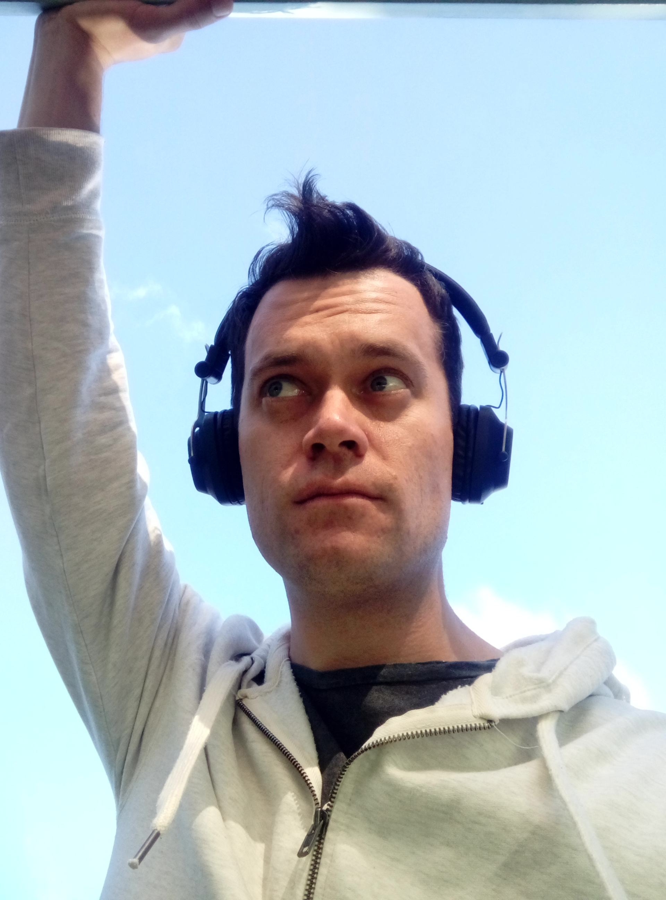

I am a very strange and dorky person.

The biggest strength I take from this is my awareness of just how strange and dorky I am. I feel violently lacking around strangers in the street. Now the best thing to counter and take strength from this kind of weakness is to be open and turn it into a self instigated joke. But I have bad comedic timing.

I'm also awful at reading people. In conversation I find myself staring right into at faces just to be able to gauge their reactions, often making people very uncomfortable. I'd be the worst phone psychologist.

_Sharing goofy photos of myself is meant to boost confidence._

How do people meet, how does this modern social game work? Around 100 years ago people had status and classes to dictate how people interacted, at least in the western world. Now people seem to engage in a conversational volley, talking back and fourth even in large groups. The media portrays it as simple and effortless, a skill inherent to being human. There is no negotiation done beforehand, no leader or moderator to ensure the talk flows and stays fluid. I'm not good at it; it always comes out as awkward and uncomfortable. I've never done a survey, but get the impression that others find me frustrating in this environment. What are the queues that people follow in social situations, do they consciously pay attention? Or does the nuance and subtlety come naturally, without the need for effort?

But power, confidence and knowledge comes with experience. Over the past six months I've been ramping up my secular social life. [As my previous blog entry shows](../../assets/images/blog/01/coming-out-as-an-atheist.html), I don't have experience in this area. So, I try and get some:

* To start, I regularly attend [a local meetup group](https://www.meetup.com/Palmerston-North-SitP/). It's nothing exciting, just a handful of fellow skeptic dudes meeting in a café. It's fun, very casual. I'd like it if it didn't always resort to a debate, but I guess that is what skeptical thinkers like to do.
* I am part of a weekly pub quiz team. In terms of peer socialisation, it's a bit awkward. My team is made up primarily of retired, 60+ people. I joined to meet people, but during the event it's impossible to chat with anyone on other teams. The annoying thing is my team is really good. Old people know heaps, and I fill in the gaps for anything since 1999.
* I have also hosted a few completely unrelated pub quiz events. They're not very serious, more of a comical type of event. Think [Taskmaster](https://en.wikipedia.org/wiki/Taskmaster_(TV_series)) on no budget. It's hilarious when someone guesses what's in ‘A Manly Man's Pie', takes the dare and ends up biting into a Urinal Cake Pie. I get a kick out of public speaking and being the master of ceremonies for events. It's like a social event that I command, a rush of power! I'd love to do it more, but I don't really know how to get such opportunities.
* I have pushed myself to attend events. I went to [Cosmic Shambles Live](http://cosmicshambles.com/live/cosmicshambleslivetour) when it came to the big city. It was great! Matt Parker doesn't look as bald in person. Social interaction wasn't great though, would love to attend these kinds of events more with actual friends rather than on my own. I felt like a doofus being alone.
* I attended a rather rowdy event when the renowned Professor Jerry Coyne visited my country. It was at a bar, about 25 people attended. And it was incredibly loud and rowdy! I was the only one who showed up with books for Professor Coyne to sign, but everyone seemed to think that was neat rather than dorky. I got into casual conversation with a dozen people, and they seemed to enjoy it. I actually don't think I was the most awkward person at the table, and that is quite an achievement. I'm horrible at remembering names and faces, so it'll probably be like starting from scratch next time.

But finally, I unlocked and achievement most people get when they're 14.

**I had a date. With a woman!**

She was great, if a bit subtle. We met over _that_ popular dating app; I somehow managed to charm my way into a meetup. I've been using the app for a few months, but didn't really hit it off with anyone prior. The ‘date' was just a casual stroll on a dark but warm autumn beach. As you'd predict, I was captain butterfingers - bouncing through conversation like a rag doll down a steep hill. She had freaking nerves of steel; I said such incredibly stupid shit over and over again without ever fazing her. I did make her chuckle once or twice. She wasn't a plank of wood exactly, just not enthusiastic or dynamic. I complimented the way she looks, acts and the colour of her hair. Five stars, why not? I was eager; I could objectively list several dozen flaws but [this bit of Shakespeare sums up how my mind was ticking at the time.](https://www.poetryfoundation.org/poems-and-poets/poems/detail/50276) It went on for two hours, I had fun. I think she did too, but a message in the morning told that she wasn't interested in a relationship.

A few weeks later she did agree to another meetup, just under the knowledge that it'd be platonic. She came around, I made greasy pancakes. I was probably more nervous this time just because I didn't know what to expect. I got a hug and we chatted about, among other things, sex. Yep, didn't expect that. Not so much the mechanics of it, but just the elements surrounding it. It included things like number of sexual partners, contraception, the hardship of screwing a guy with a micro penis all the way to how she felt great from getting laid the night before. It was also comforting to know she had a somewhat similar prude religious upbringing, but tossed it aside as a teenager rather than nearly at 30. I actually felt like a student in a class with a hippie teacher who likes to over share his personal life, just ramped up to 11. Is this the kind of stuff my generation chats about these days? [Stranger than Moon Pie, what a time to be alive.](https://www.youtube.com/watch?v=qu32fBkiHFE) She and I are the same! But only in the way that we have our own styles that we won't change. I don't think she even liked [Breakfast at Tiffany's](https://www.youtube.com/watch?v=1ClCpfeIELw). I know she did this second meetup out of sympathy, but compassion stagnates fast.

She said it'd be OK to be friends but, while I would be all for that, I doubt it'll happen. I'm very aware how frustrating I am to socialise with. The annoying thing is, despite how taxing I find it, I'm far more tolerable in group social scenarios over one on one. Around many people I tend to just shut up and only interject when I have something of note to say. But one on one? I rave on, spouting out copious amounts of garbage in an attempt to keep things ticking along.

I walked away from that feeling very inadequate, but surprisingly buzzed. I bet this is how Columbus felt when he first arrived at [The New World](https://www.youtube.com/watch?v=-kl4hJ4j48s). I should try karaoke.

So, where do I go from here? I don't know. I hate dating apps, they scream fake. It's like a synthetically extruded protein paste compared to fruit and vegetables grown in the ground over weeks and months, doubt I'll use it again. My social horizons need to expand first. I'm also surprisingly lazy when it comes to these things. The effort required to get something started seems immense, it can be like climbing a mountain when in all probability it just has a heap of manure at the top. And the rest of my personal and professional life drains me dry of all excitement. I'll work on it though, come what may.

But before I turn 30 would be nice. Three months to go!

Help, assistance, advice, questions and any kind of feedback is welcome. Comment below or buzz me on Twitter - [@aaronights](http://twitter.com/aaronights).
