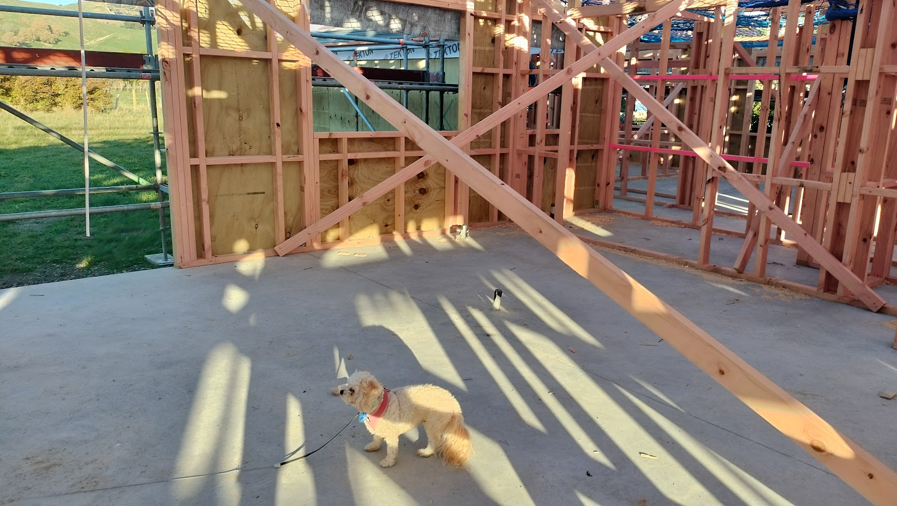
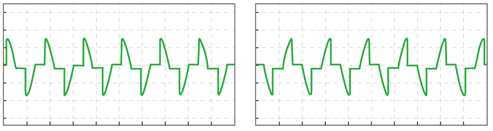
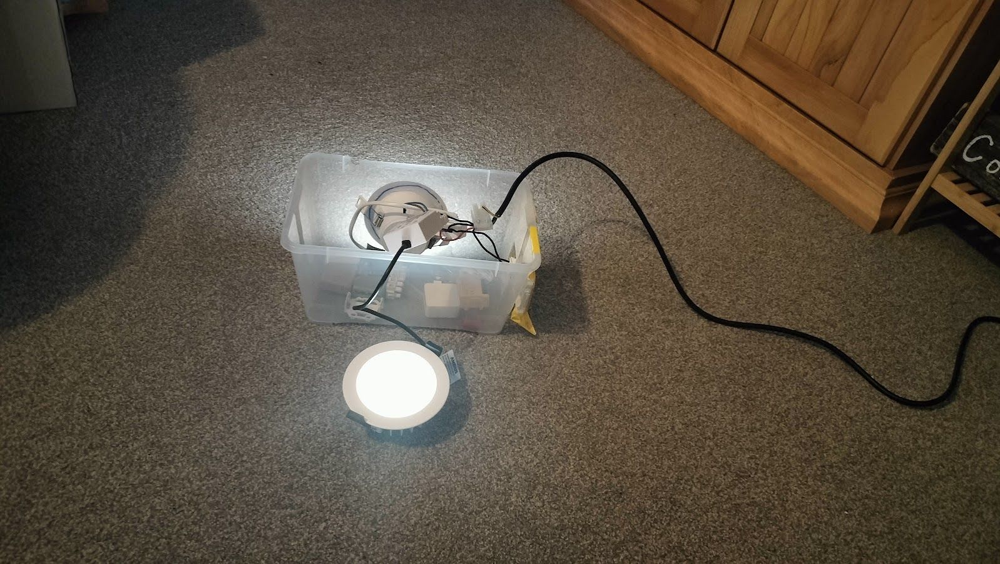
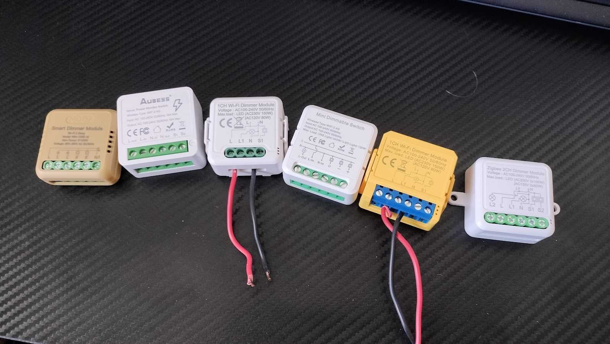
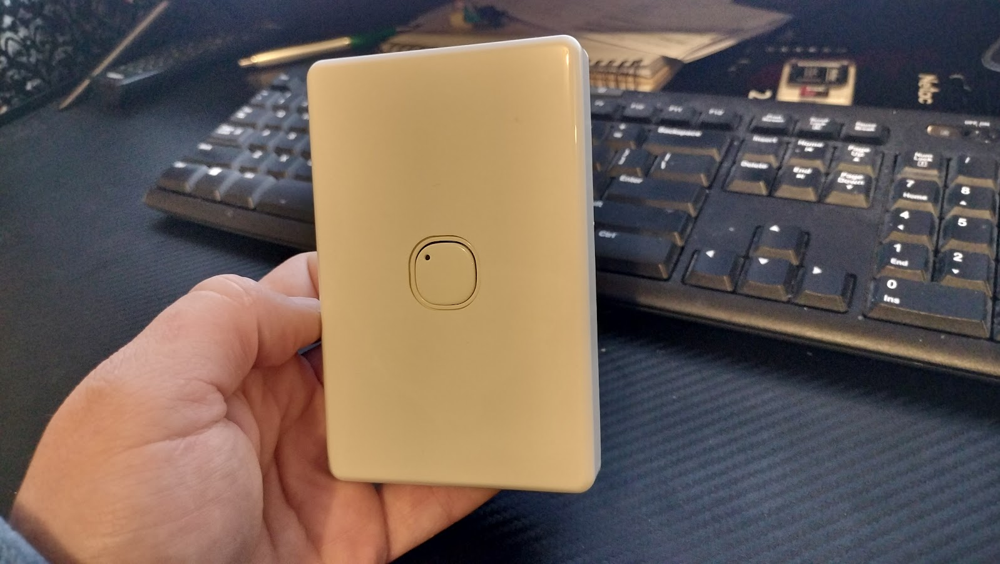

The house is coming along at warp speed…

_Frankie doing her inspection._

We've got all the framing up, and it's very much looking like a house now. Everyone, including myself, is amazed at how fast the build is progressing. There have been no issues so far, except that the grounds are looking a bit boggy. Not to worry though - the five star team at [Jennian Manawatu](https://jennian.co.nz/franchises/jennian-homes-manawatu) are on top of it with drainage runs looking to be installed soon.

But now for the main topic for today: the next update on the masterful smart home system! With the platforms and protocols in place, it's time to delve into the topic you’ve all been waiting for:

Lights! Dimmers! Action?

Anyone that knows me knows that I love dimmers. Don’t ask why, it’s just… my thing. When it came to building a smart house, I didn’t just want to be able to turn the lights on and off - that’s not cool enough! Dimmers can be key to transforming a dull and plodding smart home into something magical, something exciting! And I’ve got an ambitious goal that I haven’t seen in any other house:

Every light in the house will be dimmable.

##### How Dimmers Work

Historically, dimming lights was fairly straightforward with incandescent bulbs. Just get any dimmer installed off the shelf, and it’d work as expected. Now there is a massive diversity of lighting technologies, and even two different lights using the same underlying technology can behave very differently with dimmers.

Standard dimmers use either a TRIAC or a MOSFET electrical component control the flow of power going to a light fitting. It works by chopping up the power going to the light very quickly to reduce the overall amount of current going to the light. In simple terms, it turns the light on and off rapidly, hundreds of times a second. Other types of dimmers are available, but are much less common.

Now I’ll get technical.

Alternating Current, also known as AC, is the way electricity is distributed and used worldwide. As the name implies, it alternates the direction of power flow several times a second. The power you are using in your home has a voltage that goes from zero to 325 volts, back down through zero to negative 325 volts, then back up to start all over again at zero - and this changing voltage averages out as 230 volts. Here in New Zealand that alternating happens 50 times a second, meaning our AC power is 50Hz.

There are two main types of AC dimmers. A leading edge dimmer does this chopping up on the leading edge of the alternating current frequency - where it goes from zero and rises to 325 volts. A trailing edge dimmer does this on the trailing edge, as the voltage is going down from 325 volts back to zero. The resulting light from these two types are not the same.

_The Leading Edge and Trailing Edge AC waveforms._

Leading Edge Dimmers are generally cheaper to make and were traditionally used with incandescent and halogen bulbs. However, they are not always compatible with modern LED lights.

Trailing Edge Dimmers work better with contemporary LED lights, providing smoother and more reliable dimming. Using a leading edge dimmer on a light that requires a trailing edge dimmer can result in poor dimming performance - the light will barely get any dimmer, even at the minimum brightness level.

A key requirement I have is to be able to dim the lights so they’re just barely on. I want that ultimate mood lighting that can simulate the same level of brightness as a thin crescent moon on an overcast evening. Most leading edge dimmers just won’t be able to do this with any kind of modern light, and some trailing edge dimmers do not achieve this, primarily because early LED bulbs could burn out and fail if dimmed too low. Fortunately, a lot of modern light fittings are designed to handle this without issues. To ensure compatibility, I consulted with the team at Jennian to confirm the specific make and model of downlight we were using, and sourced one from their electrical wholesaler - good old [J.A. Russell](https://www.jarussell.co.nz/). I purchased one of the Tuya dimming modules that I’ll use in the house, and went about trying it with the exact same model of downlights we will have in our ceilings.

_Highly professional test box._

##### The Hardware

Just because we’ve got all lights being dimmable, it doesn’t mean we’ve got old fashioned rotary knobs all over the place. Most common around the house will be standard light switches. The electrical range that Jennian uses is Legrand Excel Life fittings, and that’s what most of the light switches will be. They will work the same as every other light switch you’ve used - flick the switch and it’ll turn on. The dimmability is achieved by fitting smart modules in the wall box behind the light switch.

_A variety of dimmer modules I tested out._

So, if you don’t dim the lights using a dimmer knob, how do you do it? Using smarts! And here are the options:
* Voice commands. There will be Alexa enabled devices wall-mounted throughout the house. You’ll just have to say “Alexa, dim the lights to 20%”.
* Smart panels. Around the house will be some very nice touch-screen control panels. Like an iPad, but better. These all have nice slide controls to dim any light you desire.
* Sensors. We will be able to trigger dimming in a heap of different ways using scenes. For example, a motion sensor can be used. If you enter the bathroom at night the lights will automatically come on, but nice and dim - just enough so you can see, but not enough to blind you after stepping out of the darkness.
* Timing. This is a really cool trick the lights will have: setting different levels of brightness depending on the time of day. After sunset, certain lights can be set to dim slightly. You could also make the bedroom lights get gradually dimmer as it gets closer to bed time. 
* Set and Forget. Not all dimming needs to be adjusted. In some house builds you end up putting less powerful light fittings in rooms or areas where you want less luminosity. Not here! We are going with 900 lumen lighting in all areas. If it’s too bright, we can set it to be lower. We can configure the smart system and set the lights to a certain dimmed level, and it’ll be at that level when the switch is used.

In certain areas we will have manually dimmable lights. This will be in places where we will want to adjust the brightness more frequently, like in the lounge when you may want low lighting to watch a movie, or the main bathroom when you want that mood lighting for a relaxing hot bath. Rather than a knob, these are push button dimmers. A quick tap turns them on or off, but holding the button down changes the brightness level. They’re still fully integrated into the smart home, but just have the additional option of manual control.

_The button style manual dimmer._

In semi-related news, a little while ago my wife and I went to visit my aunty Colleen down in Kapiti. It was really nice seeing her again and talking about my Dad. She reminded me of something about my Dad - before he was married, he went traveling. He went around the world twice, all with his good friend John Couchman. I remember all the stories Dad told me about this. How they slept in a car in Germany, and woke up being surrounded by police. He’d tell me how John would go into an interesting looking business or building very confidently, saying they were there for some professional reason. In reality, he just was being nosey and wanted a free guided tour.

[Couchmans Electrical](https://couchmans.co.nz/) is the company that will be doing all the wiring for our house - the company founded by John Couchman back in 1953. It doesn’t mean anything materially, but it is a bit special for this house build to have that connection back to my Dad.
