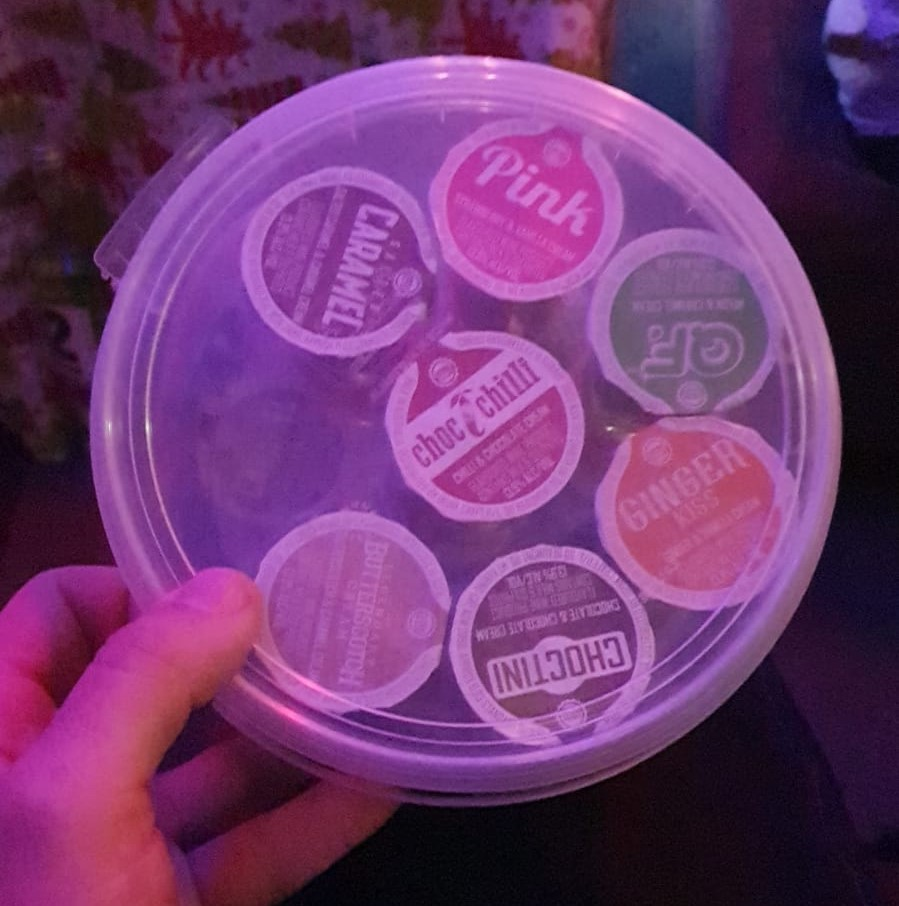
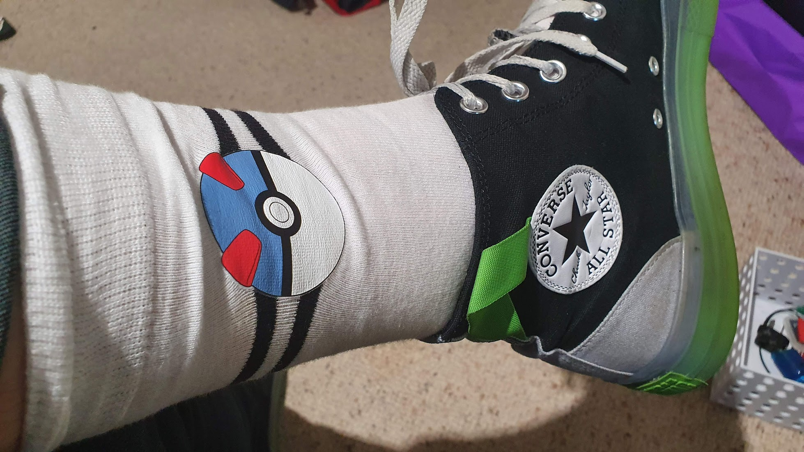

What a fun time! Regular viewers will know that I had a mid-winter Christmas at my good friend Mark's place last weekend. It was so fun! I opted to do something very unusual for me and partake of the alcoholic beverages. I stopped off at the booze shop on my way over, and ended up getting this.

_A bucket of shots._

As you already know, the most high class and professional drinks all come in buckets. Turns out they weren't horribly offensive, and they all went! I had… some.

And it actually went down okay! Being a little bit tipsy is better when you're not feeling down and mopey. I did frustrate everyone around me by always redirecting conversation to two topics: my personal life, and how big the present I bought for the dice roll gift-giving game is.

Sorry to everyone that put up with that! I'll leave that rambling here, where reading is optional. In social situations I need to shut up more.

And now the big exciting reveal of what the giant present was.

https://www.youtube.com/watch?v=W13T6MjhXo8

A Bear in a Chair! I haggled the chair on Facebook marketplace from $25 to $10, and got the giant teddy bear for $4 at a local op shop. I'm sure the handsome man that ended up with this awesome gift is currently enjoying it. As for me? I got the most awesome thing I could imagine.

_Pokemon socks! Not pictured: Batman socks._

Even if I did rave on, the beautiful people around me were very kind and generous with listening. A few takeaways:

* I should shut up and move on.
* Most people have gone through what I'm going through, this isn't special.
* Get out there and meet people.

Whomever is… lucky enough to be in a relationship, or even just be friends, with me in the future? I don't want to frustrate them with how incredibly dense and stupid I am. I'll beg them to yell at me and hammer how they're feeling into my stupid wee head.

(Metaphorically. I actually have a big head.)

And I'll listen! I will shut up and listen, and also not bounce between extremes. Everyone gets pissed off with me, difficult times will come! But I need to have the… mental discipline to not start feeling hated because a partner or even a friend expresses how upset they are. I won't jump to the conclusion that they hate me - it'll be a grey area, not hot or cold! Tepid, lukewarm. In other words, nice! And also sustainable.

I really like doing things for people.

I help and do everything I can to make people happy and, as you'd imagine, that is amplified a hundred times over when I have a committed partner. And now I know that, even with all the affection, flowers and effort I put in, I just missed the obvious stuff I should be doing as a partner. The “are you happy?” and “what can I do to support you?” stuff.

With everything going on, I lost track of how the other half was coping with stress and life.

With hindsight? It didn't even cross my mind as something I should be aware of. Despite the effort and time I was putting into the relationship, my constant worrying and my behaviour made the stresses worse. I was extremely selfish and now I'm embarrassed about how bad of a boyfriend I was, even though I would have done anything to make her happy and to make us work.

It sucks that I couldn't be what I so desperately wanted to be.

Live and learn. Due to a number of factors, that old relationship was probably doomed before it began, and now I know that I'm in a much better place to make whatever comes next for me succeed. I'm still full of problems, but hopefully now that I'm more aware of what they are I'm better equipped to mitigate them.

One last thing: I'm really wanting to help friends and family more. If you're reading this? You count as friends! Is there anything I can write here that you'd like? Not about me - doing that only helps one person. Do you want a guide on how to do something tech related? More baking ideas? Reviews of movies, shows, food or wigs?

I'm here and, like Frasier Crane, I'm listening. If anyone just wants someone to talk to about anything at all, please reach out.
