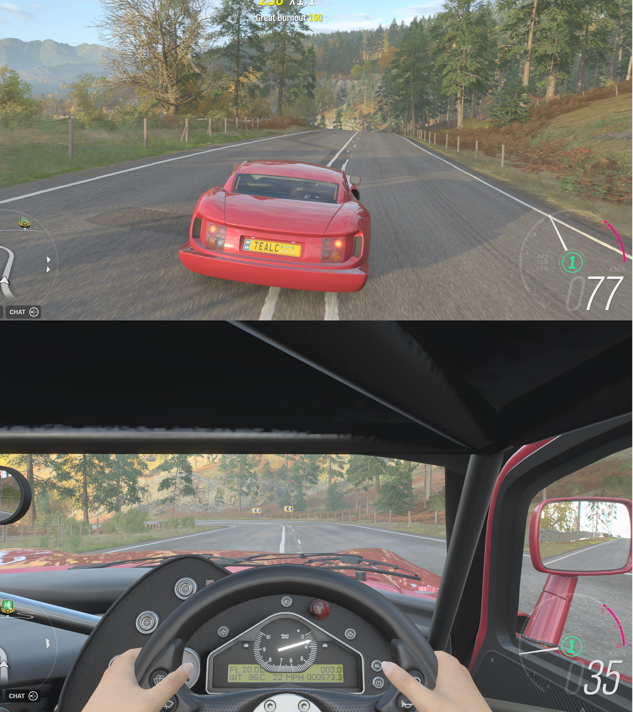

Ideas on how to be a better person: imagine yourself in the third person.

Social situations are hard for me, and oddly I think they drive me more into myself, rather than allowing me to branch out, as happens for other people. In the anxiety of it all, I’ve always focused on me, my behaviour, and what reactions I'd get. Doing this made me miss the whole point of being social: others.

Video games.

Many hit video games allow you to change your viewing perspective. You can have the option of playing in the first person, like through the eyes of the character, or switching to playing in the third person, through the eyes of… an invisible person following you around.

_Like seeing through the ideas of the driver, or following at some imaginary point behind the car._

While first person might be ideal for immersion, it hinders one very important thing: situational awareness. If you're looking through the eyes of your character, it's very difficult to gauge your surroundings and how you're interacting with the world around you.

So, recently I've adopted the attitude of trying to evaluate actions and reactions from this view. How would some imaginary person looking at me at any given time evaluate what I was doing? It's not the same as considering a particular person’s perspective, taking into account their individual personality - that's still in the too hard basket. I've gone down rabbit holes before, and reached wildly inaccurate conclusions. It'd also be a huge amount of computational effort in my little head to try and imagine being every single person I interacted with. People are hard! But my imaginary third-person person isn't.

So, now situational awareness abounds in me. That's the plan, at least. I'm sure it'll be helpful in certain scenarios, but if I start acting very strange, I hope the friends and colleagues around me are able to point it out.

Oh, I also won't start talking or writing in the third person. Aaron isn't that pretentious.
