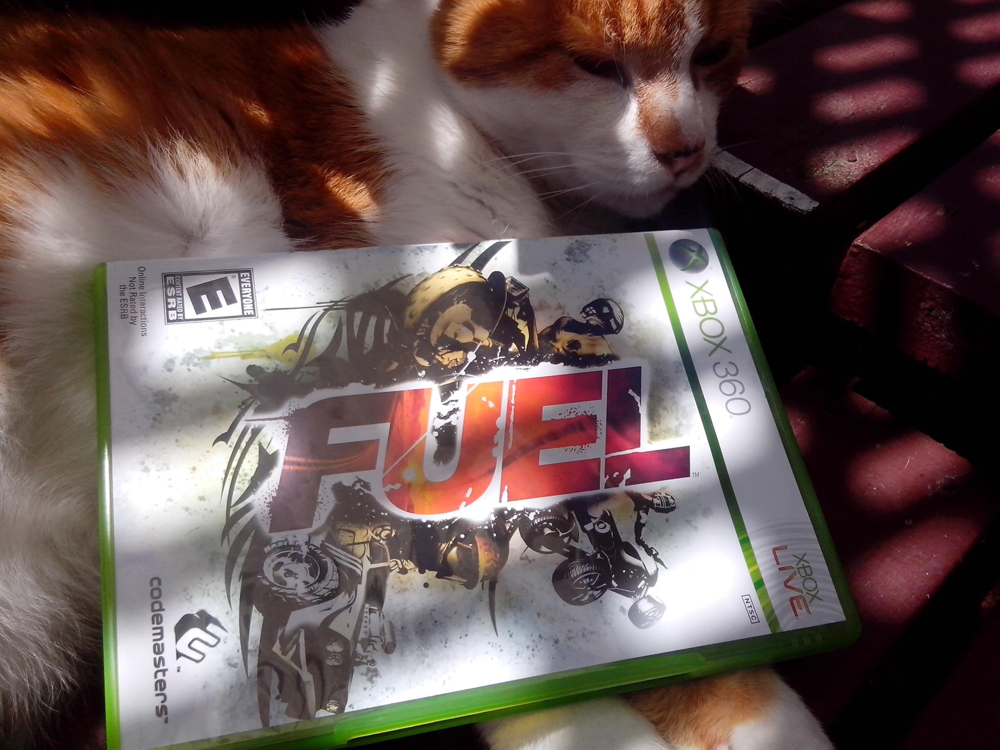
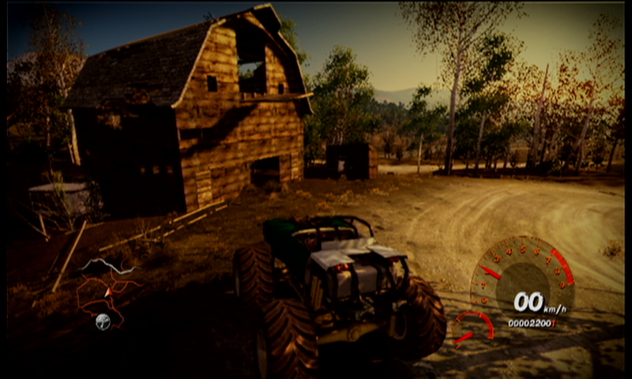
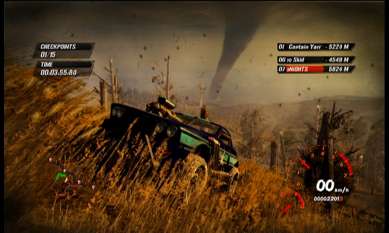

A Guinness World Record can be an awe inspiring thing. Going to school I remember browsing through the giant and heavy Book of Records, marveling at things like the man with the longest finger nails or the fastest car with three wheels. In 2008 the Gamer's Edition of Guinness World Records was first published, dedicated to records relating to video games and their associated culture. It received criticism for offering many subjective records, including stating what the best game is in a certain genre and ranking the games featuring the best graphics or villains. But not all the records followed this trend. Within the books pages were some true records of factual achievements, often demonstrating extremes of scale and size in video games.

_Fuel is a 2009 racing game developed by Asobo Studios. It holds a very notable record - The largest playable environment in a console game._

Fuel was originally titled Grand Raid Offroad, appearing first as a technical demonstration video along side the launch of the Xbox 360 in 2005. This demo showed the foundation of what Fuel would become, having off-road cars speeding around a desolated desert environment in search of fuel. From the outset Codemasters was attached as the publisher, falling in line with their extensive racing-focused catalogue including other off road games. It was close to seven years after its initial conception until Fuel was released in July of 2009.

https://www.youtube.com/embed/V_VLy--mkbE

_[The original Grand Raid Offroad trailer ](http://www.youtube.com/watch?v=V_VLy--mkbE)_

The game has no narrative, but the manual does offer a light back story. Fuel is set in an alternate present where climate change and global warming have left parts of the world ravaged and abandoned. These wastelands are now havens for extreme racing enthusiasts to gather, roam and compete in an underground league across the now desolate USA.

Much attention on Fuel was focused on the size of the open world. Over five years Asobo Studios internally developed a proprietary game engine to accommodate the enormous scale. The engine was also designed to give a lengthy 65 kilometre draw distance, making the horizons clear even when at high elevation points. Unfortunately this proves to be an issue, with texture and object pop-in being consistently present. It does become somewhat unnoticeable as most of your attention is for obstacles closer to your vehicle rather than far off in the distance.

https://www.youtube.com/embed/X_QzSydiVy0

The unparalleled size of the open world is extremely impressive. It spans 14,400 square kilometres, hundreds of times bigger than _Skyrim_ or _Burnout Paradise_ and giving it more land area than the real world locations of Vanuatu, Jamaica and the State of Connecticut. It is not randomly generated, with every mound and tree remaining in the same location across every instance. Elements of the environment do repeat often, with a small variety of identical trees, bushes and even buildings repeating several hundred times on the map. Even with this, it's not made out of stacked blocks or stitched together elements with seams. Nothing seems out of place and the entire world is presented in a believable way, flowing together very cohesively.

https://www.youtube.com/embed/g56-Xzq3TFg

_[An hour of driving due east, covering a very small portion of the map.](http://www.youtube.com/watch?v=g56-Xzq3TFg)_

The exception to the element repetition are the base camps. The open world of Fuel is divided into 19 areas, and each area has a base camp located next to various grand and unique structures. This ranges from the wrecked Ocean liner at _Tsunami Reef_, a military airfield on _The White Flats_ and a suitably grand canyon complete with a skywalk to race on in the _Redrock Bluffs_. These provide some excellent looking landmarks that obviously got more attention and development time than the open spaces in between.

_Buildings and objects can repeat hundreds of times_

While the entire environment is open to explore from the outset, the races in zones have to be unlocked by earning stars that are gained by placing first in events. Once a zone is unlocked, you can freely warp to the race events from the games menu. This feature allows you to almost skip the open world aspect of the game altogether. The only game progression offered in free roam is collecting fuel barrels, the form of currency used to purchase new vehicles and liveries, and running into a few roaming cars to instantly unlock them. This sadly makes the huge open world almost useless when it comes to game progression, offering little incentive to explore.

Fuel also provides a unique augmentation to the standing racing game with extreme weather hazards. Tornadoes and sandstorms occur during some racing events, slightly changing the handing of vehicles and providing moving obstacles to avoid. These are all scripted events and don't have the effect that such dramatic storms should have on a small car. While free roaming the weather effects are limited to the occasional cosmetic thunder storm or light rainfall.

_Storm warning_

By far the biggest issue with Fuel sadly involves something important to a racing game - the opponent AI. It's difficult to understand what's happening when cars slow to a crawl near the finish line or go the long way around a road rather than take an obvious and legal off road shortcut. Many more perplexing things occur, leaving you frustrated and unsure of what strategies to use in order to pass some of the more difficult events.

The physics of the vehicles work reasonably well, but with some issues. There is no damage modelling, making every car feel like a ridged steel box right up to the point you crash and the game resets you to the track. Climbing steep hills seems to confuse the games engine, with wheel spin feeling like you're driving on runny custard. Some vehicles can also make a peculiar ticking sound that makes you think their transmissions are falling apart. These things are big flaws, but aren't extremely noticeable when racing around in most events.

When it was released in 2009, former IGN editor (and namesake of [Podcast Beyond](http://feeds.ign.com/ignfeeds/podcasts/beyond/)'s Roper Report) Chris Roper [gave Fuel a mediocre review](http://www.ign.com/articles/2009/07/08/fuel-review?page=1), scoring it a 5.1. Fuel was a polarising, if unknown, game. Selected outlets, including Edge and [G4](http://www.g4tv.com/games/xbox-360/53538/Fuel/review/), gave a great review, praising the games achievements while recognising the aforementioned flaws but not considering them dire. IGN was certainly at the more negative end of the review range. All reviewers brought up the same problems, but the degree that it effected the game was the point of contention.

Following release, Fuel did get a small following. Fans have put together [a dedicated wiki](http://fuel.wikia.com/wiki/FUEL_GAME_Wiki) that goes into significant detail around all aspects of the game. Some people find the epic size and freedom extremely compelling, even if it does lack strong reasons to explore. [Asobo Studio's own website proudly states that Fuel has sold 670,000 units to date](http://www.asobostudio.com/game/fuel-ps3.html), a reasonable achievement for an original game. Unfortunately this franchise will most likely remain limited to the one game. Since Fuel, Asobo has worked only on licensed games based on small children's franchises with no indication that there is interest in making a sequel or even another game in the genre.

Fuel is a achievement. More than that, Fuel is a record breaking achievement. The world is hundreds of times bigger than what is found in any other game. Comparing the total land area to entire countries gives you perspective to what this game does. Fuel succeeds more as a technological achievement than it does as a game. It fully deserves its place in the record books and should get recognition for this, but it's unfortunate that it doesn't completely work as a compelling game.
