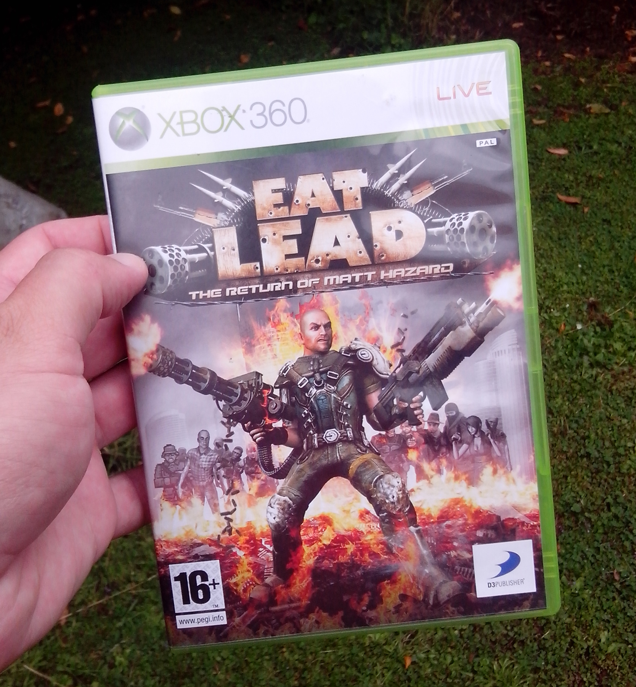
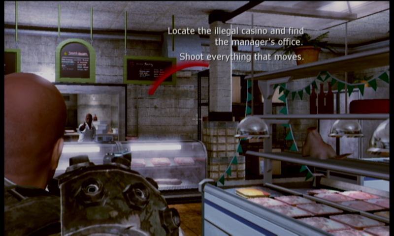
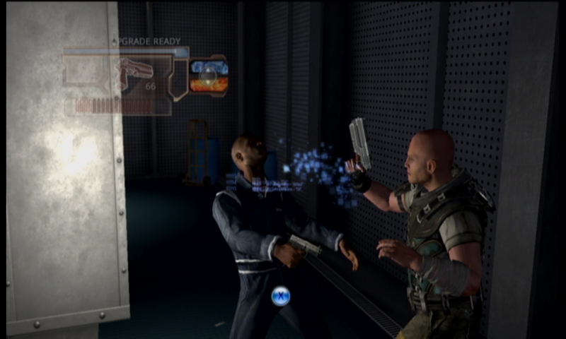

_Good games get remembered, but titles that get the lower scores or are instantly forgotten after release. Game Failings checks out forgotten titles, looks at them with the benefit of hindsight and sees if there was anything special that just didn't catch on._

* **[Eat Lead: The Return of Matt Hazard](http://www.ign.com/games/eat-lead-the-return-of-matt-hazard/xbox-360-14286898)**
* Platforms: Playstation 3, Xbox 360
* Originally reviewed on IGN: March 2, 2009

_Eat Lead: The Return of Matt Hazard_ was a 2009 attempt by publisher D3 to launch a franchise after a long history of mostly television licensed games. It's developed by Vicious Cycle Software, coming from games like _Ben 10_ and _Dora the Explorer_ and more recently made the latest entry in the _Earth Defence Force_ series.

The pitch: You play as Matt Hazard, a self aware fictional game character who is attempting to make it big again after a downward slope of over branding and bad games. The character, and his whole universe, is given a lengthy fictional back story, include many made up games and characters. All these things come off as very shallow, but being a satire you get the impression that this is intentional.

Mechanically, it plays like a typical Gears of War clone. Annoyingly, the button mapping is fairly different to other similar games, making the muscle memory hard to fight. Other than that it's standard faire, with head shots giving massive damage and characters sticking to cover points like they're made of honey. There's standard weapons like pistols, shotguns and machine guns and they all behave like you'd expect, even if they feel a little weak. It plays completely linear, often with enemy characters being entirely scripted. Magic doors regularly stay locked until you take down all the nearby enemies.

_Good advice for most games_

For a game with such creative potential, the level design is standard and bland and uses boring themes like warehouses and shipping yards. It might be a 3 year old game now, but it looks like it was made for something less than the PS2. This is most striking watching the cut scenes, featuring close ups of the poorly textured character faces. One saving grace that it never slows down or drop frames, helped by stages having very few interactive elements.

A big promotional push for _Eat Lead_ came from the inclusion of famous voice talent, with the title character voiced by actor Will Arnett and main antagonist by Neil Patrick Harris. All the voices are passable, but don't achieve anything special. It's not helped by having the same quick phrases repeated multiple times during gameplay, and often having characters glitch and talk over themselves.

_Quick time event Melee attacks_

When it was released back in 2009, the critical response was middling at best. [IGN's own champion Greg Miller gave it a 5.2](http://xbox360.ign.com/articles/958/958450p1.html), and that was mostly reflected across various outlets. It's a shame really, the concept and premise could have been something special. You get the impression that most of the effort was put into the plot idea leaving no space to invest in actual gameplay. Having a character hopping around a range of fictional games could have allowed for a strong variety in gameplay, but the sheer lack of variety in _Eat Lead_ becomes so repetitive extremely fast.

Strangely, it's still worth a look, just to be able to see it's premise. It's outright not a good game, but it has interesting ideas and a few good jokes that only dedicated video game fans will get. It's idea isn't something replicated very often. Not a successful game, but a curious one.
