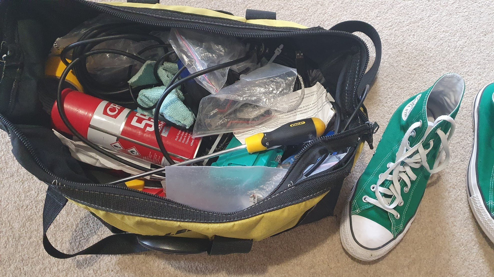
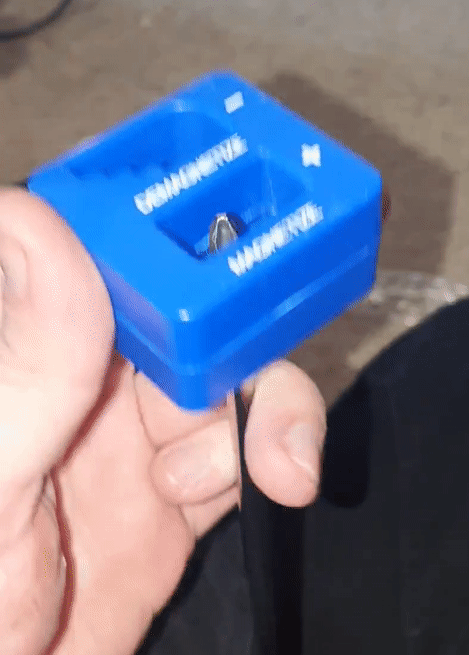

Today was Tuesday. I'm striving to just write about my days more often here, at least when work allows me to. I really don't think anyone will be that interested in it! It's more of a journal - but putting it out here for the world to see is a good way to keep me accountable.

I had a few minutes free today, waiting at home for a part to be delivered for work. Rather than sitting about, I organized my work bag. It's embarrassing to open up my bag in front of a customer when it's so cluttered! They gave me a car to look more professional, so having a toolbag that is orderly probably helps with that too.

_Hey! I've been busy._

This thing is falling to bits. I've had it for just over a year, and she's had a hard life.

Oh, I also magnetized my screwdrivers.

_She asked me if I'd like to magnetize._

My head is very much not screwed on properly. Remember all those years ago when I wrote about how **[Dating is hard and I am very awkward?](https://aarond.me/blog/2017/04/11/dating-is-hard-and-i-am-very-awkward/)** Well, that hasn't changed.

I'm far more confident now. Wait, that might be wrong. I am far less nervous now? Yeah, more accurate. I'm  confident about who I am, but I'm not at all confident that a girl brave enough to get a drink with me will enjoy my company. I don't get anxious, I'm very blasé about it.

I do have anxiety attacks, but they're generally about work being overwhelming. For the longest time I was often crippled with anxiety about the failure of my relationship. I was still deeply in love, even when she pushed me away, and I really thought I'd ruined the only good thing that would ever happen to me. I was lucky to get such an amazing woman, and I royally screwed up.

But hey! I'm older and wiser now. It's not too bad, it's now just enough to make me take my job and my… life more seriously.
