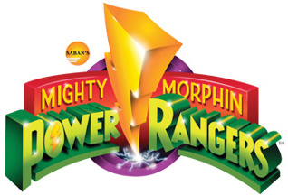
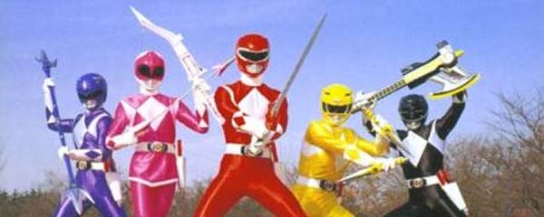
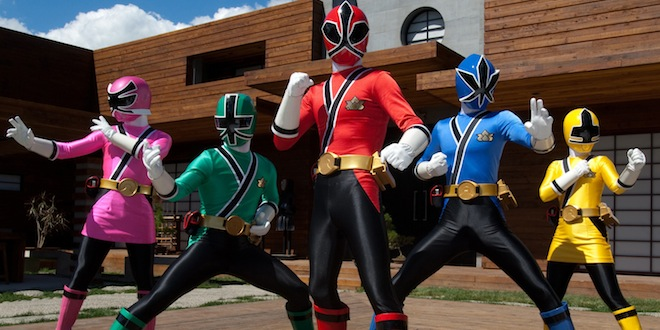
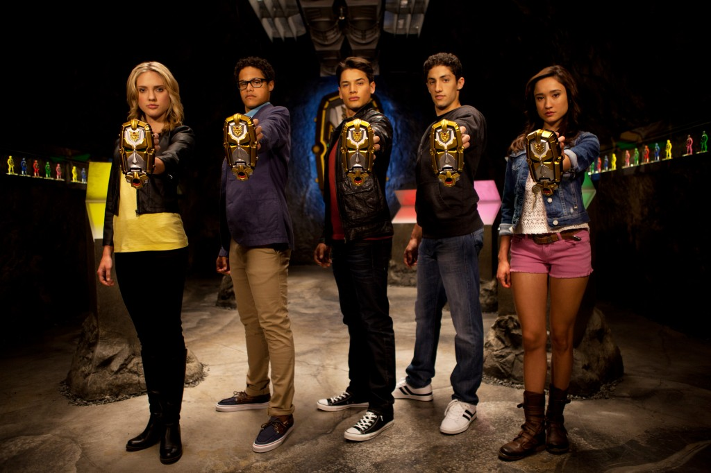
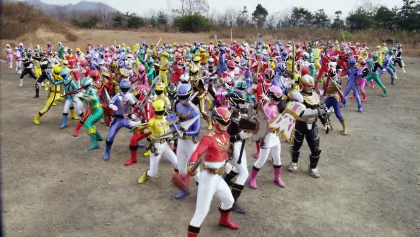

This year marks the 20th anniversary since the Mighty Morphin' Power Rangers first aired on television. Very few other children's shows have achieved this longevity, especially in the unique case of having a complete cast turn around and a new story almost annually. And now the 20th season of the show is starting up with Power Rangers Megaforce. But before we look at that, some history about how this franchise got here.

Power Rangers started in 1993, helmed by billionaire media proprietor Haim Saban and his business partner Shuki Levy. It's an adaptation the extremely popular Japanese Super Sentai, a live action series where unsuspecting youths transform into heroes wearing full body, colour coordinated Spandex suits. Rather than being a simple voice over dub of the source, Power Rangers takes the fight footage from the Japanese show and merges it with original footage of English speaking actors. The show was a skyrocketing success, becoming the best rated kids show, selling action figures in record numbers and spawning a major box office movie adaptation. After many years and several seasons when the hype and popularity plateaued, Saban sold the franchise to Disney.

_A Power and a Force television had never seen before_

When Disney started its first Power Rangers series, they moved production from Los Angeles to New Zealand, replacing the majority of people who worked on the show. Doing this not only made the show cheaper to produce, but also got around rules related to casting union actors. Disney had moderate success with the franchise, iterating every year and keeping it fresh for new audiences. After six years producing the show, Disney wanted to try something different. They wanted to refocus the show to target an older demographic and air it on the new Disney XD channel. Rumour has it that the toy manufacturer Bandai didn't like this idea, concerned that this new audience wouldn't be as inclined to buy the figures and toys. With the show already not pulling in great numbers, Disney put the franchise on hiatus. Seeing a lucrative opportunity, Haim Saban repurchased the rights to the show at a rather low cost and quickly put a new season into production.

Unfortunately, the show didn't turn out very good. A huge promotional push by Saban and it's broadcast network Nickelodeon did give the show a boost in viewers, but the new season - Power Rangers Samurai - wasn't the brightest spot in the franchise. A rushed production cycle lead story plots that outright didn't make any sense and a cast of generic, lifeless characters. The popular fan podcast [No Pink Spandex](http://awwman.com/nps/main/) recently gave Samurai the honour of being crowned the worst Power Rangers season of all time.

_Rushed production meant Power Rangers Samurai wasn't good_

But with the failings of Samurai in the past, Saban is launching Power Rangers Megaforce, a series promising to be a 20th anniversary celebration of the show.

The first episode of this new series was very similar of the first ever episode of Power Rangers from 1993. Troy, Noah, Emma, Gia and Jake are typical high school students with attitude. When evil aliens plot to conquer earth, the mystic guardian Gosei calls upon these teenagers to defend earth as the Power Rangers Megaforce.

https://www.youtube.com/watch?v=PsOdcBPzLdk

The characters fit the clichés just like you would expect; Noah being the nerdy guy with glasses, Gia being the girl that always strives for perfection and Troy as the strong, silent and focused leader. It might feel very familiar, but it is good to see characters with distinct personalities rather than wooden blocks with faces. This teams mentor, Gosei, is a giant plastic head with flashing eyes. Zordon's bald in a plastic tube from the original series felt much more animated than this simple static figure. There is also a small robotic assistant, but this time it's computer generated rather than being a short person in a suit. Hopefully this wont lead to a lack of interaction with the live characters in future episode, but so far it holds up.

_Gia, Noah, Troy, Jake and Emma are the Megaforce Power Rangers_

The fighting scenes are what every Power Rangers series is about, and there here just like you'd expect. Like always, sparking and pyrotechnic displays are used to heighten the suspension and add visual flair. The fights are choreographed well, although some of the dialog put over Japanese footage can seem out of place.

The first episode did have a nice treat for fans, showing a great battle of over 100 past Rangers against an unknown enemy. It was just a small teaser as part of a dream sequence, but hopefully it will be expanded as the season goes on.

_Every Power Ranger - ever._

Interestingly, this iteration of Power Rangers has little story in common with the Japanese counterpart it's adapted from. _Tensou Sentai Goseiger_, the 34th Super Sentai season, used the theme of young Angels who are stranded on earth after the evil Warstar enemies destroy the Tower of Heaven. The strong religious tones present in _Goseiger_ were most likely the reason for the sharp change and the original plot in Megaforce.

After a couple of episode, Megaforce does seem promising. It's already more entertaining after two episodes that the entire previous season combined. Sure, the cheesy lines and extremely dramatic acting is here in full effect. If you're someone who remembers eating Fruit Loops and watching Mighty Morphin' Power Rangers on Saturday mornings 20 years ago, Megaforce might be worth a look even if just for a rush of nostalgia.
