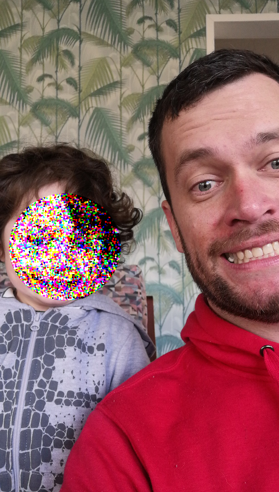
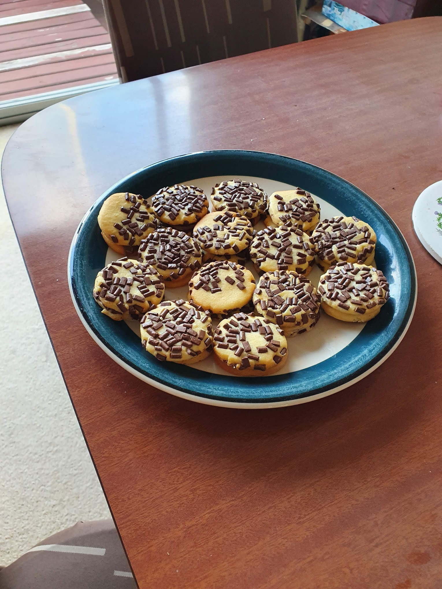

### Well, that was helpful.

Turns out this writing thing is really beneficial, I’m glad I can get back into it again.

https://www.youtube.com/embed/N2ICtCO8TCw

I really appreciate all the friends and family that reached and out offered support. Over the past few months I have been making myself really isolated. I was fighting a battle on many fronts, and made decisions based on getting advice from a million different people rather than thinking for myself. Because I was wanting to avoid conflict I just kept to myself - but then I shattered that line of thinking and posted here for all the world to see!

I hate feeling stupid, but often I deserve to.

I know many will think of me as an idiot for a recent choice I’ve made, but I own my decision. I’m at peace, and I don’t think I would be if I had made a different choice.

Yes, I’m being a little vague! I’m sure the smart people reading this will figure out what I’m referring to.

One thing I failed to mention before was the biggest source of joy in my life right now: being the #1 Uncle!

_Censored to protect the brave and bold._

My nephew is awesome. He’s such an energetic, clever and positive character. I say character just because he’s so dang interesting! He’s not some boring lame-o boy, but a super interesting, dynamic and sharp little man. He’s fun to be around, even if a bit exhausting. When I’m around him I try to give him all my attention, as opposed to most boring adults!

He’s like a better version of me! He’s into everything I was at his age - Dinosaurs, Batman, Pokemon, Video games - but he doesn’t have any of my aspergic shortcomings. He thinks I’m awesome, and it’s quite the boost to my ego! I often visit at the end of the day after I finish work close to his place, and everytime he wants me to have a sleepover.

Emotional Support Animals are a thing, so maybe I’ve just got an Emotional Support Nephew. I highly recommend it.

I have a lot of idle time with work. I’m often waiting around to get access to a site or waiting for a machine to reboot. Now that this here blog site is back up and running I might use some of that time to write stuff. I promise it won’t all be about the failings of my personal life! I’m sure everyone is interested in my adventures in experimental baking.

_Caramel chocky goodness._
