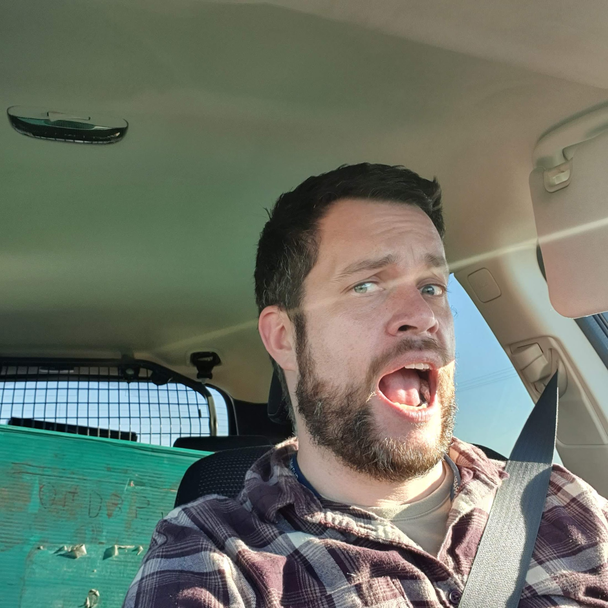
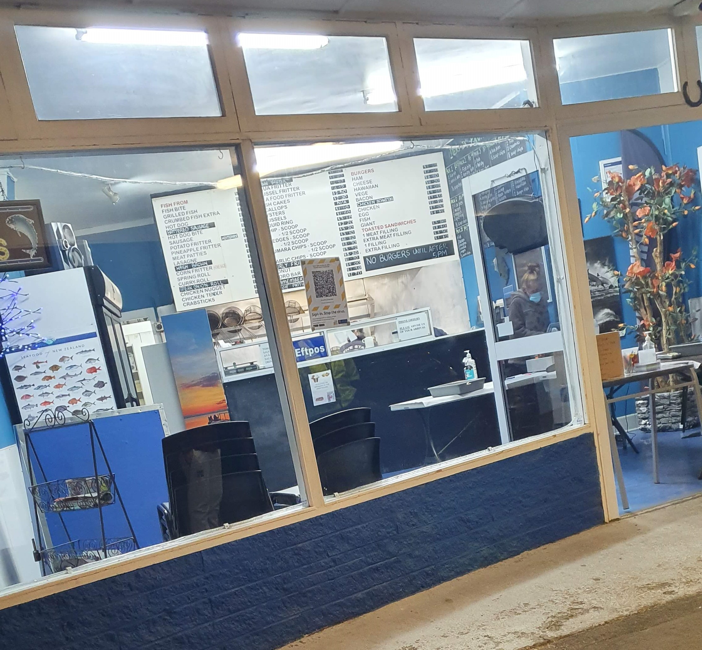

I bet lockdown has been tough! You're either isolated, or stuck around the same people in the same building for most of the day. What have you done to help push you along, to keep on trucking along?

Kids are a handful! A never ending source of joy and wonder, but also… so much energy. With my nephew, getting him outside running for a bit every day is a requirement. I totally understand that: being stuck inside with three grumpy and smelly adults for days on end is a drain, alright.

For those that usually work at an office, what's it like now working from home? Do you find it tough to adapt and get motivation to work with all the distractions and comforts of home around you, or is it something you prefer?

_Enjoying being out there working, but very much need better lockdown grooming!_

Shout out to all the essential workers out there! It sure is eerie to drive around those empty roads. It's a tad embarrassing to compare my work - fixing cash machines - to all the absolutely life and death critical workers. From doctors, nurses and firefighters to supermarket workers and couriers. Without them we all would get sick, get burnt, get extremely hungry and get nothing delivered. I know nurses have an extremely demanding and stressful job as it is, but this must bump it up a level!

For me? Work has picked up. I'm actually really enjoying having family stay with me now - it got a bit intense to be stuck at home with them for days on end. But now I enjoy knowing I'm coming home to my family. Maybe I'll miss them when they move out to their new house.

Except the dog poop everywhere. I won't miss that.

What would help you? What could I, or someone else, do to make your lockdown experience better? I'm here! Right now I'm in Foxton waiting for an escort to fix a machine - I'm out there, driving about, and am happy to assist anyone that needs it. I can also chat! My conversation skills aren't great, but if you need to vent to someone that isn't in the same house as you, I'm all ears.

But the highlight of my week? Well, at midnight Tuesday one of the local fish and chip shops opened as soon as the lockdown in my area was lowered one level…

_Socially distanced midnight snack. It was popular!_

Hey! Don't judge. I’ve been running a lot more during lockdown, so this is just catch up! I'll get back to trying to shed the excess flab right away. Besides, I felt heavy and horrible after that pile of fried food. It taught me a lesson.
