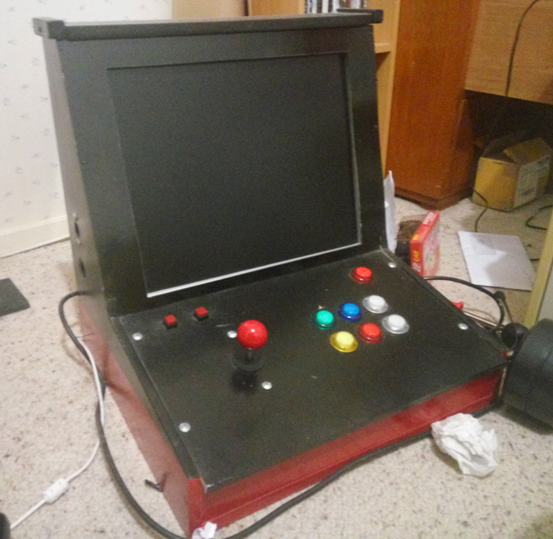

For a few years I was into a technology culture that is still growing now – the amateur maker scene. A few fortunate events let me turn this into commissioned work.

It first started just over three years ago. I did a version of a project that was very popular at the time – an emulation based Arcade unit. I got a hand saw and the recently released Raspberry Pi 2 along with some cheap buttons and sticks from eBay and put it all together.

[I blogged about the process in detail,](../../assets/images/blog/22/raspberry-pi-2-powered-arcade.html) and as a result I was fortunate enough to have the article promoted here on the front page of IGN. It's quite a rush to have thousands of views and dozens of comments about something you've done. Nothing negative either! I still get messaged today from people asking questions about the build.

_Mind the dust._

And the machine still works, although I almost never turn it on. I should give it away. Given how it's loaded with rom files it wouldn't be right to sell it. Besides, the build quality isn't that great and it has exposed AC wiring inside. It'd be impossible to ship too, it's very heavy.

One of the people to see the blog post was a content manager at element14. I was approached to be a content producer, making guides and tutorials for projects based around products that element14 wanted promoted.

The first thing I did was [a car DVR system using the Raspberry Pi camera module](https://www.element14.com/community/community/raspberry-pi/raspberrypi_projects/blog/2015/06/23/the-secrets-of-the-pi-camera--car-dvr-system). That worked well, even if it did look out of place in my old and rusty car. Just look at this amazing footage of the journey between two small New Zealand towns. The shear amount of action is overwhelming.

https://www.youtube.com/watch?v=/_-BUBQsxcJ4

One of the best things I got to work with [was the CodeBug](https://www.element14.com/community/community/stem-academy/codebug/blog/2015/11/06/codebug-car-break-sensor). It's a very easy to use development tool, primarily focused for use by children in education. It even comes on a cute ladybug shaped board. The best part is the web based coding environment. It works like assembling a jigsaw puzzle rather than writing lines of code.

When an upgrade to the Raspberry Pi camera modules were released I got to use the NoIR version for a night vision project. [The final build was a video baby monitor](https://www.element14.com/community/community/raspberry-pi/raspberrypi_projects/blog/2016/04/25/noir-v2-video-streaming-baby-monitor), but I also got to have a little fun impersonating a thief in the dark. The light hitting an eyeball always looks spooky in Infrared.

https://www.youtube.com/watch?v=/B45oQsFMWQU

That's a few of the things I got the opportunity to work on over the past few years. The whole time I was doing projects and articles I always felt incredibly under qualified. I had no training or experience in anything like this, every time I started a project I didn't know if I would be able to complete it. It was like I was an imposter, and at any time it could be found out that I wasn't at all suitable for the job.

Currently this blog is the only thing I'm really doing. I'd like to say that I would grasp with both hands any opportunity that came along, but right now getting up and doing anything at all is hard enough. If something did come along I would really like to be part of a team, even remotely. Being left to do a job for a month in a small town with no communication is very isolating.

Today written content just has no value. It has to be extremely cheap stuff made for the lowest common denominator in an audience. The only option to be viable is to attract millions of views, anything less just isn't worth it. The promise of Web 2.0 from 10 years ago has come and gone, and now content isn't worth the drive it is stored on. Video was the greener pasture, but now the bar for that being viable is high. You need an exorbitant number of viewers in order to ride on a shockingly low CPM.

The profession I ended up doing is looking to be a dead end street. Where does content on a free and open Internet go from here? I don't know. Where do I go from here? I think I'm even less sure about that.

For the times they are a changing.
