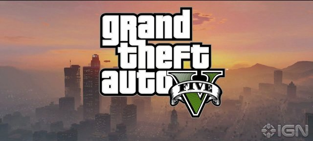

At the recent Playstation event it was announced that Sony is moving to a new architecture with the Playstation 4, making it lack all backwards compatibility with current generation titles. On the fabulous and popular [Podcast Beyond](http://feeds.ign.com/ignfeeds/podcasts/beyond/), the dream team aren't concerned about this, saying that backwards compatibility isn't a feature they want or that many people will use.

I disagree. These are my reasons why I want backwards compatibly in my next generation console of choice.

## Gaikai won't be viable where I live for many years

At the Playstation briefing, Sony claimed that Playstation 3 games would be playable on the PS4 using Gaikai's game streaming technology. I very much doubt that I'm the only one whose high speed Internet isn't up to the standard needed for high definition live gaming. A smooth and reliable game streaming experience wont be a reality for a significant portion of consumers.

## Grand Theft Auto 5

The tentative Holiday 2013 release of the next generation consoles puts it within less than a dozen weeks of Grand Theft Auto 5, quite possibly the biggest game of the year. Being such a huge game, people will still be playing it by the time the new systems arrive. To compound the issue, people may want to purchase a new console to play next generation games along with GTA 5 for the holidays.

_It might be worthwhile to have your new console run the biggest game of the year_

## One box is enough

Living in a smaller place, having multiple consoles can prove to be a hassle. Dealing with two sets of cables and upwards of four controllers along with the consoles themselves is something I'm keen to avoid. In the next generation I'm making one bed and sleeping in it; one system will have enough games I'll enjoy, even if I do miss the occasional exclusive I pine for.

## Keeping Digital content

The current generation is the first to have games distributed over the Internet without a physical product. Digitally released games cause an issue if, like me, you want to get rid of your old system when the new one comes along. You can't give digitally distributed games to friends or trade them in. If you get rid of your console all these games go along with it.

## My back catalog

As you might gather by my Game Failings features, I play a good deal of older games. Right now I'm enjoying Halo Anniversary, SSX and about to start Driver:San Francisco.  Being as poor and scarcely employed as I am, I seek out deals and bargains where I can. Old game might be old, but if fashion taught us anything it's to mix some of the old with the new.

_Older games that I still fully intend to play and complete._

## Digital sales

As of writing, Xbox Live is having a digital sale of Games on Demand at significant discounts. Even on a flashy Xbox 1080, consumers might be willing to pick up Rainbow Six Vegas for $2.95. Having these kind of sales could get people to keep using their new consoles during the inevitable post launch release drought.

## Buying a new system and using it

I wouldn't buy a new car and drive around the old one just because I was going slow. I don't want to shell out several hundred dollars on a brand new console just to push it aside to use the old one.

## The current generation can live on

If a new system has backwards compatibility, games can be released for older hardware without as much concern that it will be neglected. A game like Fez or Retro City Rampage that don't need newer, faster hardware to run can be released once. Porting it to the next generation systems can be prohibitively expensive, especially early in a systems life when there won't be many of the new consoles in the wild.

_ Is backwards compatibly something you want in your next console? Would it be a selling point if it's included in the next Xbox? Share your thoughts and comments. Also, be sure to send love to Clements. He got fired, you know!_
