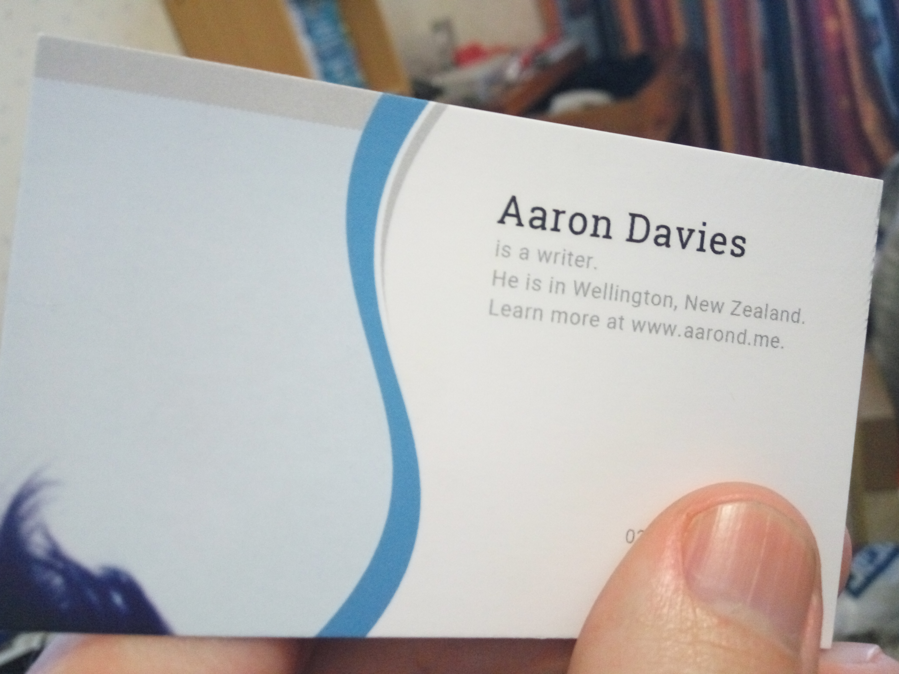
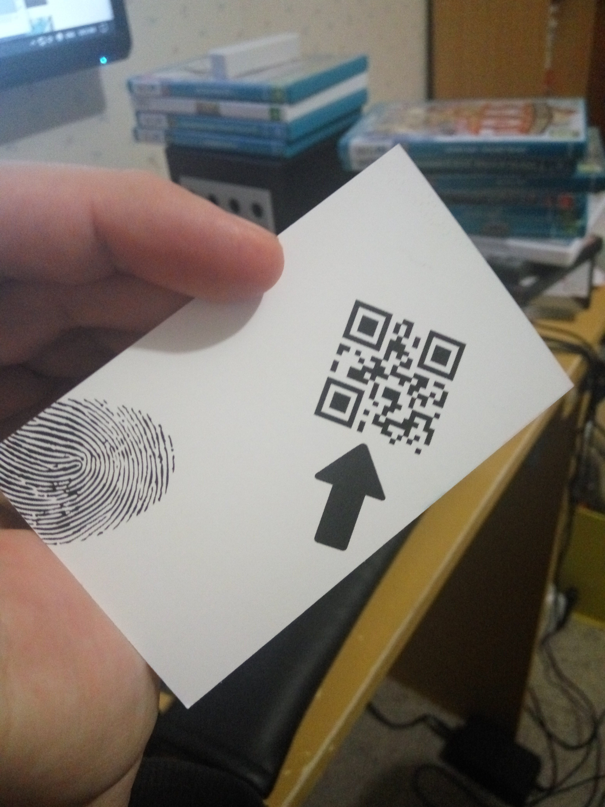

In my great effort to move forward and get down to business, I got business cards printed.

_Blue and hairy._

In person they look a little bland. I thought having an empty white space in the middle would be good for writing a note or message, but the intent isn't clear.

I combined information and humour by using sentences written in the third person rather than just a list of details. It's not just a name, occupation and website listed - it's a narrative about my name, occupation and website!

I put down that I'm a writer, but I am very open to expanding into other areas of work. Anyone that takes the effort to visit the listed website will quickly grasp my vast area of expertise.

Yes, that is the top part of my hair backed by a clear winter's sky on the left. I did try out having a photo of my face, but I don't think highly enough of my appearance to have it printed a thousand times over. I wanted to have something unique beyond just a nice template. The intent is the patch of jet black hair will intrigue people; make them want to find out what it actually is. To do that they can visit the website, follow me on Twitter, email or even phone me to learn the exciting story.

_There is a back side too. Having a QR code printed squarely in the middle was boring. This way it's instructive without instructions. Hold the card with your thumb on the thumbprint, then whip out your phone and scan the code with your other hand. Sorry to the left handed, you'll figure it out somehow._

What is the etiquette for handing out business cards? I've got enough to hand these out to everyone I speak to in a year.

Is meeting a girl and handing her your business card a bit too audacious? It might be simpler than writing down or sharing a number, but can give the impression that I've got an ego the size of the sun.

https://www.youtube.com/embed/WGOohBytKTU

But when I'm seeking business time it might be appropriate to make it rain with business cards.
