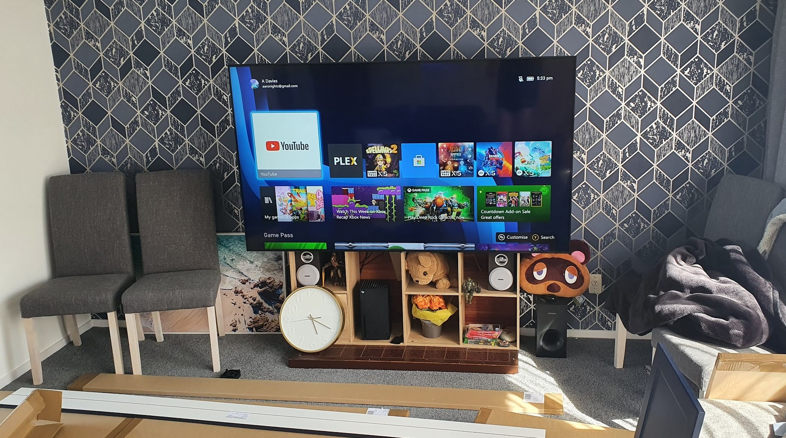
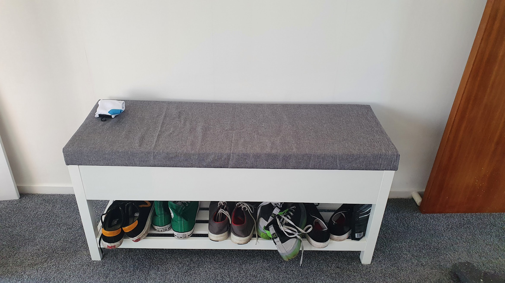
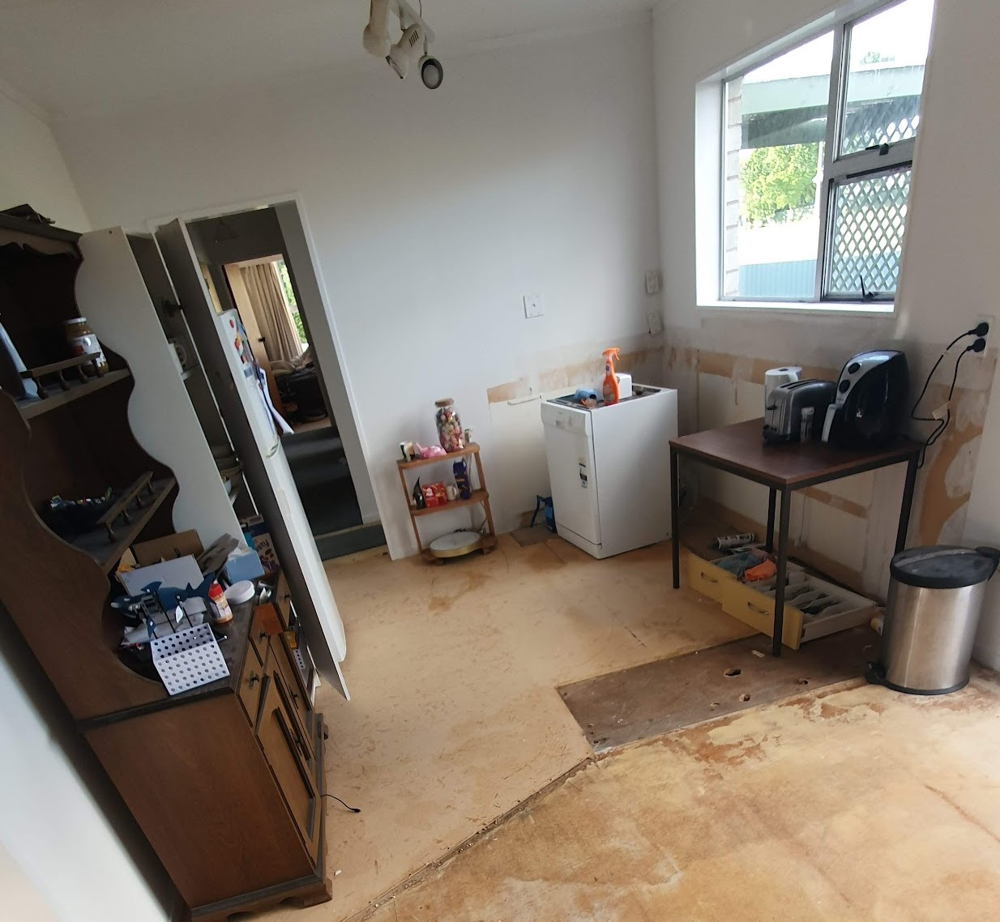
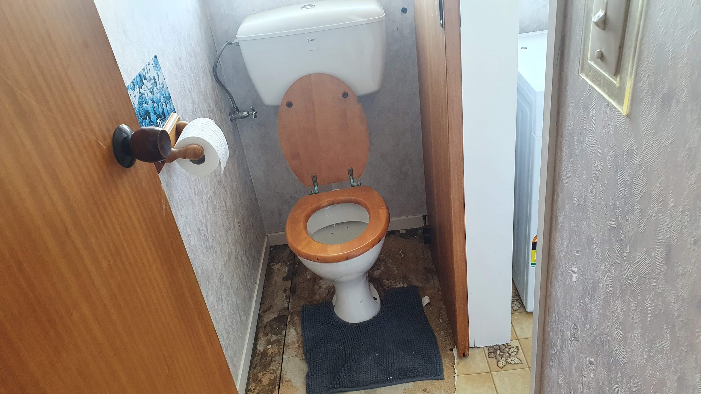
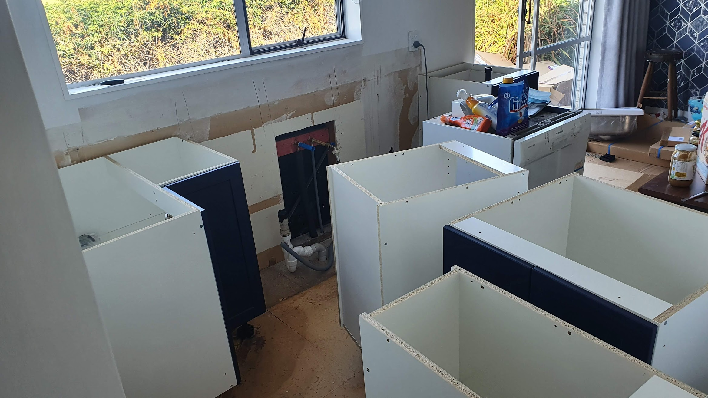

My work is ramping up for a Global Fitness Challenge later this month. To quote the email:

_“During this 10-week journey, employees will commit to improving their overall health and wellbeing and are encouraged to set and strive toward personal health and wellness goals. “._

Doesn’t it sound fun? It’s an opportunity at least. Since this time last year when my relationship stuff hit the fan, I have gone down a rather unhealthy path. I wasn’t feeling great, and just lacked the motivation to… not be a fat pieman. But now I’m wildly optimistic! I’ve registered and I’m ready to go! I have a constant notification on my work phone telling me that it’s counting my steps, every second of every day.

_A less messy photo is coming... later_

My lounge? It's done! More or less. It looks amazing. It’s all new on the inside, every bit of old furniture has gone, and now I have a sophisticated and beautiful living room to live my life in.

The wallpaper choice is so perfect. I showed a dear friend what the wallpaper was before it went up, and he suggested it was more appropriate for a bathroom! But even he has seen it since it’s been put up, and he agrees it works very well. My giant TV also works well at hiding the old hearth, where the gas heater was, and I think the bookcase below and behind it looks really good - even if it was a Kmart job. I went out on a limb and selected the couches on my own. Hey, my amazing designer was busy! It’s worked out well, the blue and grey balance each other out very well.

And a shoe rack is something that everyone should have. I mean, an actual place to store shoes that isn’t the floor? Genius!

_Rack and bench seat! So useful._

But the two biggest things that make a room? Carpet and Curtains. I was iffy about replacing the carpet, thinking the 10 year old job my parents put down many moons ago would clean up ok. I’m so glad I didn’t! Having nice, soft premium carpet makes the ‘experience’ of being in that room feel so much better. The blue-grey texture in the curtains is subtle, but brings the whole room together.

Finally, the kitchen. The other reason I took leave today was to wait here for my epic new kitchen to be delivered. It’s getting close to 2pm, but I’m assured it’ll arrive today. When it’s here I’ll be assessing how viable it is for me to fit it myself. The lovely people at Mitre 10 assure me, except for the electrical and plumbing, I can easily do it myself. Plus I have offers for help from friends and family for assistance. I’m sure, somehow, I’ll get there.

_Running on empty._

So, something else happened. As most of you are aware, I came home the other week to find the inlet to my toilet’s cistern leaking galore and flooding the room. Fortunately, a good friend was able to get a plumber to attend at very short notice to get it fixed, but the damage had already been done. I had to take today off work, and now I’m waiting for the builder to show up to give a quote on how much the repairs will be. It’s good though, the insurance assessor has been and they’ll be covering the cost. Based on what she said, it’ll be new walls, new floorboards and new flooring. I had planned to do the exterior of my house next, but now it’ll be the bathroom.

_Such a damaged, watery floor._

I’m going to take this opportunity to change things up. I plan to smash the wall separating the toilet and bathroom to make it one big space. Right now the bathroom is awkwardly small, especially when using the shower. There is also no wash basin in the toilet, so you’re forced to go into the bathroom anyway. I’m having pizza and beers with my expert designer tonight! I’m sure bathroom styles will be a vital topic of conversation.

And as a bonus breaking update? The kitchen arrived after I first penned this! Well, everything except the benchtop. It’s been a fun time putting it together! I’m getting there, but I’m sure I’ll hit a roadblock before too long.

_I have a kitchen now! Some assembly required._
