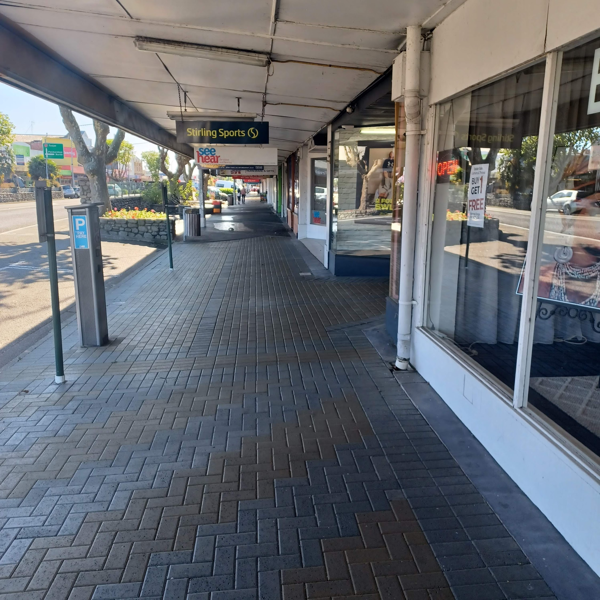
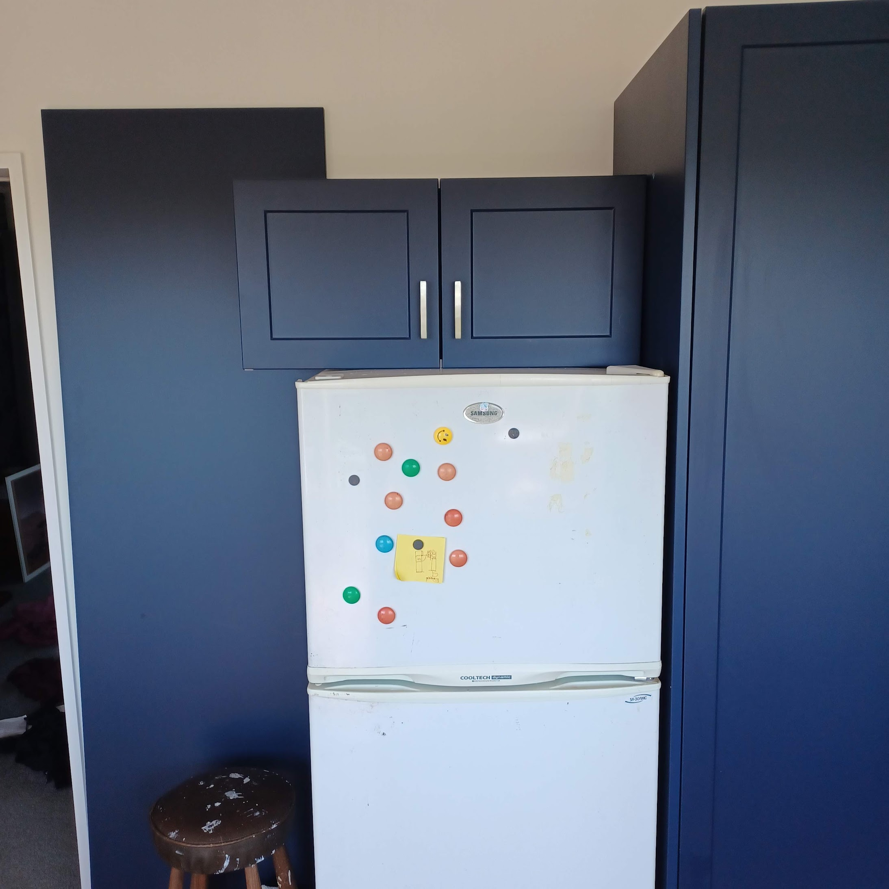

Many years ago, it must be at least 10 now, my dad and I had a tradition. On the top tier public holidays, like Christmas Day or Good Friday, we would go for a walk through town to see what was going on when everything was closed. It was interesting to see the scarce handful of shops that were open, and the rare car that went through.

He would have wanted to go for a walk every day during the height of lockdown.

On Good Friday this year I was loafing about on standby for work, and thought it'd be good to go for a jog. While not much retail was happening, the traffic going through this small town was more than any given Friday. All those years ago you could have pitched a tent on the main street! Oh, times are changing.

_Small town Levin isn't usually this scarce._

I've been on standby for work this long holiday weekend, waiting for my phone to make a beep to send me off on a job. It's been busy enough, but not overwhelming.

Is it… expected to feel valued at work? Or is that an old tradition for people with weak willpower? For a while now, my job has been feeling sour. The message and vibe is always "Work hard and long hours, or else. If you don't, we'll track you down." Some of the messages coming from management make it feel like a witch hunt is going on. Oh well! I push myself to have rampant enthusiasm with my job, but it’s been more and more challenging in recent times. Apparently big meetings are happening next month, deciding future plans!  I’d love to put my dress suit on and be involved somehow, but I’ll probably find out results months later. If I’m lucky.

Besides! Maybe, just maybe, something far more special, fulfilling and absolutely wonderful is going on.

Oh, some of you could be there wondering about house updates! No change. The lounge and dining room are all completely finished, and the kitchen is mostly done. I still need to get a splashback of some kind installed, and I need to put up the bit that goes around the fridge. It's so very nice to have a fully functional kitchen again, but I still end up using that dinky little air fryer for a number of meals. It feels like a waste to power up a full oven for one person.

_Almost done. Almost._

The toilet is still flood damaged. I got the payout from insurance, but still have to find the drive to actually get it done.  Bathrooms are hard, and plumbers are difficult to come by! I really need to overhaul the bathroom/toilet/laundry, not just patch it up.

But no rush. I'll get to that when I can. For now I'll just focus on cushions. They count as interior decorating!
