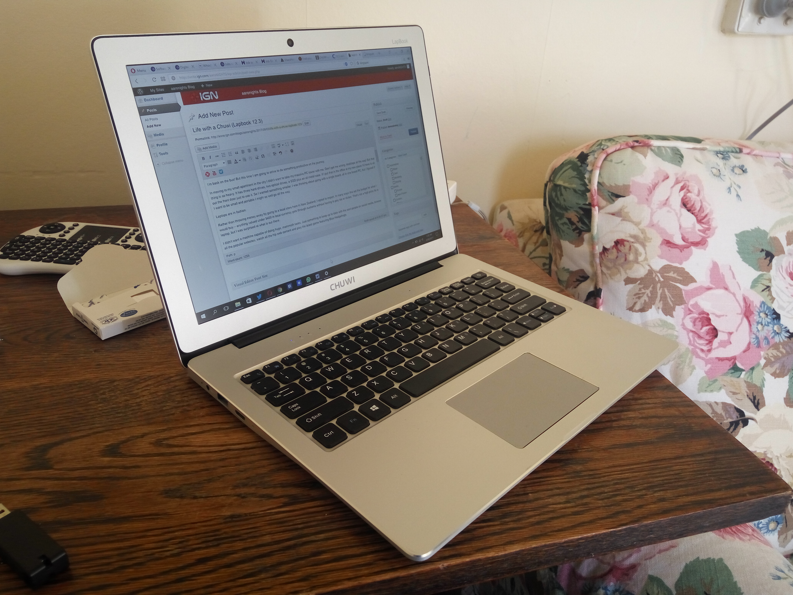
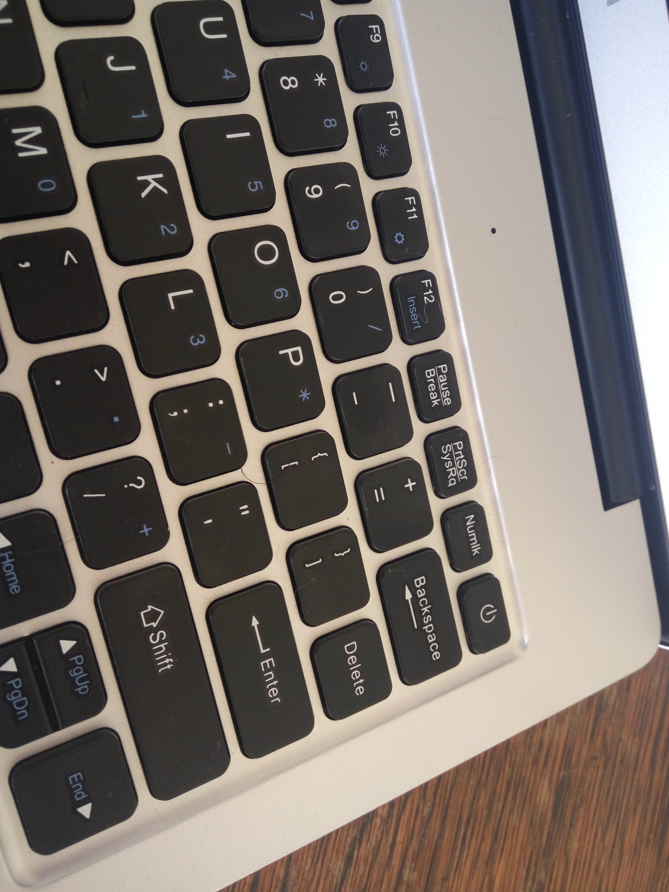
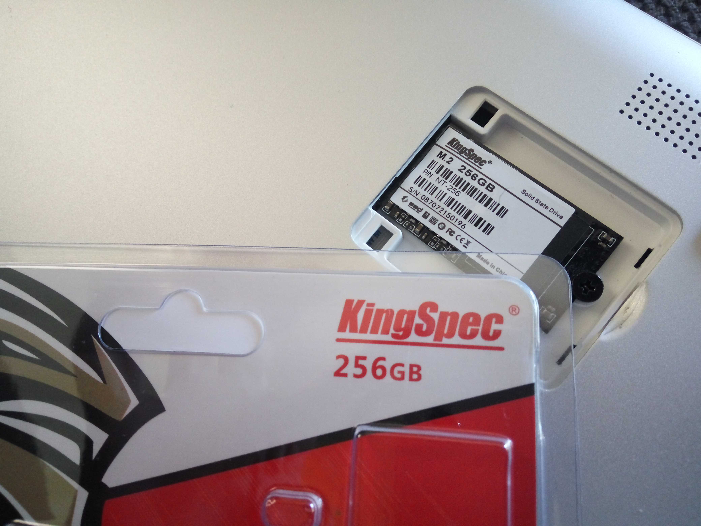
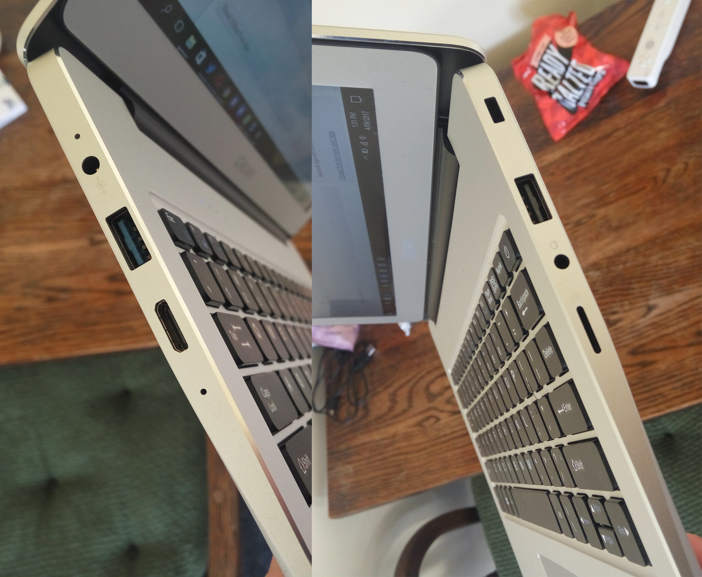

I'm back on the bus! But this time I am going to strive to do something productive on the journey.

In moving to my small apartment in the city I didn't want to take my massive PC tower with me. Don't get me wrong, desktops all the way! But that thing is so heavy. It has three hard drives, two optical drives, a SSD plus an all metal case. If I put that in the office at my new place I'd have to sit out the front door just to use it. So I wanted something smaller. I was thinking about going with a single board, all in one board PC, but I figured if I want to be small and portable I might as well go all the way.

Laptops are in fashion.

Rather than throwing money away by going to a local store here in New Zealand, I opted to import. In many ways this set the budget for what I would buy – anything valued under $400 in local currency gets through customs without having to pay tax or duties. That's not a high price for a laptop, but I was surprised at what is out there.

I didn't want a machine capable of doing huge, mammoth tasks. Just something to keep up to date with the cool people on social media, browse all the popular websites, watch all the hip web content and play the latest game featuring Blue Hedgehogs.

The unit I selected is the [Chuwi Lapbook 12.3](http://en.chuwi.com/product/items/Chuwi-LapBook123.html). It had a good buzz around it on the review sites and message boards, plus at my time of purchase [GearBest](https://www.gearbest.com/laptops/pp_622091.html) had a rather good promotion on. I was able to get it express shipped to my door for $280 US.

_Inception._

Aesthetically, it is a MacBook Air clone. But a good one! The build is nearly all Aluminium. The only thing plastic in the shell is the bezel around the screen and the hinge. It feels great; my unit has no defects or flaws in the shell.

The keyboard is good, but nothing special. Right now I'm typing this on a rather bumpy bus ride and can still manage to keep up a reasonable speed. It is a little cramped, but that is what you get with this size form factor. One annoying thing is the power button being located right above the backspace key. It isn't a long press key or something with higher resistance, it's just another key. You can hit it rather easily while typing, but fortunately this can be disabled from doing anything inside the Power Management settings in Windows 10.

_Poor Power Placement._

Now to what makes it tick. This is by no means a high end machine, but it is still running the most recent technology for its pedigree. It has an Apollo Lake Celeron CPU, not a fast beast but it is the latest 14 nm architecture to come out of Intel. It runs laps around the previous generation models or even a modern Intel Atom processor. The integrated graphics won't be pushing the polygons, but it falls in line with what you'd expect.

Paired with this is 6GB of memory. Bumping that up to 8GB would have been nice, but it is very nice to have that bit of breathing room when compared to the more common 4GB that most low end machines have.

Storage comes in the form of 64GB eMMC chip soldered onto the board. This is nowhere near enough for anyone that actually uses Windows 10 for anything productive. Normally you'd expect expansion would come in the form of a slow and expensive microSD card, but this Chuwi has a nice trick up its sleeve. On the bottom is a little panel that slips open to reveal a slot for a M.2 SSD card. Not only is this form factor significantly cheaper than any memory card, it also has the advantage of running at full SATA 3 speeds. I was able to pick up a 256GB module direct from the manufacturer [KingSpec](http://www.kingspec.com/) for less than $80. If it wasn't for this feature I would have avoided this laptop entirely. Some other devices in a comparable price range can come with 128GB built in, but getting the 300 plus GB that I have now would be near impossible.

_Small and easy to install._

Connectivity is minimal, but includes everything you probably need. There is a USB port on each side, with only the left hand one being USB 3.0. Video out is over mini HDMI and it even supports 4k resolutions at 60hz. There is also a 3 pole audio input/output jack, a microSD slot and a Kensington Lock socket. There is a webcam and twin microphones, but I haven't had a chance to use these yet. USB-C isn't anywhere to be found, all charging is done via a standard 12 volt barrel jack.

_All the ports._

I'm saving the best feature for last here – the display. It's a fully laminated, 12.3 screen running at 2736 x 1824. It's very nice to look at, has great viewing angles and can be used in well lit environments with next to no glare or reflections. Specification wise, this is identical to the screen used on the latest Microsoft Surface tablets. Rumour has it that it is an identical display – definitely punching well above its weight in this price range.

Windows 10 is included and comes activated right out of the box. Using it is responsive enough. I can have multiple tabs, browsers and applications running without any excessive latency when switching between them. I haven't had it crash or hang on me yet after three weeks of use.

Gaming with anything released in the past few years isn't great, just like you'd expect. I have been playing through Sonic Mania without any hitches, but that's an exception. A tip for getting a huge boost in performance is to go into the Intel graphics settings and make a custom resolution of 1368x912 – exactly one quarter of the pixel count of screen. Doing that might lessen the awe of that amazing display, but games can happily run much smother at that resolution without any scaling artefacts and at the correct 3:2 aspect ratio.

_Don't hate due to the poor controller choice!_

Battery life is at best average, probably because of the power needed to drive that high resolution screen. Being casual I can get 6 hours of life from a full charge, but turning everything on and hammering the processor will no doubt decrease that.

I'm pleased overall. Almost all the problems I have with this laptop are easily overcome, or what you'd expect with a device running such a high fidelity screen. The build quality is exceptional and in no way reflects the ultra low cost. Plastic is for bags and toys, metal is where it is at!

It's a great buy at its price point, but anyone expecting to edit 4K video or play The Witcher 3 at native resolution just needs to have their expectations put in perspective. Right now I'm a writer by trade, and I am happy to have this as my daily driver.

--

How was that for a productive hour in a bus? The weather is getting bad outside, hope I can make it to my place without being chilled to the bone. In the upcoming week I'll be on the phone to every recruiter and employer in the city. I hope I can get something great, I've been applying to everything! I'd ideally not want to do level one phone tech support, but maybe beggars can't be choosers. Just like Beyonce sang all those years ago, something has to pay those damn Bills, Bills Bills.
