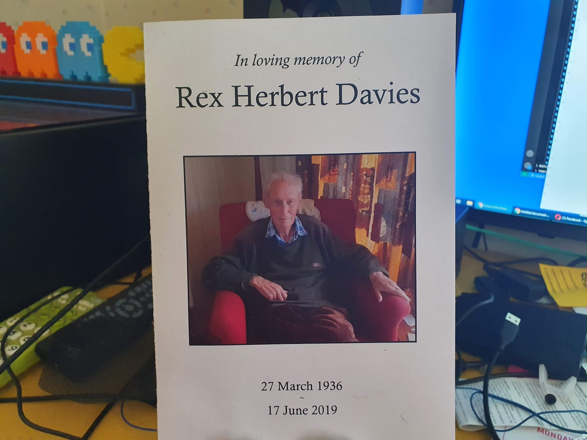
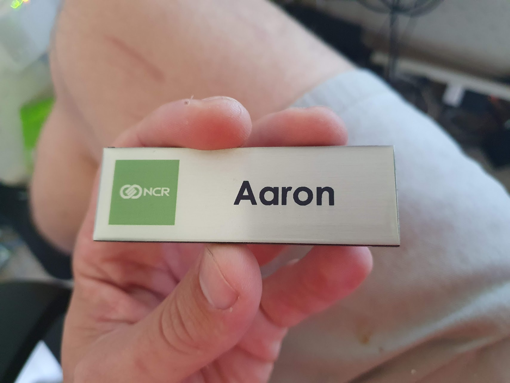

It's an odd dichotomy.

It feels like the status quo of me living on my own, working and maintaining this house has been this way forever, but at the same time it feels so recent that my Dad passed away. It's coming up on two years. Two years! I still find myself wanting to talk to him about everything. I see stuff at the supermarket and still, instinctively, ask myself if I should get it for him.

_It still feels like very recent history._

It still hurts when I dwell on it, but in a way I'm glad it does. It means I still remember everything about him so well, and I hope I always do. Sometimes people tell me how proud my dad would be of me, with my work and how I've pushed on with life. But the most important thing to me is hoping my Dad knew just how proud I was of him.

And Work? My job sure is something! Some days it can be extremely long, leaving at 7am and getting home at 10pm. It's tough, but I don't mind hard work, especially when I don't have much else to do.

I'm a Field Engineer! I drive around the wider area fixing things that are broken. It's impossible to plan out a day. If something is broken? I have as little as four hours to get to the machine and fix it, no matter what the fault might be. Sometimes it feels like I'm being stretched in 10 different directions, really struggling to hit targets.

I drive all over the wider area, some days racking up more than 500 kilometers of driving. When you've got the field service management team barking at you to get to three different urgent jobs ASAP that are two hours of driving from each other, I do sometimes feel like I'm going to be torn apart!

_It's a real job! I have a name badge._

But it's a good job. I feel very fortunate that I was able to get it. I started the job by being thrown in the deep end, and through much stress and struggle I learned to swim. I'm proud of what I do, and always do the best work I can. I know I've still got a lot to learn, but I'm getting there. It's always a goal to get a job you enjoy and are good at, and I think this is the closest I'll ever get to that.

Right now, long and exhausting days at work are a helpful distraction from other, more heartbreaking things in life.

I met the love of my life. It hasn't gone too well. We dove into buying a "renovators delight" house together way too early in our relationship, and the stress and tension that came from that was too much.

_Memories are made of art._

Sad is an apt word to use, but it's also extremely… frustrating. I was in a loving, affectionate relationship with the only person I've ever met that I would want to spend the rest of my life with.  My list of regrets is huge. I would give anything to have a time machine to travel back to make better decisions and hope that it would lead to me being a better partner. In the stress of everything, I did and said things that hurt her.

#### **[And I will stumble and fall. I'm still learning to love, just starting to crawl.](https://www.youtube.com/watch?v=-2U0Ivkn2Ds)**

We split up over a month ago, and I sold her my half of the house at cost. I still care about her. If I could have any superpower, any magic spell or any wish, I would want for me to be exactly what she wants and needs. Right now I just need to have patience and give her space.

For now? I'm in a holding pattern. Being hopeful and taking one day at a time. Let's see where this ongoing battle between hope and despair we all call “Life” takes me.
