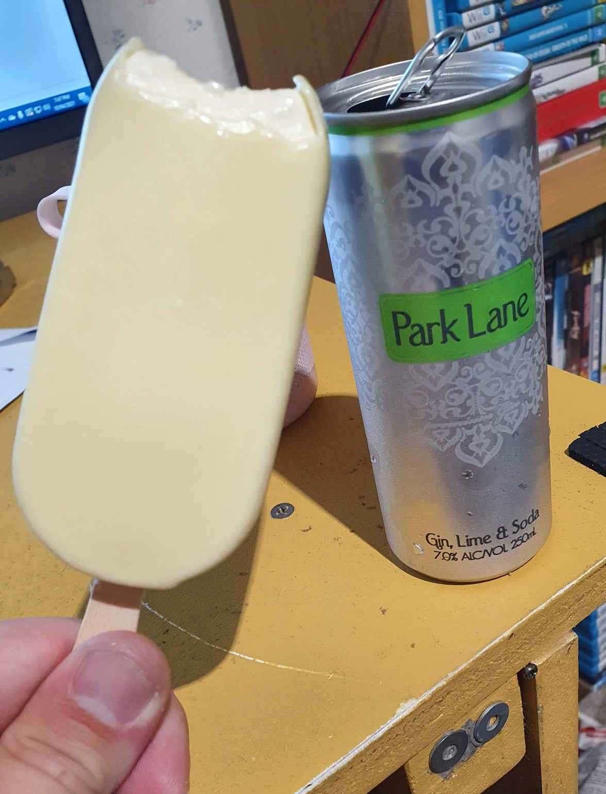

I’m good!

I can’t really complain, as much as I want to.

Last time I was emotionally distraught was when my father passed, and just like last time I’m getting by with a little help from my friends. Gin and Ice Cream also help.

_I regretted this combination._

I’m such a juvenile. I had such a sheltered upbringing, and for many years of my life I didn’t really get out much. When you’re a full time caregiver, living with your elderly dad? Social life takes a back seat. I didn’t complain, I’m hardly a social animal.

But now that leads to here. Kids these days have probably had their heart broken a handful of times before they start to drive! Here I am north of 30 dealing with this for the first time. I just need to grow up.

(I’m not old! Just getting that way.)

Yes, it’s hard! It’s painful, stressful, depressing, sad, full of regret, anxiety ridden and many other things.

And that’s OK. Life is about calculated risks, and this is the consequence of that. Fortune favours the bold! Things that you think happen for the worst are sometimes just making room for the best to happen (Thanks, Jackie!). When you’re in the deepest pit of despair it seems impossible that things will get better and you’ll feel good again, but that’s just illogical. My worst could always be worse, and my normal is better than many peoples.

I think I’ll always miss what I had, just because it was so…. Perfect. For a while there it really was the dream. But maybe that can be fuel to motivate me to strive towards something even better. Is that even possible? I don’t know, but I’ll find out.

I hate it when a plan doesn't come together. I hate the responsibility of making decisions, but I get really uncomfortable when I’ve got no idea what is going on. I like to be aware of my surroundings. Renovating a house? It’s full of surprises! Nothing goes to plan, and to succeed you have to adapt. I wasn’t prepared for that. I find it tough with work too. Sometimes I have a good idea of how my day will go, but then I get swamped with a heap of remedial calls that changes everything I had planned.

Being more dynamic and adapting to changes rapidly is a skill I’m slowly getting better at.

I’m really getting out of shape. While I was a caregiver for my dad I put a huge amount of effort into exercise. I would run once a day and would watch what I eat. These days I’m working a lot, and often eat when I’m out and about. It’s not good! Lately I’ve just been skipping meals altogether. I just can’t summon the motivation to eat. It doesn’t help - when I do finally eat it’s normally something horrid. I’ll work on it.

Next week I’m off to Auckland for work. I’m looking forward to it. Day to day I never see any colleagues, it’s just me out there on my own getting stuff done. When I was up there last year I got to know a lot of the staff that work out of the head office. It’ll be good to catch up with them.

Onward and Upward. To the future.
