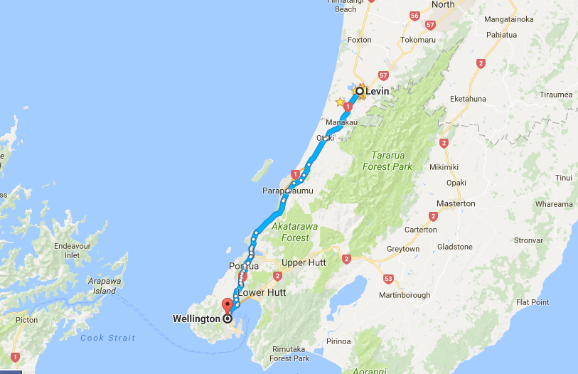
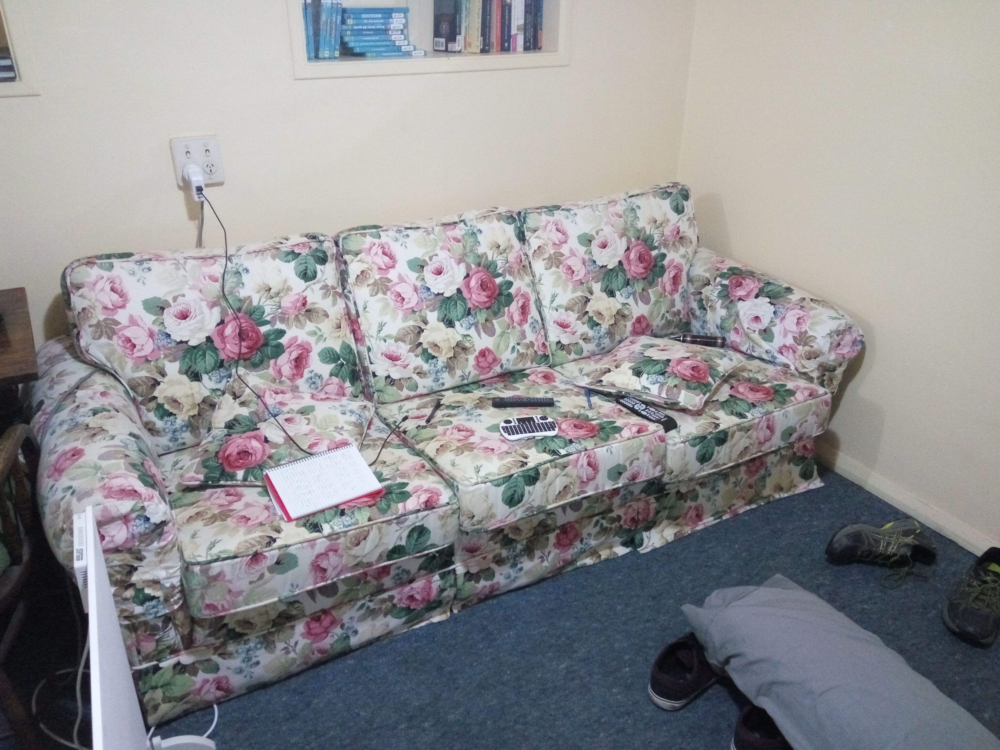
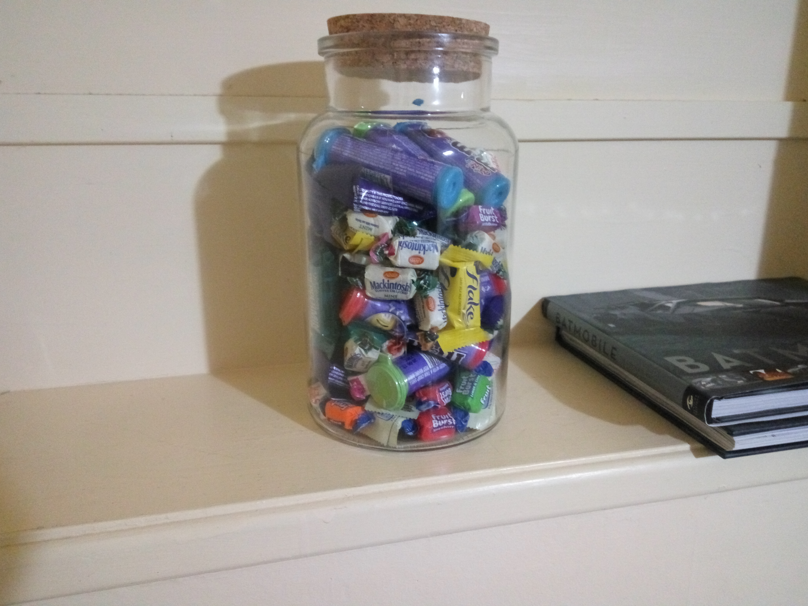

Well, my life has changed.

Last Saturday I lifted up my entire life, moved away from small town New Zealand to live in the capital city Wellington.

_It feels further!_

I felt like life and action was just melting away on me. Being full time in a small town largely full of elderly and retired people when turning 30 can be a dangerous catalyst for rampant depression. Trust me on that one!

I found a place to rent. It's a very small one bedroom flat/condo. It's nothing amazing, but still comfortable. A bonus is that it came with a really comfortable double bed and a giant couch with a charming retro floral pattern.

_The best of 1979._

I took the big move without any employment. Yep, I'm paying way more in living costs now but have no income. Don't tell my landlord. I'm assured by people that my fancy qualification will mean I shouldn't have too much issue finding work. Because the government is based out of this city there is somewhat of a demand for Information Technology roles. That's what people say, at least.

I opted to get a place all of my own. I don't really mind having flat mates, but didn't want to dive in with a bunch of randoms.

I don't know what I was expecting, perhaps just for things to be a better?

Wow it's lonely. It's nice to have my own place and the freedom that comes with it, but I now understand how people develop cabin fever.

I have a few things lined up employment wise. Contacts are helping me out there, I'm writing this on Monday night so the hope is these prospects will blossom over the rest of the week. But nothing yet. My savings drop and my anxiety increases while I wait.

I thought I had friends or something close to that here. But given my age most of my peers already have well established social circles and aren't really wanting new members. I'm almost tempted to join a lacrosse team.

Oh and I screwed up too.

I do have a really sweet candy jar plus Mario Kart 8. I picked up an ex-repair 40 inch TV very cheap too. I'll consider myself established once I have two or three people around for some sugar fueled MK action. Mature adults do that stuff, right?

_Everyone needs candy._

Oh, I typed this on a laptop with a keyboard missing the J key. Every time I need that letter I have to bring up an on screen keyboard and insert it that way. I'm trying to avoid that as much as possible, was it noticeable?
