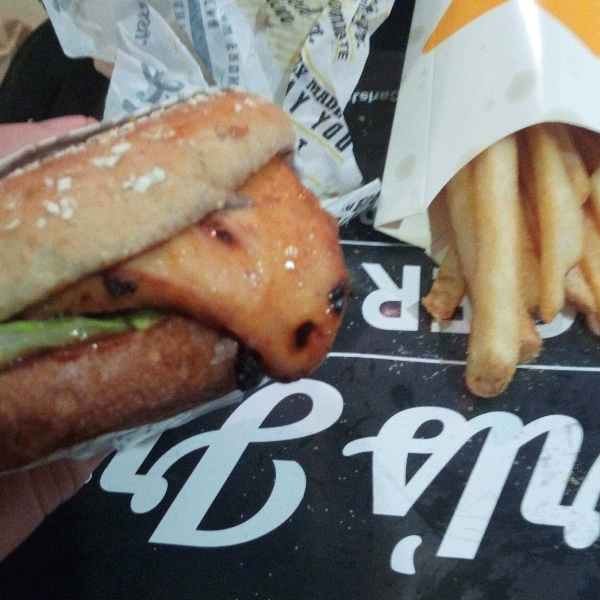

So, I had a fun night.

I was up in a nearby city rather late last night. I had to hurry home – my father is on some rather strong pain killers that can make him go a bit wonky before bed time.

I was hungry. It was about 9:30 pm and I hadn't eaten anything substantial that day except a milkshake. I opted for something different - I went to the famous [Carl's Jr fast food restaurant](http://www.carlsjr.co.nz/). There isn't a Carl's Jr near where I live so I very rarely have it, while I was nearby I thought I'd dive in.

I went a little over the top and got a large chargrilled BBQ Chicken Sandwich combo. It was nice! The burger could have been a bit warmer, but I really liked the rather chunky fries. I didn't have a huge amount of time to eat as I had to get home, so I got it all down fairly fast. After I was done I jumped in my car and started the 40 minute drive home.

_I was so excited, I even took a snap!_

Ugh. After about five minutes I started to feel rather unwell. My gut was squealing, I was nauseous and my head started to throb.

I kept driving, trying to move my head as little as possible. It got worse. My insides started to feel like a volcano about to burst and my head felt like it was being crushed by a bus. Driving became a challenge.

About five minutes away from home, it happened. I thought I was holding it down OK, but without any warning I vomited all over the dash, steering wheel, my pants and the floor. It happened so fast, I started to pull over but then just figured I might as well continue home while sitting in my own sick.

I got through the front door and managed to get all my clothes into the washing machine without getting any mess over the carpet. I then had a fun time sitting on the floor with a bucket for the next hour, hurling multiple times until every bit of that large BBQ Chicken Sandwich was out of me.

Once I was fairly sure I'd finished with the vomiting, I took a higher than recommended amount of Paracetamol and Ibuprofen then sat in a hot bath full of bubbles until I started to feel a bit normal again.

But this morning I woke up feeling fine, like the whole thing never happened. Plus I don't have to digest all that high fat and salt food!

So, the lesson from this? Avoid lukewarm chicken! Especially from anyone whose father is named Carl.

Got experience with hurling after chicken? Empathise with me - [@aaronights](http://twitter.com/aaronights).
