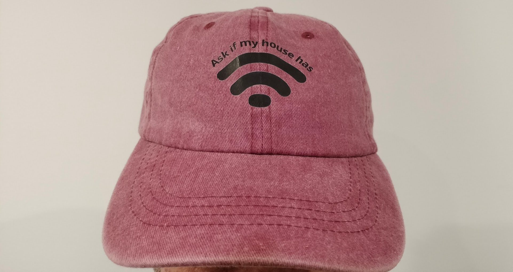
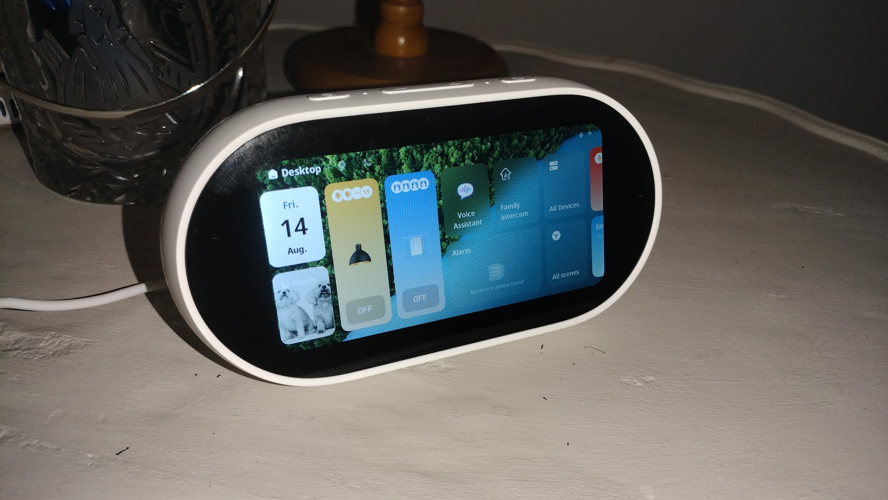
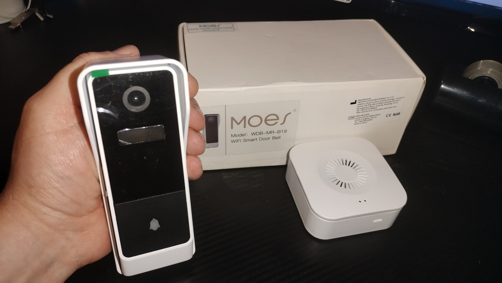

Well, after all that hype and waiting, I can confirm we didn’t win the Master Builders Smart Home Lifestyle Award. What a weak sauce outcome. And yes — I owe my wife an apology for being a grumpy bastard all week. Still, very thankful to the Jennian Manawatu team for both doing this smart home with me and entering it into the competition.

Judging happened months ago, and it was obvious from the first minute that the technical side of the smart home went sailing over the judges heads like a satellite. They might be great builders and architects, but when one of them said, _“So, your house has Wi‑Fi?”_ I realised I was dealing with people whose understanding of smart homes begins and ends with plugging in a router.

That irritated me so much that my wife printed it on a hat.

Smart homes aren’t built with hammers — they’re built with digital networking, APIs, automation logic, and systems engineering. Beamforming, wireless protocol behaviour, interference management — none of that is in a builder’s comfort zone, but it’s absolutely essential when you’ve got 105 devices chattering away nonstop. I got the impression that smart features were not getting much scrutiny at all.

The hardest part of this project wasn’t installation — it was the obsessive research. Digging through platforms, protocols, and hardware to build something that actually works together. People with no experience think you just buy “smart home stuff” and it magically cooperates. It doesn’t. Making a cohesive, reliable system is a slog, and I think they had no clue.

And honestly, I should’ve gone nuclear. I should’ve pinned those judges in a corner and force‑fed them every technical detail until their eyes glazed over. I had scripts, demos, even a whole segment where the smart home introduced itself. I used maybe a third of what I prepared. The judging criteria made it sound like they’d be experts — instead I got two people who looked like they’d never seen a VLAN in their lives.

After the results came through [I put together this report of the smart home.](https://aarond.me/140820206_SmartHomeReport.pdf) Give it a read! I specifically wrote it with the publicly available [House of the Year Lifestyle Awards judging criteria](https://www.masterbuilder.org.nz/assets/publicdocs/HOY_2026_Judging_Criteria_Lifestyle_Awards.pdf) in mind. I don't think I could have done anything more! I should have had this prepared before and given it to the judges.

I’d love to tear apart the $4‑million house that won. Word is it was a nightmare to get working, and they basically admitted that in their acceptance speech. I’d bet anything they’re juggling a dozen apps, everything’s cloud‑dependent, and the whole system is about as reliable as a wet paper bag. I mean, I don’t know for sure! But I think mine is clearly better. But I’m likely biassed there.

Yes, I’m still bitter. I spent a lot on trousers for that black‑tie event!

In other news, I’ve added more smart home gear to the house — because of course I have. MOES, easily the most common brand of things in my smart home setup, just released something they are calling an [AI Desktop Hub](https://moeshouse.com/products/moes-tuya-ai-desktop-center-control-panel-alexa-built-in-with-zigbee-ble-hub/). It’s a fresh form factor running the same operating system as the smart panels I’ve already got around the place. You can control the entire smart home through Alexa voice commands, the touchscreen, or the shortcut buttons on the side.

_My photography isn't good - it looks fantastic in person!_

Those shortcut buttons are genuinely great. I’ve set one so a quick tap on the side of the unit instantly brings up the driveway camera feed — perfect for checking whether visitors or couriers are arriving.

Two things really stand out: the screen and the speakers.

The display is bright, sharp, and miles better than the smart panels. It’s not huge, but the clarity makes it easy to navigate and fantastic for photos. And the speakers? Surprisingly impressive. You can use Alexa for Spotify or run it as a Bluetooth speaker, and because the unit has some depth, it actually produces decent bass. Amazon hasn’t released new Alexa hardware in years, but this thing more than fills the gap.

MOES also sent me another device — and I’m sensing a...

### Giveaway!

It’s a smart video doorbell. Mount it on your front door, and when someone presses the button you get an alert on your phone. Perfect for courier deliveries when you’re not home — you can talk to them through the two‑way audio and tell them to leave the package safely. It also records motion, so it doubles as a security camera. Plus it comes with a wireless indoor chime you can place anywhere in the house.

_Win this! Be excited!_

It’s completely wireless. As long as your front door gets Wi‑Fi, you’re set. It has a built-in battery, no wiring required, and it’s large enough that you’ll probably only need to recharge it once a year.

You’ll love it - and I've got one to give away! Huge thanks to MOES for sending it over. If you want to win it, just comment on my Facebook page! Any comment will do. If you’re local, I’ll even come install it for you. Please enter! Doing a free giveaway that only one person enters is highly embarrassing.
