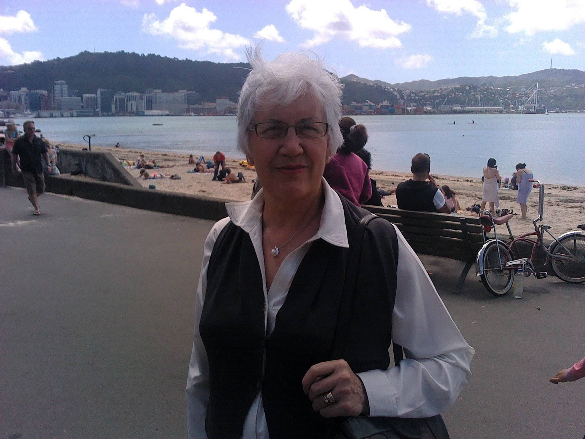
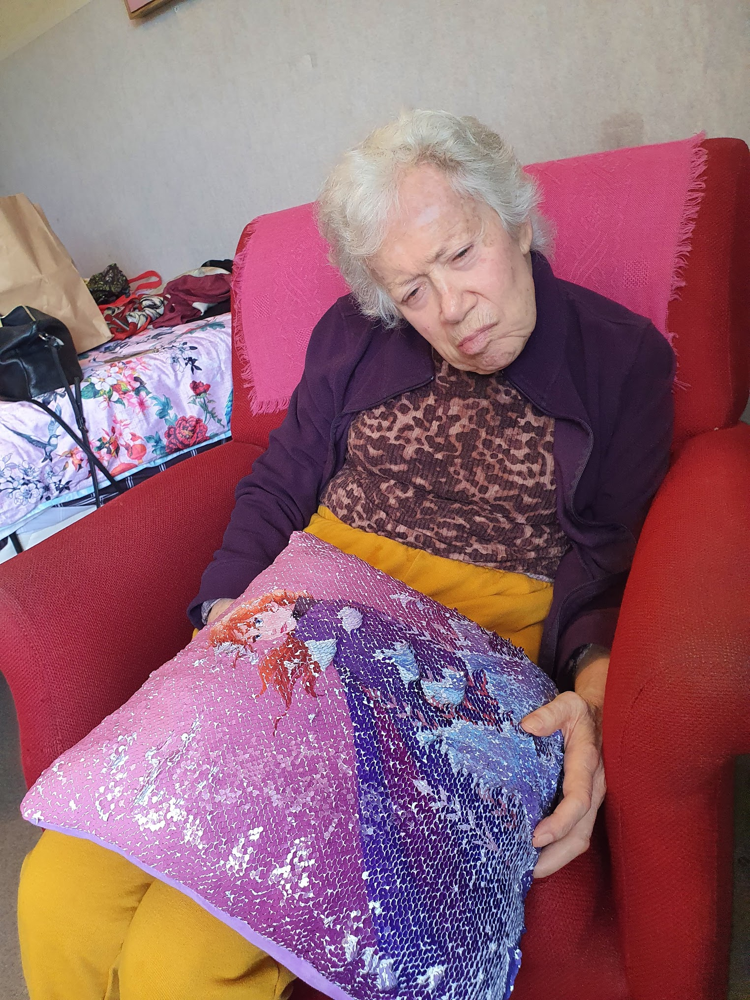

Well, that was one hell of a week. My work days were long hours, but it was, frustratingly, a lot of waiting around. Oddly, I'd rather be working hard for 14 hours than trying to sort out scheduling and logistics.

I'm at peace with taking on long hours for now. My boss's boss phoned me up when it reached him through the grapevine that I was doing crazy hours. I'm waiting to hear back, but I'm hoping I can come out of it with something like a week on week off schedule for on call after hours work.

And hey! It's not like I have anything better to do with my time, so I might as well be out there raking in the cash. #SingleLife. Maybe that'll change sometime, but God only knows when.

Here in New Zealand today is Mother's day (Did you know in Norway it's in February? Scandinavia is crazy!). All the well wishes and celebrations being shared about on social media have got me thinking about something I haven't really brought up here before - my mother.

_About 12 years ago. Wellington bays!_

Many years ago, she was an awesome mother. I was fortunate enough to have her around a lot, as she took up the role of a stay at home mum. It was great for me, she was always around and always supportive. She had a lot of health conditions that drained her of energy during most of my youth, but she still pushed hard to doing everything she could for me and my sister.

I went through a rough ordeal coming to terms with my… uniqueness in my late teenage years. I worked hard to push through my autism and social anxiety, and every single step of the way my mother was there. She provided me with the support and reassurance that I needed, coming to every appointment and being extremely patient with me. There's a good chance that, without her support, I'd still be the wreck I was, rather than the semi-functional human being I am today.

About 15 years ago my mother started to deteriorate with Alzhimers disease. It was very gradual at first, often something my Dad and I would laugh at. She just did and said weird stuff!

We kept on top of it, even when it started to get worse. I was studying at the time, so my Dad was at home with her, keeping an eye on things during the day. I remember she started to want to go to bed at about 6pm in the winter -  I don't have an issue with people going to bed that early, but it'd mean she'd be up in the middle of the night, and one of us would need to be up with her.

My Dad and I worked so hard. Near the end it was constant and round the clock. I'd sit on the floor all night, sometimes getting an uncomfortable sleep but making sure I'd wake up if she got out of bed. It was exhausting for both of us, and with my Dad's health not being so great we just couldn't go on. We had to place mum into specialised dementia care.

My mother hated us for doing that. She still had just enough marbles to know what was going on, and her emotions ranged from extremely sad to angry at the idea that we were making her leave her home. For about the first year, every time we visited her, she thought we were there to take her home to live. It was so hard, and I know my Dad struggled with that too.

For the first few years we visited every day, with only the rare exception. Sometimes we'd take her out in the car. On one of the last times we did that, she got extremely uneasy. She didn't want to be in the car, and tried to open the door and reach over for the steering wheel. She was confused, and thought that something bad was happening. I had to restrain her in the back seat with quite a lot of force, while my Dad sped back to the rest home.

We didn't dare take her out after that, it was just too much of a risk. We couldn't handle her.

_My mother today._

Her deterioration continued, and is still ongoing. Mentally she has completely gone now. She has no perception of what's going on around her, and very little means to communicate with anyone. She spends her days in the dementia ward at her rest home just existing, and nothing more. She can barely walk without assistance, but is still often restless. The nurses and staff that look after her do a remarkable job, and I thank them greatly.

It's tough. The strongest memories I have of my mother are from well into her path of deterioration. I remember the struggles my Dad and I had dealing with her, more than I remember the good times when I was younger. It was such a relief when she went into care that I wasn't really aware that it was the end of my mother in the way that she used to be. I never got to mourn the loss.

I admire mothers. I love being around my nephew when he calls out to his mum. He loves his mum, and she does an excellent job being a mother. In my past relationship it was really nice to be around a family unit again, and I appreciate being made to feel so welcome.

The lesson here? Mums are awesome. Don't take your mother for granted. Appreciate her while you still can.
