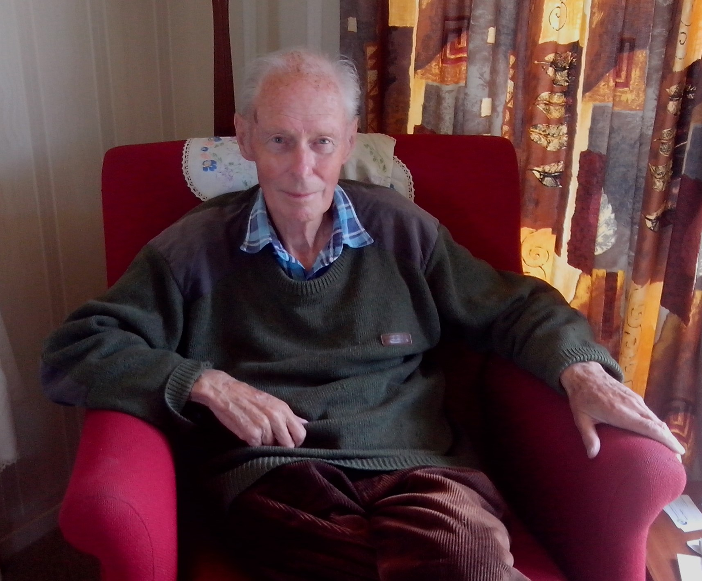

The past few weeks have been difficult.

Right now I'm in a hospital grade rest home in my hometown. Next to me is my Dad, sleeping in his bed. He looks so weak and frail. He hasn't been able to speak or even seem at all aware for a few days now.

About a month ago he started to go downhill. He was a bit wonky, being exhausted and disoriented far more than usual. At one point he ended up being  rushed off to hospital in the ambulance. During a two week stay in hospital he was put on a course of powerful intravenous antibiotics.

Unfortunately the antibiotics didn't work. The infection had started in his lungs, something he has always had trouble with. During his working years he worked with very strong glues and solvents, and back in those days health and safety around chemicals wasn't considered to be an issue at all. Now the infection has spread to his liver and kidneys, and has put a strain on his heart. He's not doing very well at all, and there is nothing that can be done. Recently the hospital sent him back to this local rest home to be more comfortable in a less sterile looking environment.

Dad's on a good dose of morphine. It makes him a little more delirious than he has been, but it takes away all of his obvious discomfort and pain. He fidgets and twitches every so often. When that happens I get the nurses to come and reposition him - he doesn't have the physical strength to roll over by himself these days.

About six years ago I took on the role of full time caregiver for my Dad. He was happy at home, and we got along well. Prior to that both of us were taking care of my mother. She had extreme dementia, and we looked after her until it got to the point where she needed professional care.

For those six years that I was dad's carer, my Dad and I did everything together. Every day we'd figure out something to do: go for a ride in the car, get a milkshake, see what changes were going on in his hometown of 80 years. He enjoyed it, and was kind and very appreciative of everything myself and others did for him. I'd go for a run in a forestry track out the back of our hometown, and he'd wait in the car listening on the car stereo to an SD card I had loaded up with all of his favourite music. When I came back I was always given a run down of all the traffic and other happenings dad saw while he waited for me.

Every time I was away from Dad, I've always felt a little paranoid. I'd phone all the time to make sure everything was well, and to check if dad had learned anything he'd want to share with me. We were a team. He might have needed me for help with mobility and getting things done, but I needed him too - because he was my best friend. Not many people with a 52 year age gap would get along as well as we did.

Growing up, and through my entire life, I have always had everything I needed. Dad worked hard for his whole life, and when my sister and I came along he kept working to ensure we were happy. He would have done anything for us, and I did everything I could for him.

But now there is nothing to be done. No matter how much effort I can put in, it won't help him at all. I reassure him that I'm going to be ok - I don't know if he can understand me, but I know that's something he would worry about. I'm not actually sure I will be ok. I have never been so scared or hurt in my life.

I've booked in to see my GP, after getting a recommendation to seek out grief counselling. It seems selfish to do something like that right now, I'm not the one dying. But I hope it can help.

My Dad was the best. I hope I can keep all the stories he told alive and well. Whenever someone asks me about my Dad, I want to share all his tales and also tell people how he was the best Dad I could have ever wanted.

_The best father I could have ever wanted._

My Dad passed a few hours after I finished writing this. Goodbye Dad. I love you, and will miss you so much.
