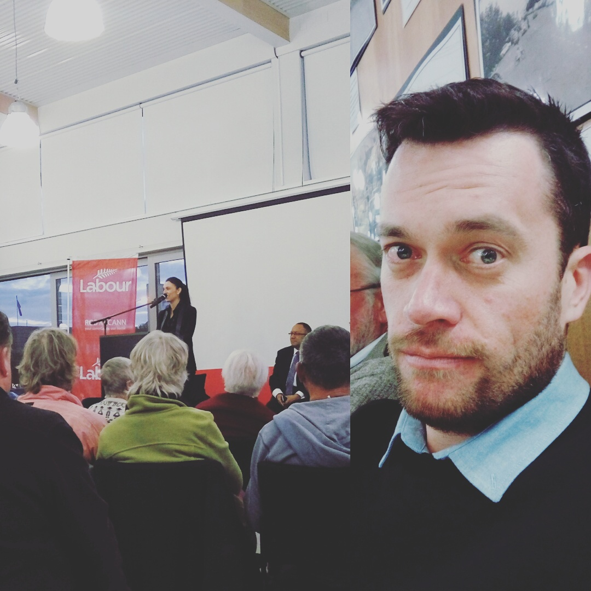
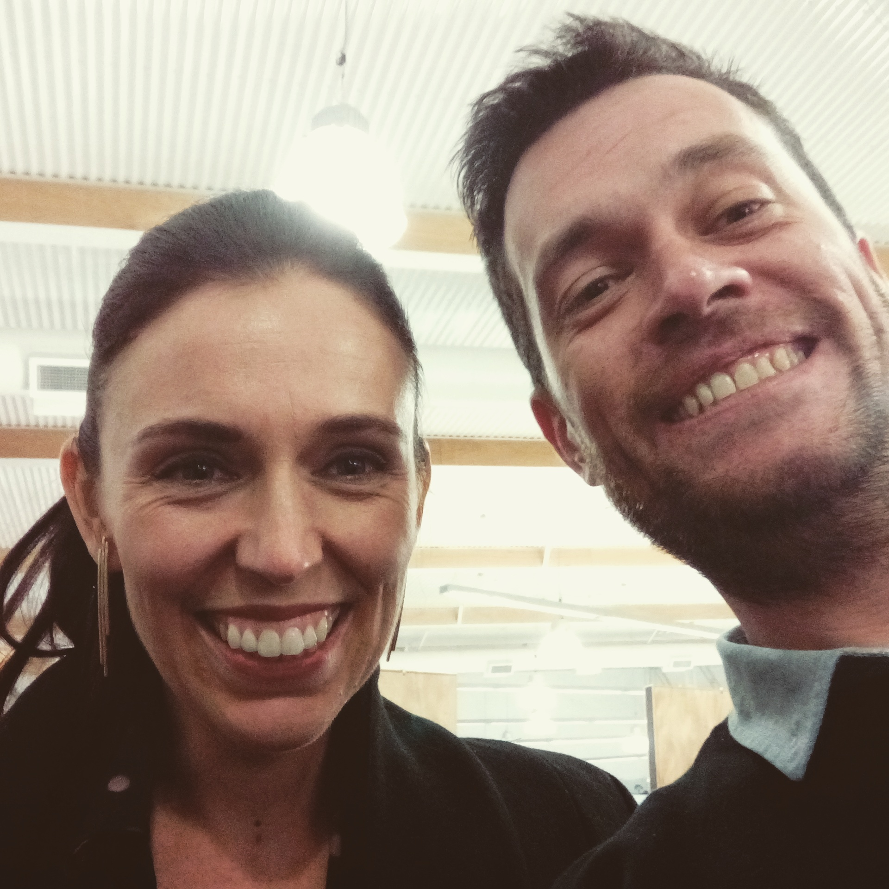

New Zealand doesn't have a political system like the United States. The head of the country isn't someone you vote for directly. Instead you vote for a political party, and the head of a particular party then becomes the countries leader – or Prime Minister.

[There are currently 15 political parties in New Zealand](http://www.elections.org.nz/parties-candidates/registered-political-parties/register-political-parties), but the majority of votes go to the two biggest ones – the [National](https://www.national.org.nz/) and the [Labour](https://nzlabour.nationbuilder.com/) parties. Political terms in this country are three years long, and for the past three terms the National party has been in power. The competing Labour party has been struggling somewhat, only getting 25% of the vote compared to Nationals 47% in [the most recent 2014 election](http://www.elections.org.nz/news-media/new-zealand-2014-general-election-official-results).

The next election is due to be held this September and the Labour party (along with their potential coalition partners in the Green party) has been strongly promoting one key point – The country needs a change of government.

_My enthusiastic face at a political rally._

I had the opportunity to meet with the heads of the Labour party and attend a political rally last week. They spoke very well about how they would move this country forward, and these were some of the key issues raised.

New Zealand is a great country, but we do have some very worrying problems.

Poverty, and [especially child poverty](http://www.childpoverty.co.nz/), is outright unacceptably high by any reasonable rubric.

Mental health is a dangerous headline issue. [We have among the highest rates of suicide in the developed world](https://www.tvnz.co.nz/one-news/new-zealand/new-zealands-high-youth-suicide-rate-highlighted-in-report). The infrastructure and support for people struggling with mental health issues just isn't there! I've had first hand experience with this problem and I find it incredibly scary.

Housing is a problem. The cost of buying a first home is way out of reach for even middle class families with strong full time jobs. Beyond this, many vulnerable and less fortunate people just don't have a place to live. Rent for anything bigger than a closet in a city is absurd. Government owned housing, run by [the Housing New Zealand Corporation](http://www.hnzc.co.nz/), just isn't working. There are families of five living in one bedroom motel rooms just because there are no other options available. There are outright not enough homes in places where they are needed, and nowhere near enough are being built.

There is an attitude in certain circles that people who are unable to find work almost deserve to be treated like trash, and the current government seems to reinforce that stance. Many on an unemployment allowance do not get enough to survive one week to the next. These people are often wildly grouped together as all being lazy drug addicts that are just unwilling to work. Making such sweeping generalisations is dangerous, potentially leading to disgusting things called prejudice and bigotry. A large portion of these people are desperately seeking work! Not only is it not available, but trying to seek out employment while you face a struggle to survive every week is an unreasonable task to expect someone to do.

Taxation is becoming more of an issue that voters are paying attention to. Big corporations are doing elaborate dances to jump through hoops in an effort to minimise the tax they pay. Even Apple, every hipsters favourite company, has [come under scrutiny for the extreme low levels of tax they pay](http://www.nzherald.co.nz/business/news/article.cfm?c_id=3&objectid=11820240). Some companies are using New Zealand as a tax haven, letting money just sit in this country to avoid paying any tax in their home country. These things are very shifty, but still perfectly legal. Now that voters are aware of it they are not happy at all.

And these are just some of the issues.

Unfortunately the Labour party's campaign wasn't getting much traction. Public polls by the media pained a grim picture. They were approaching record lows and the party's leader, Andrew Little, was getting [extremely low numbers in the preferred Prime Minister statistic](http://www.stuff.co.nz/national/politics/90663942/Jacinda-Ardern-leapfrogs-Andrew-Little-in-latest-preferred-prime-minister-poll).

_Some goof and Mr Andrew Little._

So he did what could be considered the ultimate. Less than eight weeks out from the election he stepped aside as the leader of the Labour party. His former deputy, Jacinda Ardern, unanimously got selected by the party as the new leader.

And the crowds went wild.

A female Prime Minister wouldn't be something new. We've had two before! Jacinda Ardern is also relatively young at 37, but even this isn't unprecedented. [Back in the 19th century we had two Prime Ministers in their 30s!](https://teara.govt.nz/en/1966/prime-ministers-of-new-zealand/page-3) That is going back many years, but it still stands as historical fact.

But she is resonating very well with voters, specifically with a demographic that often isn't exploited. Rather than fighting over people that are almost guaranteed to vote, the Labour party has the potential to draw in people that have never voted before. They have the opportunity to bask in a blue ocean, an untapped resource that no one else is pursuing.

But it will be an uphill fight. Starting a campaign from scratch so close to an election is an ambitious task. The party is starting from a huge disadvantage too. As of writing they have 52 days to radically increase their statistics in the polls.

And sadly, after less than 48 hours in the role, the new leader has already faced sexism in the media. In New Zealand it is illegal to ask in a job interview about a candidates plan for having children, but some outlets thought it was a good idea to ask exactly that question to our next potential Prime Minister. Thankfully there was widespread condemnation of that question, even from the current Prime Minister.

But the old saying is that all publicity is good publicity. That really isn't true, but seeing the excitement over the media is invigorating. I personally don't have huge social circles, but the outpouring of support for her has been spectacular and somewhat surprising.

_I'm with her. Wait, that's not a good catch phrase!_

Will she and her party win? I'm not willing to wager on that one. But just based on her attitude and how well spoken she is, I really think she would be an excellent option to head the opposition for the next three years. She would bring the current government to task, fighting them all the way until the next opportunity in 2020. My only hope is that if she doesn't outright win it isn't seen as a failure. If the Labour party manages to increase its representation from the last election it should be seen as a very big win for them.

But only time will tell. Seven weeks can be a very long time in politics. But now, given both the political situation in the United States that is constantly dominating headlines and this new curveball here in New Zealand, I really think more people are paying attention to politics than ever before.

And I count that as a win.
