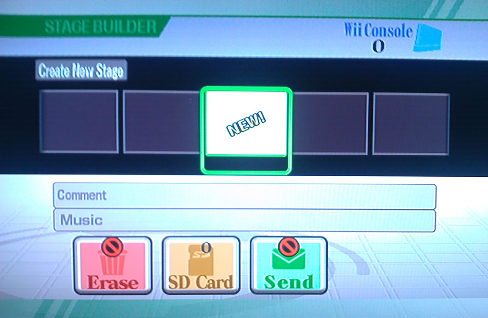
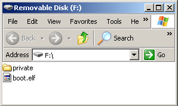
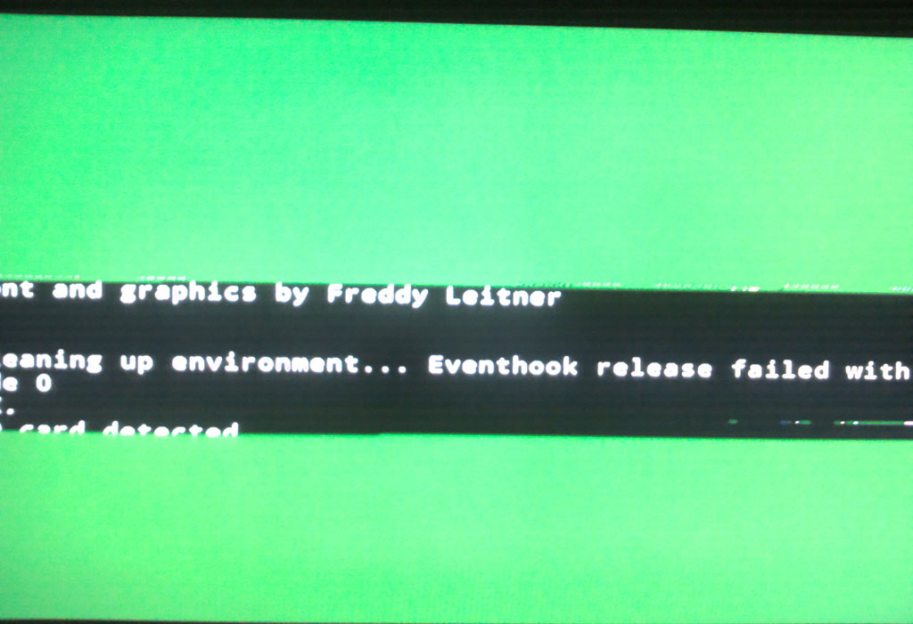
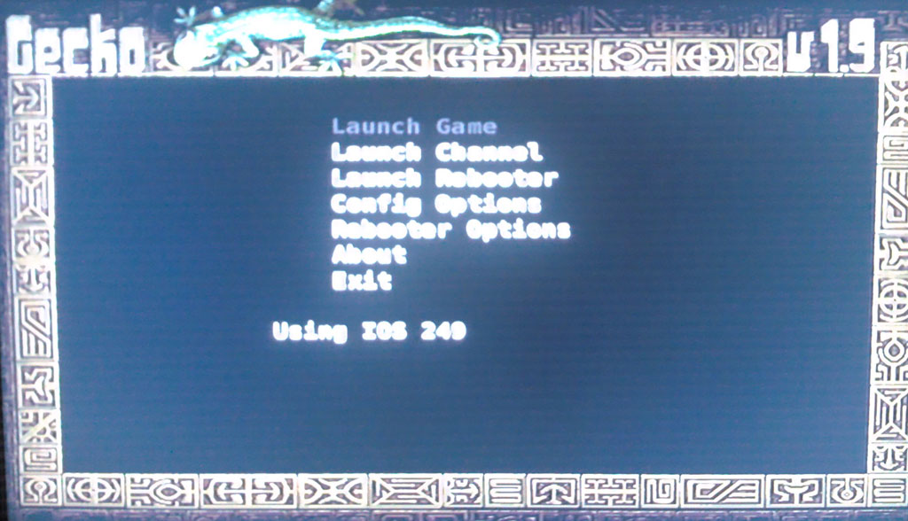

Hi everyone, this is my first blog on MyIGN. I've had an account here on IGN since 2003 and have been a long time lurker. This is a brief article I wrote up about something that I'm sure many people will find interesting. Enjoy! Please leave any comments or questions, I'll get back to them all. Promise!

--

In the recent weeks, [Operation Rainfall](http://au.wii.ign.com/articles/117/1179120p1.html) has shown the power and dedication hard core Nintendo fans have when it comes to games they really, really want. Importing the European version of the big titles of the campaign is something that has been asked about a lot. Unfortunately, doing this encounters an issue that is the bane of many import game fans: region locking. When it comes to this, Nintendo is in a unique position.

Sony does not have region locking on any of its consoles or handhelds. All Playstation 3, Playstation Portable and (supposedly) upcoming Playstation Vita games will be fully region free. It might be a surprise for some people, but Microsoft does not enforce region locking on the Xbox 360. Region locking is an optional parameter that publishers must choose to put on their games, and by far the majority of Xbox 360 titles are region free. For statistical comparison, out of the top 30 IGN rated Xbox 360 titles, only 5 are not region free – 83% of these titles are completely region free\*. While this isn't the most accurate statistic for the entire platform, it shows that region locking is not something that is enforced.

Nintendo is the only current video game console manufacturer to enforce a regional lockout system across all systems and titles.

Unfortunately, this leaves North Americans wanting to play Xenoblade Chronicles this September in a bit of a situation. The game is going to be released in Europe with a complete English translation, but an imported copy of the game will not natively run on a local Wii console.

But there is a way around it, there is a solution. A simple software modification can be done on a Wii to allow all imported games to be fully playable. This guide will show you how to do just that.

Just to be clear: This is not a solution, it is a work around. Imagine if there was a giant, 8 foot wide pot hole in the middle of a street. The solution to this problem would be to fill in the hole and fix the road. This work around guide is more akin to instructions on how to successfully drive around the giant, gaping hole. The true solution to this problem would be for the Operation Rainfall titles to be fully localised and released in North America.

Before we start, a few points.

* This mod will NOT permanently modify your Wii
* This mod will NOT invalidate the warranty on your Wii
* This mod will NOT directly ‘brick' your Wii.

The mod won't brick your Wii directly. There is an extremely slim  chance that anything you run on your Wii, including standard games, could cause a random error that might disable your Wii. This mod is no different. This mod is designed to be very safe. It is a temporary mod, it will not permanently change your Wii in any way. Simply resetting your console will fully remove the mod from your system along with any traces that it ever existed. It will not affect your ability to play standard games, buy WiiWare games or play online.

While this mod is very safe, still proceed at your own caution. IGN or I will not be liable if something goes disastrously wrong (even if there is almost no chance of that happening.)

The mod described in this guide uses the SmashStack exploit to load GeckoOS. There are definitely alternative mods to make a Wii play out of region games, but I consider this to be the easiest and safest method.

### Modding your Wii to play Imports

The tools you will need are:

* An SD Card
* A copy of Super Smash Bros. Brawl for Wii

The first step of this mod is the most difficult part – you must delete all custom built stages from Super Smash Bros Brawl. Sadly, this must be done in order for the mod to work. Make sure you have no custom stages in either your Wii's system memory or on your SD card. Just load up Brawl and delete them all one at a time. If you're really eager to keep that replica of N64 Saffron City, you can put your custom levels on a separate SD card.

_No Custom stages can be on your Wii or SD Card_

Now the hard part is over. [Download this file.](http://homepages.ihug.co.nz/~aaronights/SmashstackandGeckoOS.zip) It's a zip folder containing all the necessary files to mod your Wii.

Now copy the _entire_ contents of it to your SD card. This should result in a file named ‘boot.elf' and a folder named ‘private' on the root of your SD card.

_The contents of your SD card should look like this_

Put the SD card into your Wii and load up Super Smash Bros Brawl. Go to the Stage Builder option. The mod should immediately start running. You should see a big block of text pop up on the screen. If it turns green and garbled, do not worry. Simply wait and the mod will initialise.

_Don't be alarmed - this is normal_

You have loaded the GeckoOS application onto your Wii. GeckoOS is a homebrew app designed to allow games from any region to run on a Wii.

Now eject Super Smash Bros Brawl from your Wii and insert your imported game of choice. (Xenoblade, if you're reading this  late August)

You should see a menu on screen. Press A on the Wii remote to select the ‘Launch Game' option. You should now be successfully playing your imported game.

_Insert your imported game and press A on this menu to load it_

To summarise the whole procedure:

1. Delete all custom stages in Smash Bros Brawl
2. Copy the contents of [this folder](http://homepages.ihug.co.nz/~aaronights/SmashstackandGeckoOS.zip) to your SD card
3. Put the SD card in your Wii and load up Smash Bros
4. Go to the Stage Builder
5. Put your imported game in your Wii and press A

Because this is a temporary mod, every time you want to play an imported game you must do steps 4 and 5 again. This ensures that no trace of the mod if left on your console; it's the files on the SD card that is doing all the work.

And there we go! Enjoy Xenoblade and all the other import games that you want. This mod also allows a Wii to play imported GameCube games, so IGN editor  [Sam Claiborn](http://people.ign.com/Samuel-IGN) could use this to finally play Doshin the Giant.  This particular mod will be almost impossible for Nintendo to block. The Wii doesn't have the capability to have title updates for specific games. Remember the Guitar Hero 3 mono sound glitch? The Metroid: Other M game breaking save bug? None of these things were fixed with a patch, so it makes it very difficult for this mod to be disabled. Please send all your thanks to the homebrew developers of [Smash Stack](http://wiibrew.org/wiki/Smash_Stack) and [Gecko OS](http://wiibrew.org/wiki/Gecko_os) for making this mod possible. It is difficult to locate a homepage for these mods, but I recommend keeping up to date on them at the [WiiBrew Wiki](http://wiibrew.org/wiki/Main_Page).

_ \* Grand Theft Auto 4, Rock Band, BlazBlue: Calamity Trigger, Forza 3 and The Elder Scrolls IV: Oblivion are region locked on Xbox 360. For comparison, Bioshock, Red Dead Redemption, Mass Effect 2, Fallout 3, Modern Warfare 2, Portal 2, NBA 2K11, Halo Reach, Halo 3, The Orange Box, Gears of War 2, Bayonetta, Mass Effect, Gears of War, Call of Duty 4, Batman Arkham Asylum, Rainbow Six: Vegas, Prince of Persia, Splinter Cell Conviction, Street Fighter IV, Ghost Recon Advanced Warfighter, Call of Duty: World at War, Assassins Creed 2, Grand Theft Auto: Episodes from Liberty City and Bioshock 2 are all completely region free._
