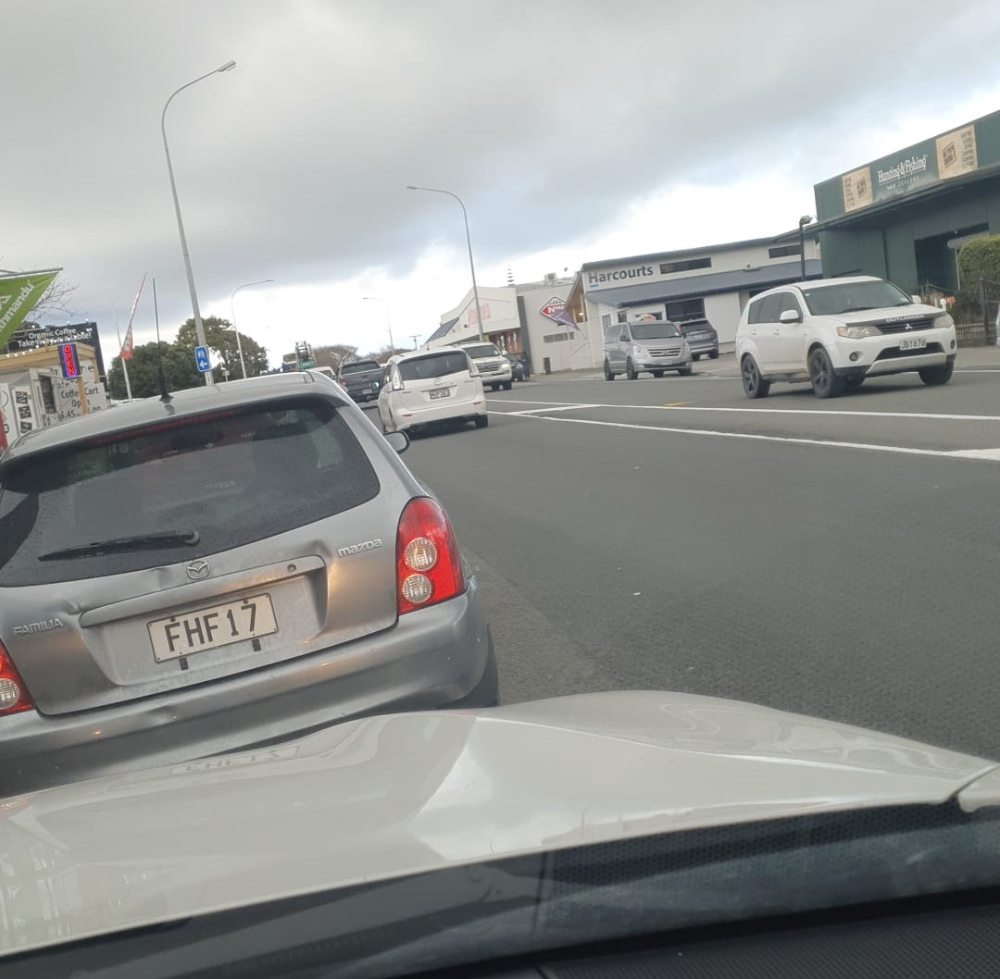
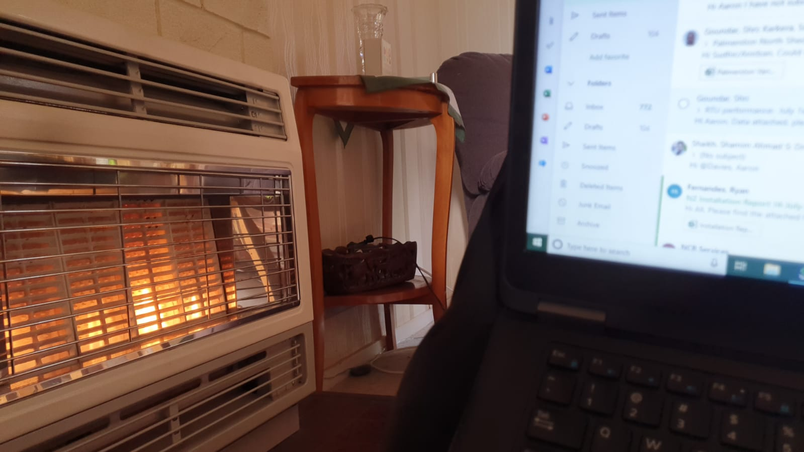

Well, that was fun. I got up bright and early for a job in sunny (cold) Otaki. I was sitting in the car for 20 minutes, waiting for my security escort to show up before I went to my phone to figure out why it was so late.

_Not pictured: The cold and the wind._

The job had been delayed from 9am till midday. My work phone is appalling with notifications, and I didn't get the email that morning telling me about the delay.

Oh well, live and learn.

It's very cold. When I've been matching on Tinder somehow I always end up bringing up the weather. Yep, impressing girls with my slick and sexy weather banter! It's just… the weather is something I know we have in common. No one likes the cold! Well, maybe crazy ice queens. Do I want to date a crazy ice queen?!

Sure!

If anyone has advice on that whole conversation front, bring it! I'd be open to anything. Sometimes the conversation is just the best! It's fun and it flows like butter on a hot grill. I don't know, maybe when it's difficult to get things rolling it's a clear and present sign that stuff just won't go anywhere.

I went back home to catch up on what I will call office work. Office work for me involves being frustrated with the worst part of my job - logistics. Getting parts, job details and stock status is a never ending fight. Sometimes I think this company is held together with string and staples given how some of this behind the scenes stuff is.

_Home office._

I hate it when work is slow. I like working hard! The satisfaction of doing a good job is something I'm riding high on these days. Yep! Diving headfirst into work. First it was to distract from soul crushing regret and heartbreak, now it's just… to distract from nothing? Hey! Focusing on nothing isn't very fun.
