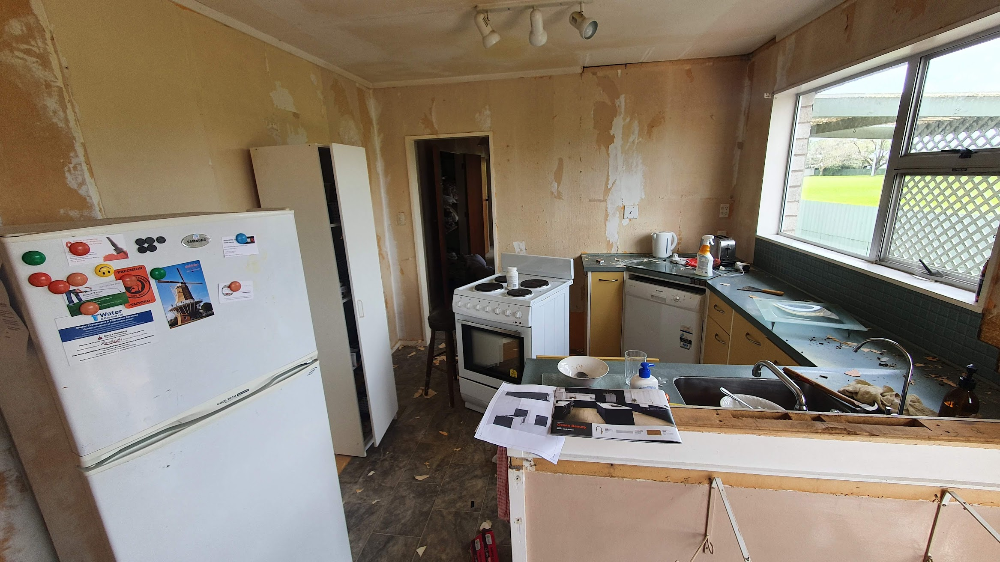
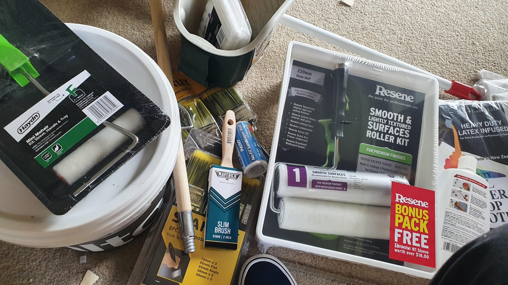

Design skills? I have none.

I'm trying to be less indecisive in life - trusting my gut and own judgement. I usually nag friends and others around me for advice on every little thing, but I'm now striving to be more independent.

But not for all the design choices going on here! That's one area I absolutely rely on an awesome friend.

Thanks so much, Jaymie! You have so much style, and without your help I know my house would be an ocean of clashing colours and impractical layouts.

Plans are getting locked in!

I've got an awesome wallpaperer locked in, I'm seeing a highly recommended flooring guy early next week, and hopefully maybe potentially I have a plumber. But I'm doing what I can on my own, and it's a lot of work!

Demolishing stuff brings a lot of joy. I've started smashing out the old junk in the kitchen to make way for the wallpaper. A whole set of hanging cupboards and the pantry are all gone, and the greasy wallpaper behind it has been scraped away. After I’ve put stuff back in order, the next step is more sanding and painting.

_It's a bomb site._

If anyone wants to come and paint ceilings, skirting boards and throwing stuff in a skip this weekend, give me a buzz! Beer, food and appreciation will be provided. I'm taking this Friday off work just so I can #getshitdone. I'm sure it'll be a fun time, right here in Levin!

_Do NOT buy cheapo paint brushes. Holy crap, they cause so much pain._

It has been a rough time lately. For over a decade I’ve been on medication for anxiety and, well, my mood. But recently? I wasn't coping, stuff was just getting to me, I was oozing with anxiety and wild depression. I saw a local GP, and we opted to change up what I’m taking.

It didn't go well. I really hit an all time low in just how bad I was feeling. This hit me just as this renovation got intense, and other stuff in my life was coming back into view. It took a lot of willpower just to keep up with work!

Oh, and my face was breaking out wildly. Gross, I know.

I started to look for other reasons why I’d be feeling like this. Did I actually hate my job? Did I need 12 hours of sleep every night? Was the dread of loneliness and mortality finally becoming apparent to me?!

Nah, just a change in medication. I’ve spoken with the nurse, and we changed stuff up a bit. Now I’m much more lively, spritely and happy. Back to normal? I don’t know what normal is anymore.

But maybe I don’t want to. With how stylish and amazing my house will look, I’ll be hitting a new and better normal!

I’m off tonight, going to Brew Union in Palmerston North. See, I made a bet with my epic designer and she won massively - I think she has a time machine or ability to predict the future somehow. Unfortunately, you humble readers will never know the details of that bet. It’s… of a personal nature. I’ll just say that! Speculate away.
