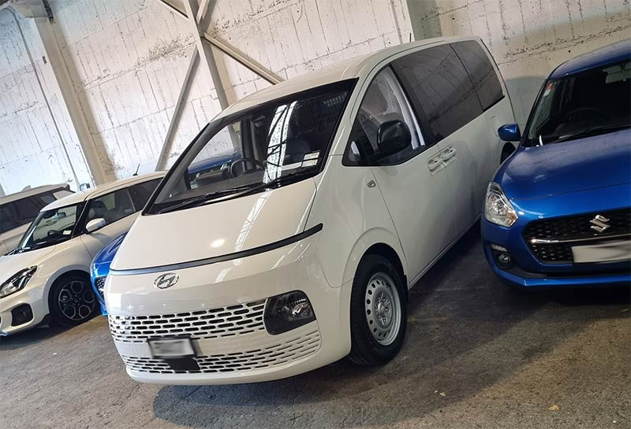
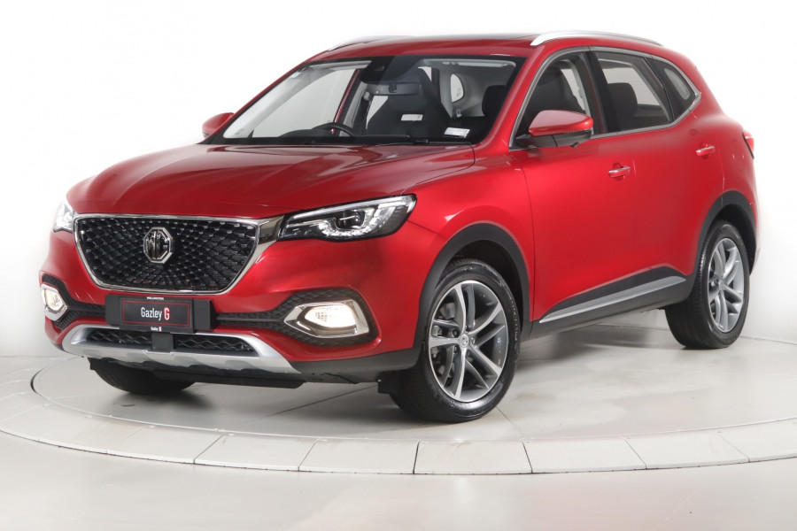

We are looking at cars! The 2011 Prius we have goes great, but it’s very old and well travelled. Rather than wait until it dies, we are doing the looking and investigating now. It's not urgent at this point, but it's good to know what's out there before it does become urgent.

I still have to drive a giant van that looks like a Spaceship for my work, but there isn’t anything I can do about that.

_My Giant loud Diesel Spaceship Van. I spend a lot of time in this thing!_

Electric Vehicles are here, and now there is even a good selection of used models. It’d be great to be able to charge up on sunshine from our house’s solar roof and have a clean running machine! But, rightly so, we have a bit of range anxiety with a full EV. Some days it'd be fine, but with the travel distances involved with Rachel’s work it just wouldn't be at all viable.

So, maybe the solution is half way in between. A hybrid approach.
Hybrid time.
Broadly, there are two types of hybrids:

* A Standard Hybrid has a small battery that is charged from the car's petrol motor and from regenerative braking.

* A Plug-In Hybrid has a much bigger battery, 10 to 20 times the size of a standard hybrid. It does all the same things, but it can be plugged in to charge up the battery.

Unless you've got a high end and very new plug-in hybrid, the all electric range in a plug-in hybrid isn't designed for long distances. Based on what I’ve found, they commonly have around a 14 kilowatt hour battery with a rated range of 60 kilometers, but in the real world you might expect closer to 30 - 40 kilometers. It still has all the benefits of the standard hybrid too, so the plug in capacity can just be a bonus. It’s excellent when going slow in city traffic, plus you can use both the petrol and electric motors at the same time to give that extra power when needed.

Here's where the issue I have comes in: Road User Charges. It’s a tax you pay to let your car drive on the road. It’s included in the price of petrol, so a normal car or even a standard hybrid don’t need to pay it. In April 2024 New Zealand introduced them for both full electric vehicles and plug in hybrids.

It's $76 per 1000 kilometers for an all electric vehicle, and $38 for the same in a plug in hybrid. The annoying thing is, depending on how you'd use a PHEV, it can be a good deal or a wild ripoff.

If you only ever did small trips between plugging it in, and strictly stuck to the all electric range, you'd be golden! You would essentially have an EV with half the road user charges. However, if you drove it much more than the full electric range between charges, you could get super ripped off. If you did more than 100 kilometers between each full battery charge, you’d be paying more in tax than you fairly should - potentially a lot more.

We also have some scenarios where we might not want to charge it all the time. We wouldn't want to always be pedantic about topping up the battery - we would do it when it suits us. We only have single phase power coming into our house, so the home EV charger would shut down if we had a full house using a lot of power. It’d be great to only charge up the car on excess solar power, but in the depths of a grey winter that might not always be enough to fill the battery.

That makes it suck even more! If you didn’t plug it in all the time, you’d be getting royally screwed over with these road user charges.

The financial side of it is just a frustrating pain. There are ways that it could be made more fair and equitable. A plug-in hybrid car itself could measure what portion of driving is done on all electric, and somehow make you pay the full road user charges just on that. Another option would be to have metering on all EV chargers, paying tax based on how much electrical energy you’re putting into the car's battery. Either option is likely in the too hard basket, just for technical reasons.

I do get that, for a lot of users, the current scheme would average out to be fair over the life of the car. 

I think the best option here is to just strive to get a deal on a plug in hybrid. Try to make savings on the purchase price of the car to compensate for the road user charges. With our lifestyle, the solar on our roof and where we will live, I think that the plug-in hybrid is the best choice of car for us. I love the technical side of it too! It'd just be nice if the taxation around it was a bit more fair.

We are off to the city this weekend to investigate what is out there. We’ve both been researching a lot, and want to get hands on to try things out. I love the look of an MG - an old British brand that was revived in China. They’re great value, and value is what I want! There is a dealership in Wellington selling some ex-demo cars that look good. 

_MG HS China Plug In Power, in Red._

But far more than any cost or taxation considerations, my beautiful wife has to like it - she will drive it a lot more than I will! It’s got to be comfortable. 

Well designed cup holders are top priority.
