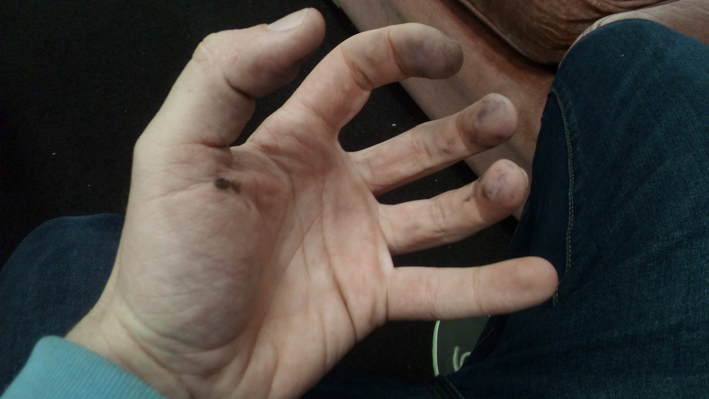
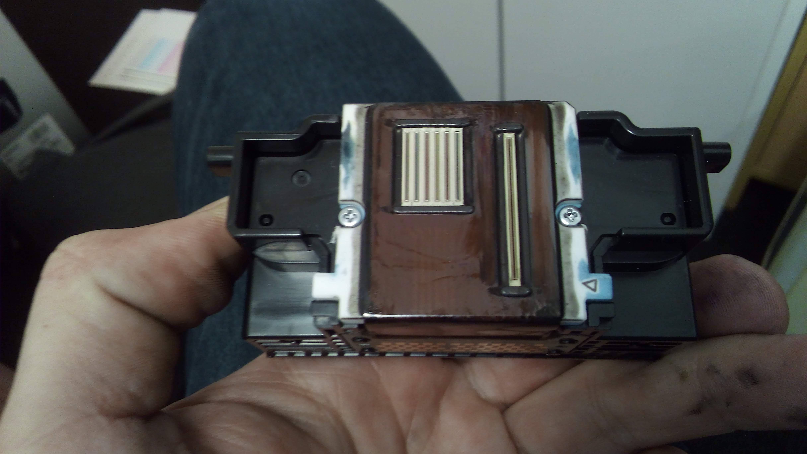
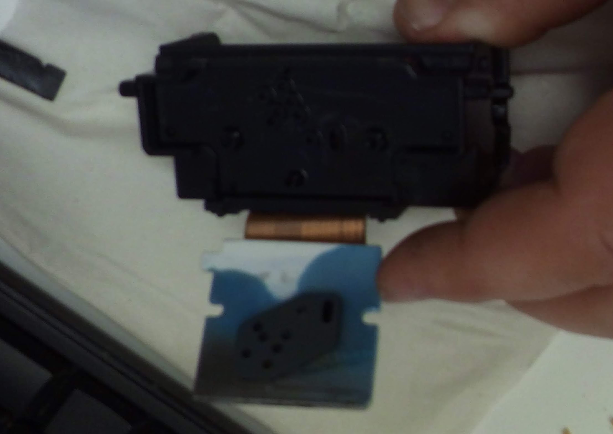

I was recently contacted to help an elderly person in my small town get his printer working. The printer was consistently printing poorly, with text coming out very blurry and smudged.

My troubleshooting plan was to start simple, and work from there.

_Spoilers: My hands get dirty!_

First was a printer head clean, which was accessed using the touch screen menu on the printer. Running this diagnostic would also print a test pattern to help me see what the specific problem could be. It took a while, but the resulting pattern was rather fuzzy. The edges of fonts had blurry trails and lacked any sharp edges. This matched how the problem had been described to me!

I tried using the printer's auto alignment function next. This function does all kinds of magic to make sure the software is aware of exactly where the print heads are, and can compensate for their position to improve accuracy. This at least seemed to improve things slightly, but unfortunately didn't resolve the issue entirely.

Next up was a manual head align. This is a process where the printer outputs an A4 page full of different patterns, and you inspect each of them and apply the settings to the printer based on which patterns are the most well aligned. This process is done for each printing head: Black, Cyan, Magenta and Yellow.

The trouble is that none of the resulting patterns were good enough. Now it was time to get a little dirty...

I disassembled the printer to get access to the actual print heads, and removed them from the printer. The heads didn't seem too dirty, but could definitely be improved.

_The polished printer heads._

I used cotton swabs and isopropyl alcohol to clean up the heads. Surprisingly, a lot of built-up dried ink came off that wasn't obvious with a simple visual inspection. After cleaning the assembly, I left it out to dry for an hour. When I put it back in the printer I tried another head clean.

The result was an improvement, but still not ideal.

I went in much deeper and disassembled the printing head assembly. It was flooded with excessive ink. Googling for more information showed me that a plastic plate inside the head should be clean and white, but this one was soaked in ink. I cleaned it out as best as I could, but still couldn't get it shiny and white like most example photos online showed.

_That should be completely white._

I put it all back together, and another test page showed very little improvement.

I was now reasonably sure that the fault was either with the ink cartridges or a defect in the printing head. No amount of cleaning was going to resolve this issue, and any further diagnosis would require extra parts to test if my ideas had any merit.

So, not a great result. Still, the printer was better than when I started! It's unfortunate that getting replacement parts for this printer could very well cost more than an entirely new printer, one that would likely be an updated model with better features.
