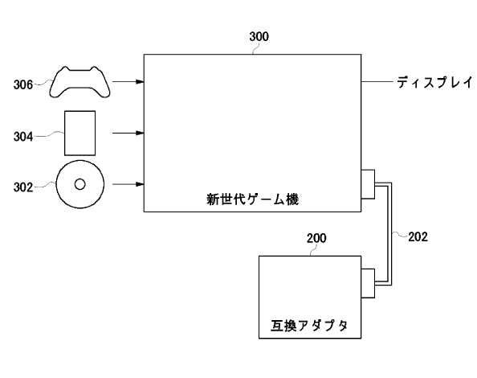

Backwards compatibility is a feature consumers might assume is available. Other than the Playstation 3, every video game console and handheld released since 2002 has offered it. Every smartphone or computer has it. Even when Apple switched processor architecture from PowerPC to Intel's x86 in 2006,  they designed the Rosetta software to allow older programs to work in the new systems.

This holiday season many consumers, unaware that the Playstation 4 cannot run Playstation 3 games, may end up buying a console along with Grand Theft Auto 5 or Assassin's Creed IV and just assume that it will work. With Beyond: Two Souls and the rumour of Grand Turismo 6 being released just weeks before Playstation 4, people might be inclined to pick up the newer system to play these games just to future proof their purchase.

Sony has promised to try and solve this problem using game streaming over the Internet. Going back through the patent office shows a different possibility.

[ In 2010 a patent from Sony was uncovered that demonstrated a peripheral designed to give backwards compatibility to a console.](http://www.siliconera.com/2010/09/14/sony-japan-files-patent-for-new-generation-console-to-previous-generation-console-adapter/) It involved a small unit that contained a processor, DVD drive emulator and graphics and sound chips. The physical optical drive, controller inputs and video output of the main console would work in tandem with this additional unit to give seamless backwards compatibility.

_From Sony's patent, an attached accessory provides backwards compatibility_

At the time it was assumed that this patent was for Playstation 2 capability on the Playstation 3. This may not have been implemented due to the Playstation 3 lacking a suitably fast connection method - a standard USB port probably wouldn't be able to handle the throughput required. But with the Playstation 4 still in development, the necessary connections for such a peripheral can be integrated from the outset.  It may even be possible to design it in such a way that the memory and graphics processor in the Playstation 4 can be utilised, with only the complex Cell processor from the Playstation 3 needed in this accessory, effectively lowering the cost.

If an optional peripheral was to be released for the Playstation 4 to provide backwards compatibility, would you purchase it? If the rumoured $429 price tag for the console is correct, how much above this would you be willing to pay for such an accessory? Share your thoughts in the comments below.
