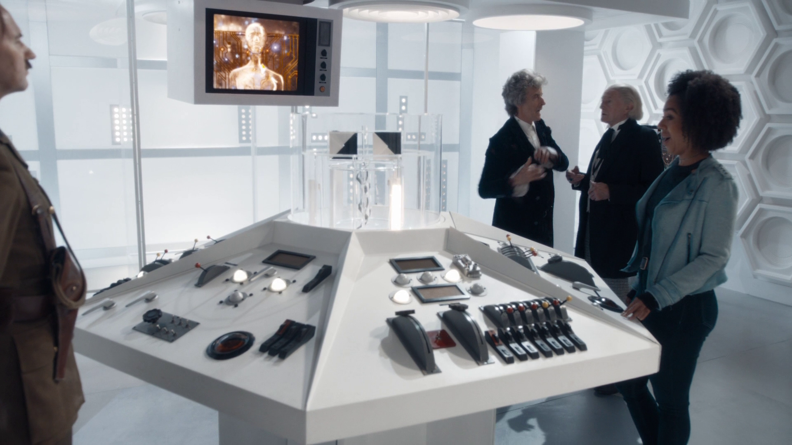
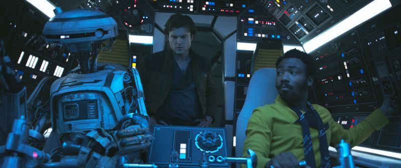
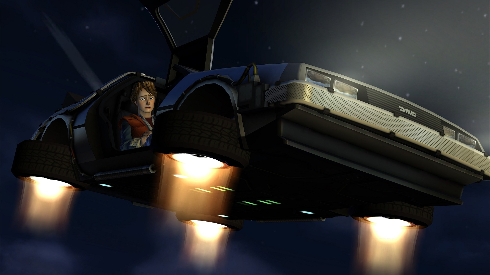
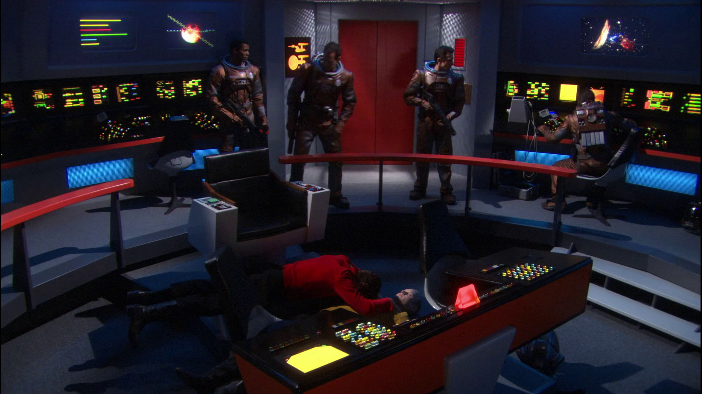
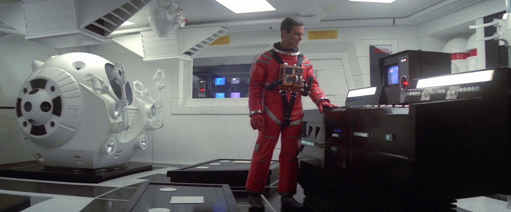
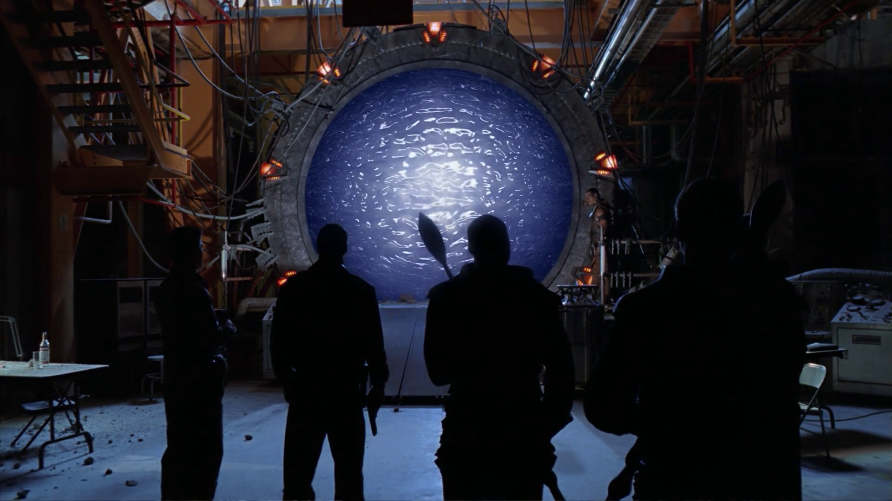
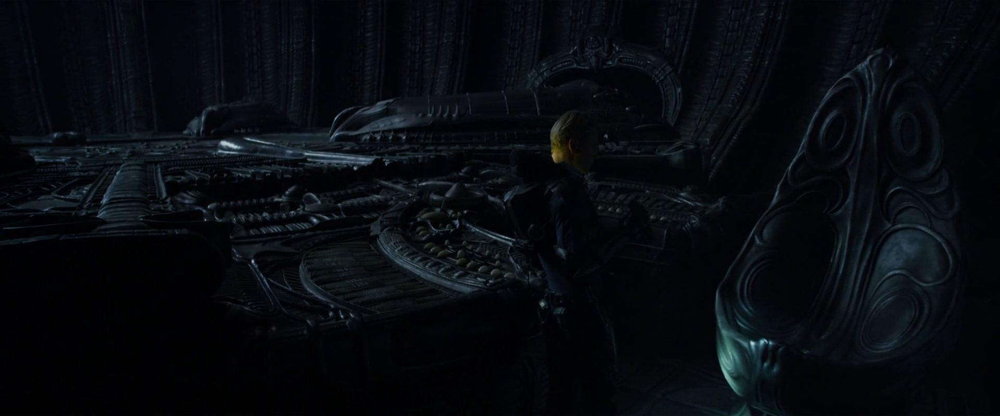
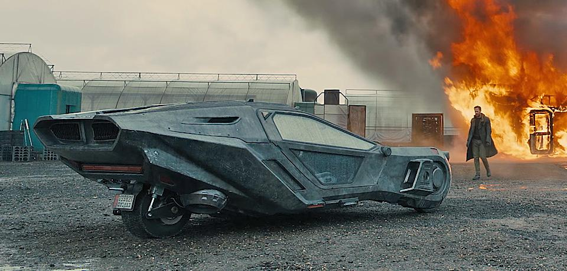
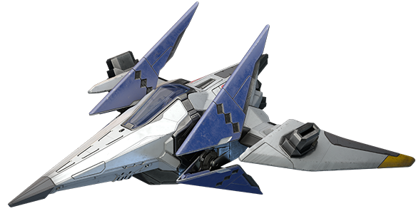

Season two of Star Trek Discovery features the return of the premier starship Enterprise, but with a striking redesign that is causing some debate amongst fans. Narratively it is stated to be the same NCC-1701 ship from the original series, but many aspects of the new design are inconsistent with the original. The size, shape and basic layout reference the original but have been modified, putting it at odds with the recognizable ship's form people have come to love from Star Trek: The Original Series.

How have other revived Science Fiction franchises approached this issue? It's often a case of coming back many years later, sometimes with a switch in format between feature films, TV and games. Do the creators of a new entry in a franchise opt to update designs to be more modern, despite causing a contradiction? Or do they remain true to the original iconography of these ships and machines?

Rebooted and reimagined franchises don't have this concern, so things like the title ship from 2004's Battlestar Galactica are not eligible for this list - it's a different universe and an entirely different ship!

### Doctor Who - TARDIS original design.
Authentic

During Peter Capaldi's last season portraying the Doctor, he encounters his original self complete with TARDIS in crossover with the 1966 episode “The Tenth Planet”. This TARDIS is accurately based on the original design that was seen in the pilot, with the same clean all white motif - although at a much greater level of detail to hold up under the scrutiny of modern HD displays. This original interior also appeared during recent episodes as other TARDIS ships in the “factory default” setting.

### Star Wars: The Force Awakens, Solo - Millennium Falcon.
Authentic

There are changes to this kessel running ship, but they're not in conflict with any prior work. They show upgrades Han and Lando would have made over the ship's long and rough life. The bones, size and structure all match up from Star Wars in 1977 to Solo in 2018, but features like the communications array and color schemes change as the rag-tag ship gets repaired and improved over the decades.

### Back to the Future: The Game - DeLorean Time Machine.
Authentic

Despite a change from live action to a very stylized computer generated game, Back to the Future: The Game from 2010 accurately recreated the DeLorean Time Machine from the original movie trilogy. It's still a DeLorean DMC-12 with the Time Circuits, Flux Capacitor and red, green and amber LCD time displays - exactly as you remember them.

### Star Trek: The Next Generation, Deep Space 9, Enterprise - Constitution-class Starship.
Authentic

Yes, other Star Trek series make an appearance in this list. The original design of the Enterprise has appeared in three other shows, each time heavily accurate to the original appearance. In the Enterprise episode “In a Mirror, Darkly” the deceased crew of the ill fated USS Defiant are even positioned in the same way as they were last seen in the original series episode “The Tholian Web”.

### 2010 - The Year We Make Contact - Discovery.
Authentic

It's another space vessel bearing the name Discovery, but this one was recreated accurately to resemble the design from years before. Due to budget limitations the whole interior wasn't remade, just key areas like the bridge, EVA pod bay and the computer core. Despite endeavouring to stay true to the 1968 original, there was one mistake - the number of modules making up the long spine of the ship was inadvertently increased.

### Stargate SG-1 - The Stargate.
Redesign

Between the 1994 feature film and the pilot of Stargate SG-1 in 1997 the design of the Stargate changed. The glyphs around the gate went from being engraved to pop-out embossed. The nine chevrons also changed from metallic to being transparent and lighting up in red as the Stargate dialed. It still remained a 15-foot high metal ring, but the details weren't consistent.

### Alien franchise - Space Jockey Ship.
Authentic

Despite many sequels over the years, the original Space Jockey ship design with it's enormous chair wasn't seen following the 1979 original until Ridley Scott returned to direct the prequel Prometheus in 2012. It's not the same ship, but two separate ships of the same design. The colours are slightly different between the two vessels, but the aesthetic, size and details are accurately represented.

### Blade Runner - Spinner Car.
Authentic

The sequel is set 30 years after the original, so there have been some logical upgrades to the vehicle shown (such as a detachable drone and improved screens) - but this design of car and the overall aesthetics in Blade Runner 2049 still retains solid continuity with the original.

### Star Fox - Arwing.
Redesign

The very low polygon count of the Super-FX charged 1993 original wouldn't make for a very good technical showoff in a Nintendo 64 title, so redesign was the choice here. The simple size and outline of the ship has largely remained the same, but extensive detail has been added in successive games. The lack of an overarching story does open the possibility that the ships have just been upgraded by Fox McCloud and the team - maybe there was a 90's trend in ship design for flat coloured surfaces!

---
There are some shows that take the upgrade route, but many franchises chose to stay true to the original series. Video games trend towards a redesign, largely to show off improvements in rendering technology. Concerns about designs and technology looking dated are often not an issue when it comes to a time machine or space ship in a movie - having designs the viewers will be familiar with tend to be more important.

Speaking on the DVD release of Star Trek: Enterprise, showrunner Manny Coto spoke of concerns when using an outdated 1966 ship design in a modern show: *“Our fear was: would it look cardboard, would it look like our heroes had gone to a cheesier set… but it didn't work out that way. The sleekness of the 60's set actually looked like we were going into a futuristic vessel”.*

 Now with Star Trek Discovery, that perspective is out with an enhanced redesign being the chosen way to bring the original Federation Starship Enterprise back.
&nbsp;&nbsp;
&nbsp;
&nbsp;
> >*Do you know of other show revivals that went for a more modern look? Are you pleased with the redesign used in Star Trek: Discovery? Would you rather it stayed more true to the original series? I'm sure I've missed many! [Drop me a line and let me know.](https://twitter.com/aaronights)*
