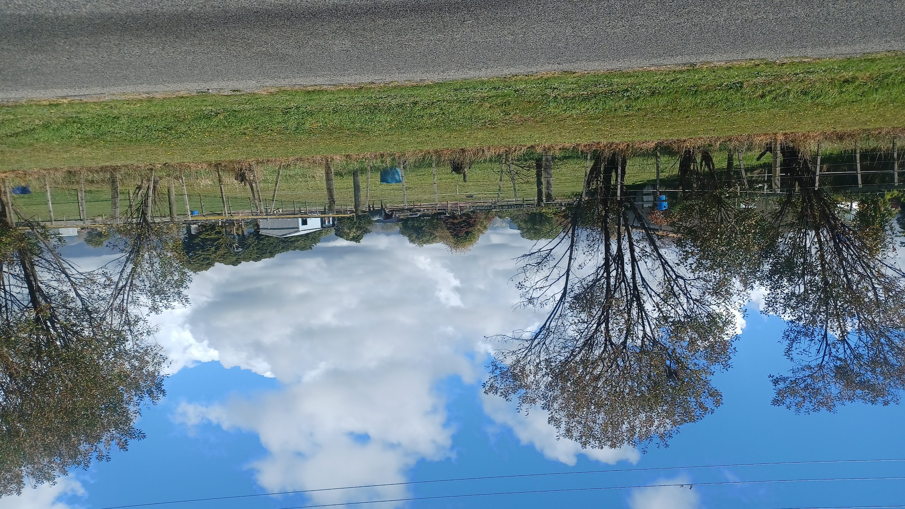
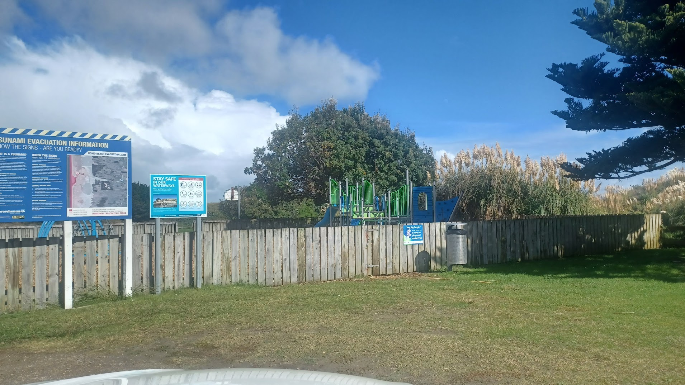
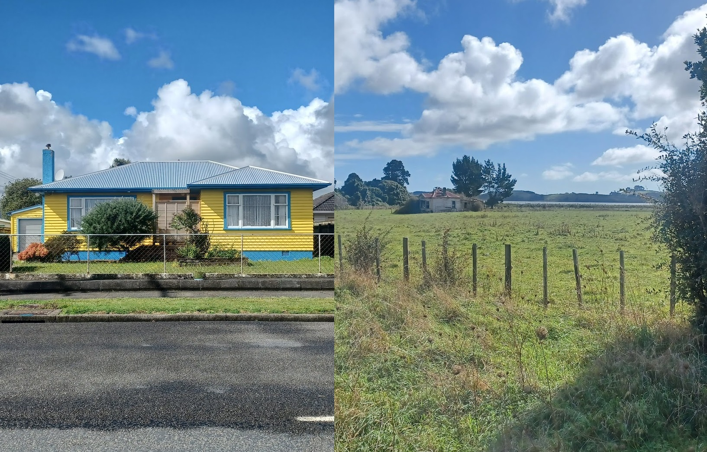
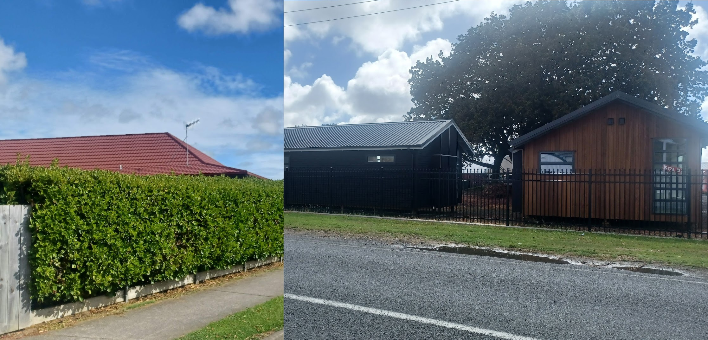
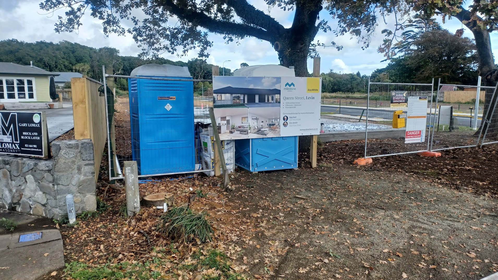
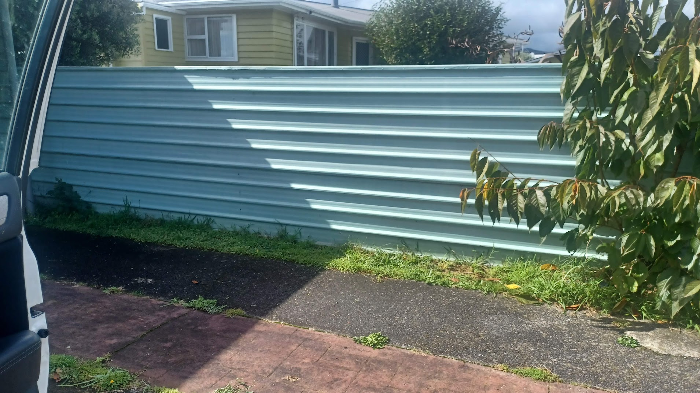
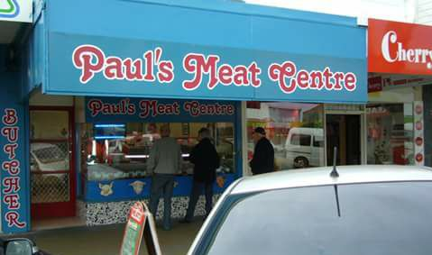
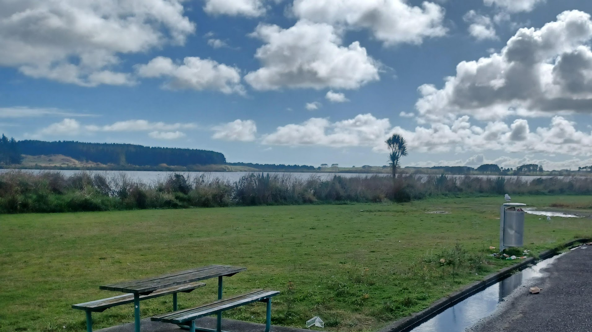
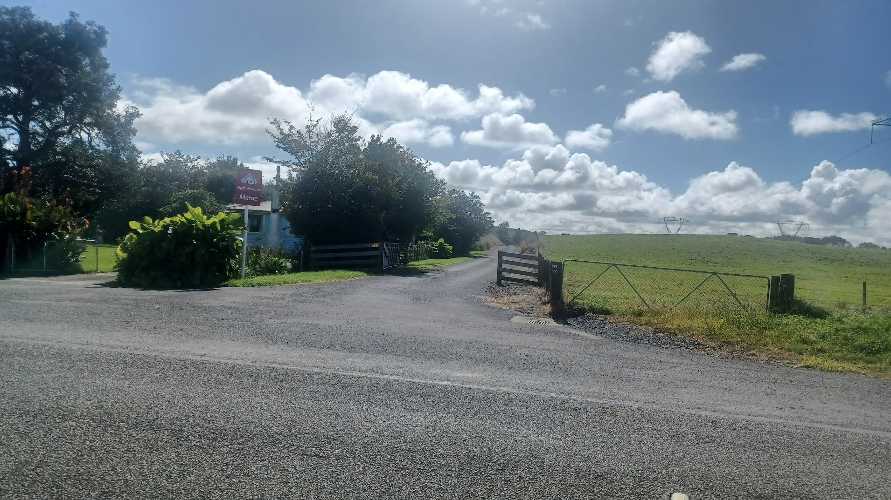

I have been sick! And boy, have I been sick. After three years of evasion I got the covid, but no one told me what the worst part of it was - the sweating. I’d wake up every few hours after finally being able to get to sleep oozing oceans of salty sweat. Thankfully, I haven’t got any crazy long covid conditions. I’ll be back to work on Thursday, and then off for a little vacation this weekend! That was planned months in advance, so I’m very happy getting sick didn’t get in the way of that.

Despite the exhaustion, I did manage to get some stuff done… very slowly. Every room in this house is organised, clean and tidy. I consider that a remarkable achievement, but I likely have low standards there.

I think my work has low standards too, because I got awarded this.

Kind of like being employee of the year, so I must be doing something right. It’s a demanding job with long hours, but somehow I’m still at it. I did hear how this highly esteemed award involved a work trip to Australia for an annual event of some kind, but I think that’s been cancelled.

After a week of not leaving the grounds of my house, I started feeling spritely enough to go out for a drive. To make it more of an event, my wonderful partner set me a series of tasks to accomplish while I was out. 10 tasks, each requiring photo evidence!

**1. Find a horse and take an upside down photo of the horse.**

Well, this was hard. Turns out phones really don’t want to take photos upside down, and use advanced gyroscopic sensors to ensure no photos are upside down. I had to settle for post processing here, as I didn’t have the courage to wrangle the horse into rolling over.

**2. Find a place on the Horowhenua where a happy childhood memory took place and tell me the story.**

This is a happy memory. For the first year or so after my mother went into full time care for her dementia, she was still able to be taken out. My Dad and I would pick her up and go sightseeing around the town, and sometimes go for a picnic. This beachfront playground was a common destination, at least when the weather was cooperating! It’s been many, many years since that last happened, but around here not much changes over time.

**3. Find two houses you like the look of, tell me why.**

On the left, it’s yellow! Very, very yellow. I like how very outwardly yellow it is. Maximum yellow. Also some blue, but still plenty of yellow. On the other side? It’s a run down, abandoned and annexed house. But just look at how much character and personality it has.

**4. Find two houses you don’t like and tell me why**

Why do some of these new housing developments all strive to have roofs like old Pizza Hut restaurants? It looks bizarre. And at this construction site, you’ve got the choice here of all wood cladding, or all black. I am not a fan of either.

**5. Find something that made you laugh and tell me why.**
Nothing made me laugh. Some people go crazy with evil laughter after isolation for so long, but I’ve just become extremely indifferent to anything that even tries to be funny.

**6. Find the house you think would best house Mr. Shit.**

I won’t explain the origins of Mr Shit, but just know it’s a hilarious joke courtesy of Australian comedian Luke McGregor. He’d feel right at home in this luxury two room condo in blue.

**7. Find a green fence.**

I have a green fence! This one was ticked off before my car even moved.

**8. Take a photo of your favourite Levin shop.**

I’m cheating here and resorting to Google Maps. I did drive through town, but couldn’t stop to take photos due to traffic. This is the local independent butcher in town - the only place to buy sausages that my sister actually enjoys.

**9. Take a photo of an animal by Lake Horowhenua.**

Lake Horowhenua is extremely pooey. It’s like the entire park area is lined with a fine layer of stinky bird poo. Not recommended by me, but this bird in particular seemed to be having fun sitting on that rubbish bin.

**10. Take a photo of the entrance to your marae**

I don’t know if the driveway counts as the entrance, but given I’m still in isolation I didn’t want to drive in. Appreciated the signage!

That was fun! My partner is very thoughtful like that. I have missed her greatly over this past week. She is amazing, and I feel very loved and appreciated every day.

Even when I’m all alone for a week with this sweat inducing disease!
