Now, it really has been a while! Just under a year ago I started documenting my smart home journey. My intention was to document it along the way, but that plan was obstructed by… being busy. But now I’m ready to wind it up.

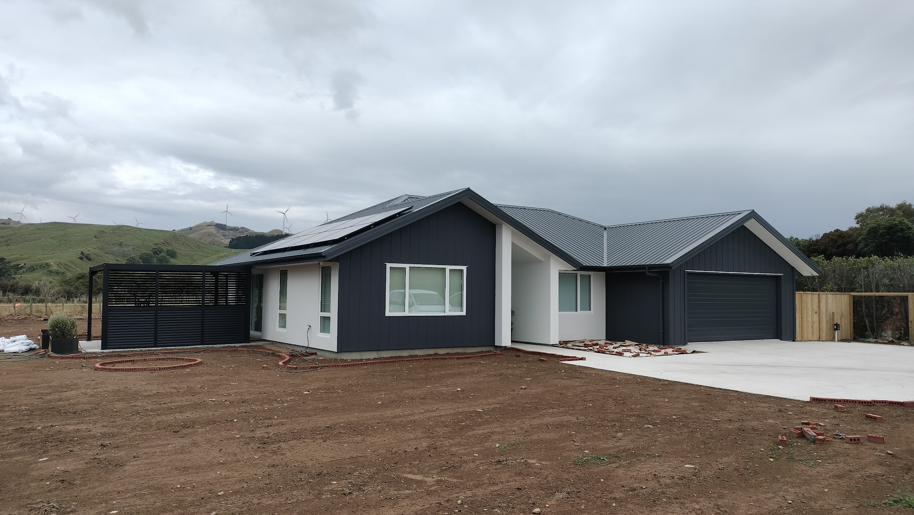
_It's very smart. Grass is coming soon!_

The Smart Home is live - fully up and running, with the teething all worked through and most of the kinks ironed out.

So far, I’ve documented my reasoning for the [smart home platform](https://aarond.me/blog/2025/03/01/sosmart/) and [protocols](https://aarond.me/blog/2025/03/16/sosmartb/) I’ve used. Those decisions turned out well. The wireless mesh network is super robust, with excellent reliability on the dedicated Smart Home Wi-Fi network. I’m also very pleased with how well Tuya is working as the smart home platform. There’s such a massive range of products, and it’s very flexible with the automations we’ve been programming.

The goal was achieved: The smart home is all running under one account, one app and one ecosystem.

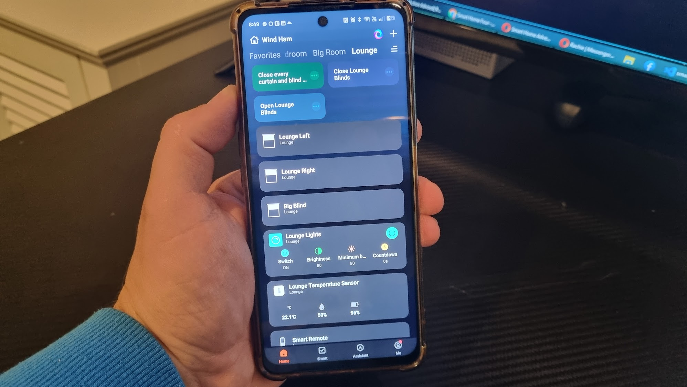
_Curtains, Blinds, Lights and everything else!_

The last thing I discussed here was around [the smart home lighting we’ve used](https://aarond.me/blog/2025/05/25/dimmer/), and I’m happy to report that has gone very well. Every single light in the house is dimmable - I’d say that’s a unique feature of this house, and it’s something we use every day. With few exceptions all the lights are standard downlights, but we rarely run them at 100% brightness - when you’re not used to it, that is just so painfully bright. Adjusting lighting to suit the mood and the time of day is so useful.

Now, let’s dive into the rest of the smart home features.

#### Curtains and Blinds
We were able to build a good relationship directly with a manufacturer and wholesaler out of China - Guangdong Chuangming Sunshade Technology Limited, better known as Wintom Blinds.  With the smart lighting modules, they were cheap enough that I could buy several of them to test out if they met my requirements. But curtain tracks and roman blinds are more expensive - both to buy and to ship. By having good communication with a representative from the supplier, I was able to ensure I got all the technical questions I wanted answered before locking in an order. It was actually a great experience! You might expect it to be a challenge dealing with a company based out of China directly, but we got excellent and timely communication, and any issues that arose were always addressed as a priority.

First, curtains. Mostly, we got smart curtain tracks that have an adjustable length. This was mainly so we could have them here and ready to go before the curtain measurements were locked in. This has enabled us to tweak the length of some curtain tracks after living with them for a few weeks.

In the dining and living area we have double curtain tracks for both blackout curtains and sheers. The curtains are powered by motor units that plug into a standard outlet that was installed during the build, all hidden behind the curtains. They’re AC direct, meaning there are no giant power bricks to get in the way.

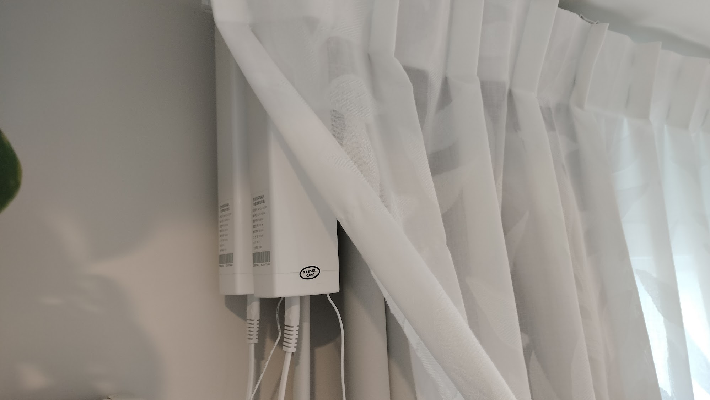
_Two tracks for the blackout curtains and the sunshade sheers._

We got the smart tracks from our Chinese supplier, but the curtains themselves locally. That can’t be done with blinds, so all smart blinds in the house are from our supplier - fabric and all. I was unable to source a good smart blind solution that also had a chain for manual operation, so in some places we did opt for standard manual blinds. All smart blinds can be operated through the smart home system, but also by using a remote control. 

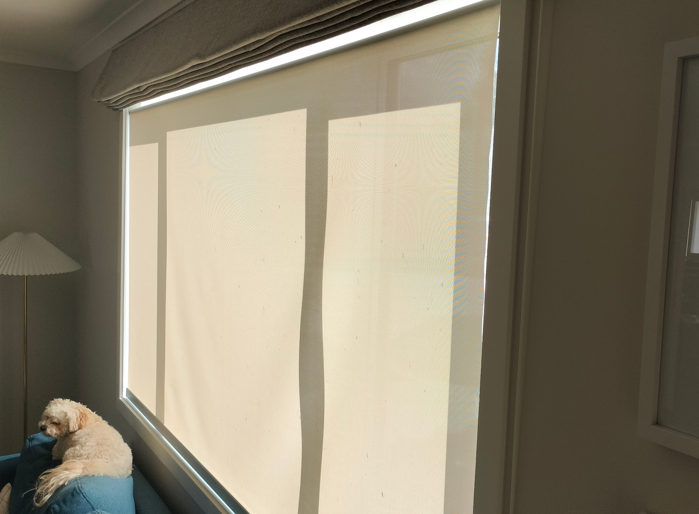
_A big smart sunshade roller blind in the lounge._

The roller blinds have nothing external - the motor and the smart circuits are on the inside of the roll. They just have a standard AC power cable that is wired in through a little hole in the side of the window frame, discreetly hidden behind the mounting bracket of the blind. In our walk-in wardrobe we wanted a blackout and sunscreen double roller blind, but couldn’t find a two-in-one solution that would work. With some creativity, we were able to mount two single rollers in the window cavity. 

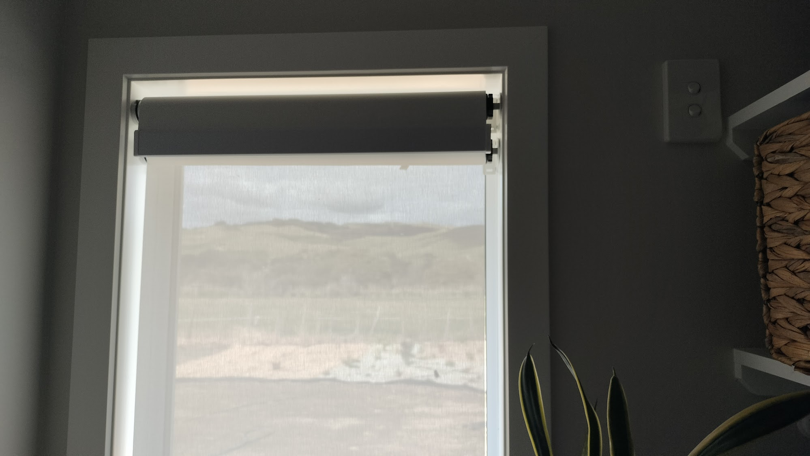
_Doubling up: A sunshade and blackout roller blind combo._

A few months after moving in we realised we wanted a sunscreen blind in our scullery - a place where we didn’t think ahead to put wiring behind. It was an oversight, but to resolve this we got a smart blind that runs off a rechargeable battery. It charges over USB-C and comes with an extremely long cable. After over a month of use it’s got 80% charge left, and it’ll send a silent alert to our phones when the battery drops below 20%. 

#### Cameras
We don’t have a huge need for security cameras, but I was able to get them for $50 each, so I went for it! We laid ethernet cable for the cameras during the build, just because having the high data rate of live 4K video beaming over Wi-Fi isn’t always reliable and can clog up the airwaves for other devices. They are connected using Power over Ethernet, meaning it’s just one cable to get both power and the data connection. They’re great, record locally to a cheap SD card, and fully integrate into our smart ecosystem. I configured them to record 30 seconds of video when they detect human presence.

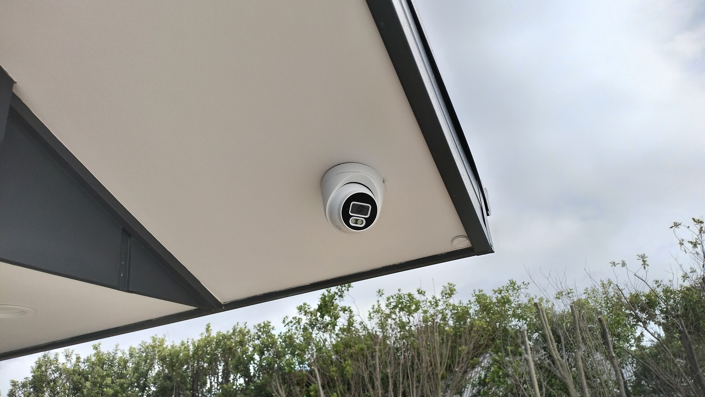
_Small and discrete cameras._

#### Doors
And now, the front door! We’ve got both a smart lock and a smart doorbell. The lock here is something that my wife and I are very pleased with. It’s a good, solid handle that is physically satisfying to use - and it’s full of features. It can be unlocked with a thumbprint, a pin code, an NFC keyfob and by the smart home system. It also keeps logs of who opened it and when. We can disable and enable individual thumb prints or codes remotely using the phone app. The app can also generate a one-time use code. As it’s part of the smart home system, it’s also got the neat trick of turning on the entry foyer lights when the door is opened at night.

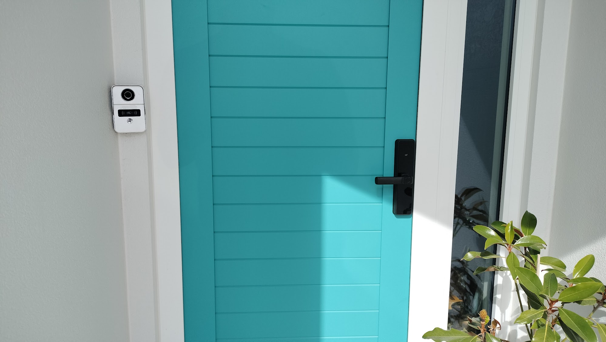
_Is it blue or green?_

The doorbell is wired up just like the other cameras, recording when the button is pressed and sending out an alert to both my phone and the smart panels in the house.

#### Smart Panels
Ah yes, the smart panels - the main feature of this smart home. They’re touch screen displays that are mounted to an electrical flush box on the wall. We’ve got the smaller 5 inch ones in the garage and master bedroom, plus a big 10 inch panel in the dining area of the ‘big room’.
https://www.youtube.com/watch?v=aR5gqBX7LFo

What can they do? Everything! They’re the control centre to the smart home.

Each one can control every smart device in the house with a really nice user interface. You've got sliders to dim the lights, icons to open the curtains and shortcuts to any custom automations you want set up. You can also do other cool things, like view all the security cameras, add new devices to the smart home, get it to sound alerts triggered by motion or sensors and show the weather, the time and the date. When they’re left idle they become photo frames, showing images you can upload. They can operate over Wi-Fi or wired Ethernet, so for robustness and reliability we ran Ethernet cables for them. I’m very impressed with how responsive and easy to use they are.

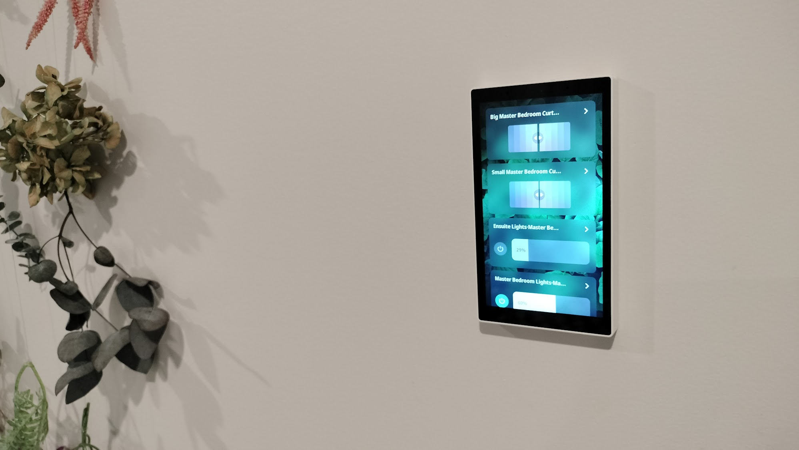
_The small smart panel in the master bedroom._

The last trick they've got is full voice control for all the smart home devices using Amazon Alexa. Yes, Jeff Bezos’ empire is extending to this house!

#### Alexa
Now, a tangent. Alexa can be a fickle beast to deal with in a smart home. If you find a product that's Alexa compatible, that's no guarantee that it'll work well. Each device manufacturer has to program their own interface or skill with Alexa, and not all are made equal. Some can be painfully frustrating and unreliable to use. In the Alexa phone app you can search for different skills along with reviews, and some well renowned brands are full of 1 star ratings from frustrated customers. Using Alexa relies on the cloud, so it does require an internet connection to function.

Please don't trust a “Works with Alexa” sticker as a guarantee of functionality or reliability.

Thankfully, I was able to test and interrogate the Tuya skill for Alexa just to make sure it did what I needed it to do accurately and reliably. Beyond just the Tuya platform, I also was sure to test that each bit of hardware also did what I wanted it to do through Alexa. If it didn't? It was out! For example, some of the dimmer modules didn't support dimming over Alexa, just on and off. I had to check with our curtains and blinds supplier to ensure their Alexa-ness was robust - you can ask Alexa to open the curtains to any percent you want to, not just all or nothing.

Voice control has become a staple in the home. Even beyond the smart home we use Alexa to set timers when cooking, get reminders to put the recycling out, and ask her for the weather forecast. Alexa does occasionally mishear what you say, but on the whole it works well.

#### Scenes and automations
This is the real power of a smart home. Setting up scenes that can do many things with one prompt, or do things automatically. For example, we've set up the blind in the walk-in wardrobe to close automatically overnight.

Using automation scenes with Alexa is something even my beautiful wife has got into. Being able to say “Alexa, all lights off” when you’re heading to sleep is useful. We can get a bit warm, so “Alexa, turn on ‘Cold Blast’” sets the air conditioning to super cool for just one hour. Alexa can also make announcements - I put a sensor on the garage door, and Alexa announces when it’s opening (it’s very useful to know when it’s open with little doggies about).

#### Sensors

We use three main types of sensors: motion sensors, door sensors and temperature sensors. I opted for small, battery-operated sensor modules for the flexibility they offer. I didn't want to pre-determine every sensor location and wire power to them. Besides, the batteries on these sensors last for years. We've been here for six months and the lowest battery is at 91%. They'll also send an alert to my phone when their batteries get low.

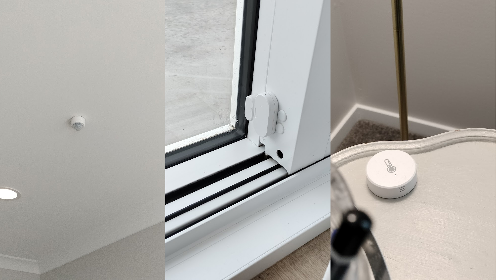
_The motion, door and temperature sensors._

The primary thing the sensors are tied to is lights. Walk into a room and the lights turn on automatically. In bigger rooms like the hallway I've put multiple motion sensors and set them up to all work in tandem to cover the whole room together. Rooms such as the hallway and scullery will trigger the lights at all times, but all the exterior sensors will only activate lighting at night.

#### Smart Plug
A little device with a lot of uses. You can just plug this into any wall outlet, then plug whatever device you want to “smartify” into it. Right now I use it with the slow cooker. I can use the Tuya app and set a timer to turn it on during the day, and I can turn it off remotely if I end up getting home late. 

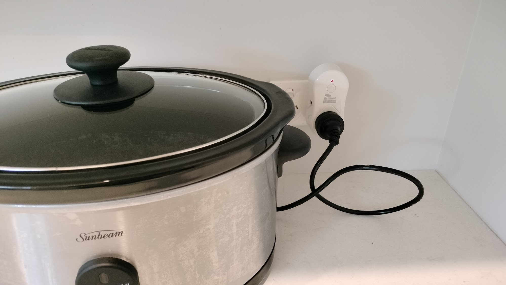
_Connected to the slow cooker in the scullery._

#### Solar and Smart Power
We’ve got solar panels on the roof, powering our house with sunshine. We have 14 panels on our north facing roofs, powering a 6 KW GoodWe hybrid inverter. We haven't got batteries, but opted to get a hybrid inverter so we can easily add them in the future. Even without any batteries, if the sun is shining during a power cut we've got an emergency power outlet that can be used.

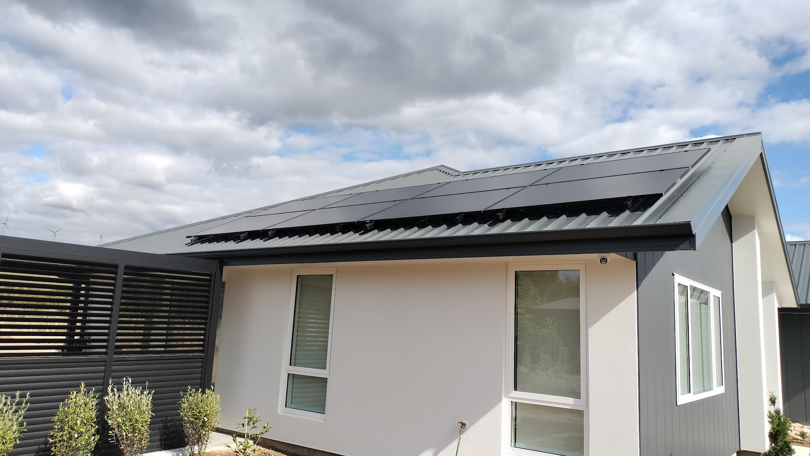
_Sleek, black solar panels on the north roof._

The important thing here is that I was able to integrate the solar into the smart home. I got a Tuya-compatible smart Current Transformer clamp installed on the main power feed at the switch board. What this means is that the smart home is fully aware of how much excess solar power is being generated, and can trigger things to happen.

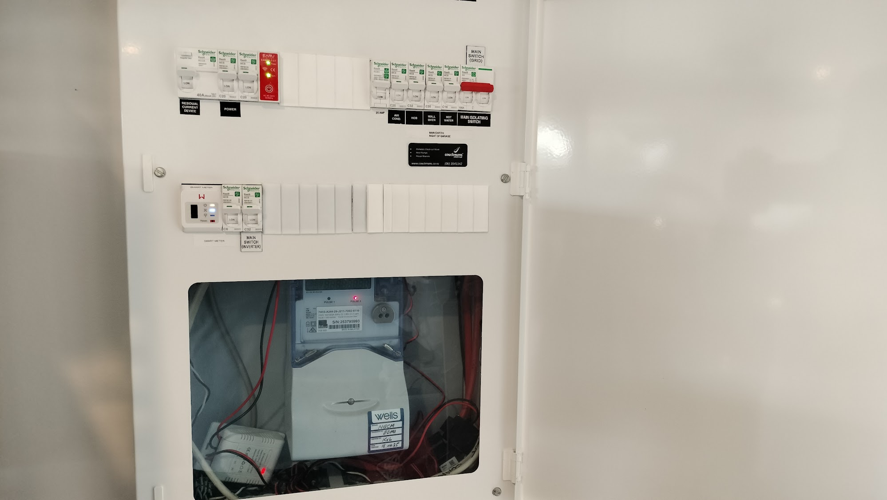
_It's the red one!_

The biggest use of this is our large heat pump hot water cylinder. In doing research, I found that Rinnai makes one that has Tuya compatibility built in. What this allows us to do is get the hot water cylinder heating up when the solar is giving us all that free energy. It'll superheat the water using solar energy, and because it's such a well insulated cylinder the water stays hot and good to use for showers in the evening or the next morning. Just to make sure the hot water never runs out, there is a setback temperature that'll force the cylinder to heat if the water temperature gets too low. This rarely happens, and so far nearly all of our hot water has been from free sunshine.

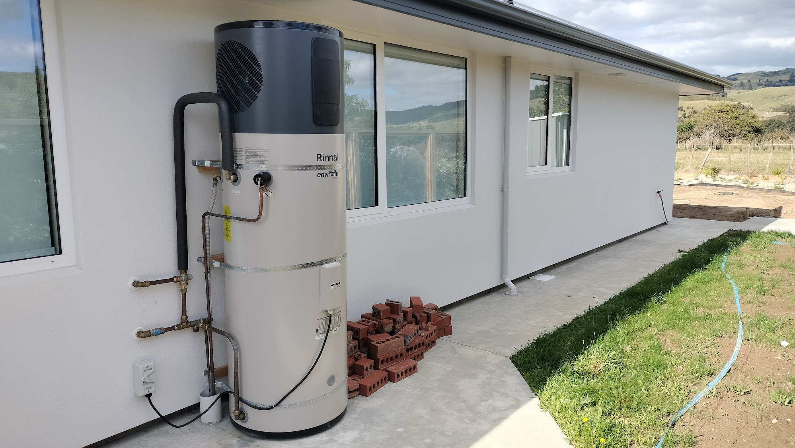
_Smart hot water, powered by sunshine!_

I've also integrated both the clothes dryer and dishwasher. I installed a smart relay in the clothes dryer and used a little thing called a Fingerbot to press the start button in the dishwasher.

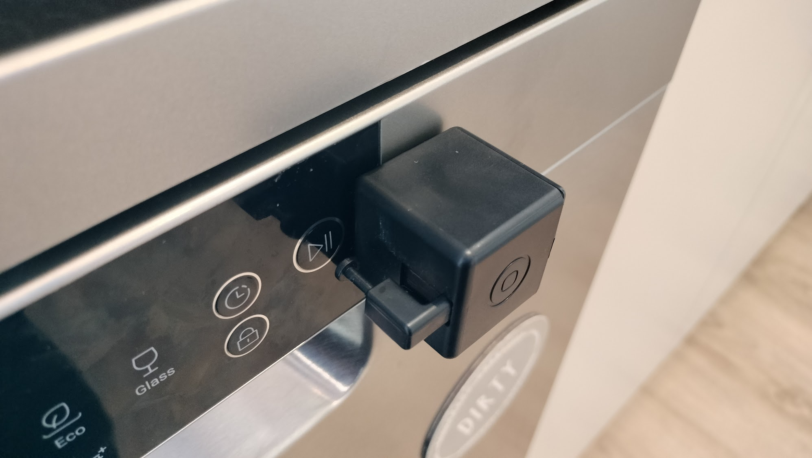
_The little Fingerbot presses the start button on the dishwasher._

Fingerbots are cool! They're just tiny little boxes that can push buttons for you, transforming any device with a button into a simple smart device. It is a simple and quirky solution to “smartify” things, but it works well (despite my wife thinking they’re an eyesore). You can load up the dishwasher and the dryer, and they'll automatically be turned on when the solar is generating enough excess power to run them. Don't worry - if it turns out to be an absolutely miserable day, it'll bite the bullet and turn them on regardless of the sun and have it ready when we get home from work. That's very rare though, it takes an extremely stormy and dark day for there not to be enough power coming from the solar to run these appliances.

The final solar powered trick is with the smart EV charger. It's a 3.5 kilowatt charger that plugs into a 20 amp outlet we had installed in our garage. I set up an automation that lets you charge an EV only with solar power - it can dynamically change the rate of charge based on how much solar power is being generated. Of course, if you work during the day and need to charge at night it can also be set to charge at any time from the grid.

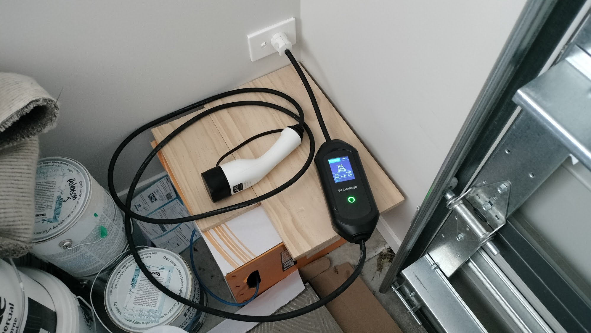
_The 3.5 kilowatt charger, connected to a 20 amp outlet in the garage._

#### Sound System

We have music everywhere! Sorting out a smart way to run audio over three different rooms was one of the bigger challenges in this smart home. Some high end audio equipment does support multi room amps, but they’re extremely expensive and very proprietary.

We have three zones for music, fitted out with speakers installed in the ceiling: the lounge, the ‘big room’ and the outside patio (The ‘big room’ is the main living area that has the kitchen, dining area and a living area). Each zone has their own amp connected over HDMI to an Amazon Fire TV stick. Yes, those $80 things you see for sale that are sold as a way to stream Netflix or Prime Video to your TV. I opted for the Fire TV stick just for its compatibility - Amazon directly makes the Fire TV stick, and it has very strong integrations with Alexa and the Tuya plugin. 

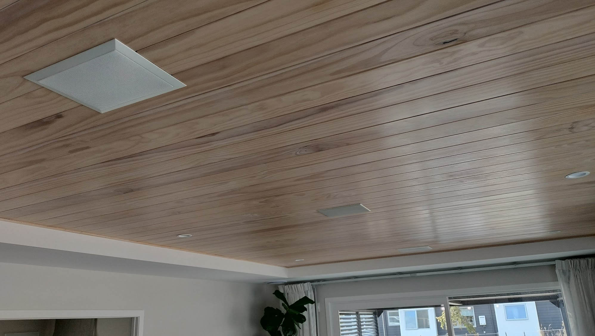
_Speakers adorn our beautiful ceiling._

The Fire TV stick is connected to a 3 way HDMI splitter that then connects to each zone’s amp. The amps for the big room and outside are in the network cabinet installed in the garage, while the lounge amp is very discreetly hidden behind the wall mounted TV. We placed all the speaker cables in the walls and ceiling before any cladding went up - it’s much easier that way.

So how does smartness come in? We use Alexa’s voice control and the smart panels to play music and control the audio zones. Both Alexa and the smart panels are fully integrated with Spotify. You can ask Alexa to play a specific song or playlist, use the smart panel to browse what you want to hear or control it from the Spotify app on your phone. 

Turning on the various audio amps and adjusting the volumes in each zone is done using an infrared blaster. This is a little round smart device that sends out a signal that simulates what happens when you push a button on a remote. Doing it this way let me use any amp that I wanted to, rather than trying to find a specific smart amp. If we say “Alexa, turn down the music outside by 4”, the infrared blaster will send the volume down signal to the outside amplifier 4 times. Each zone has its own separate volume level and power control, and because they’re all fed from the same source they are all perfectly in sync. You can also use the smart panel to control the zoning and the volume - the 10.1” smart panel in the dining room has 4 physical buttons down the right side, so I configured those to control the volume for the big room and for outside.

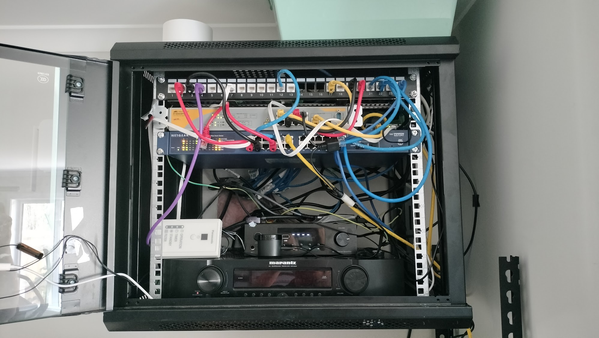
_The data cabinet has networking gear, but also the amps for the sound systems._

It works very well! We just say “Alexa, play some music”, and it turns on the amp and starts playing whatever Spotify recommends. We aren’t just limited to Spotify (it does have the best integration with our smart home), we can also use other platforms like Youtube and Amazon Music. As the Fire TV also does video, we’ve got it connected to both the lounge and big room TVs. The TVs do not need to be on when playing music, but setting it up this way lets you use the integrated sound system for any movies to shows you watch, too.

It’s easy to use. You can have the same content on both TVs with the audio pumping in all three zones. It’s also set up so the lounge can be playing something entirely different to the big room. My wife can be in the lounge watching… whatever she watches, with the full in-ceiling speakers with premium Dolby Surround audio, while I’m in the big room listening to music while prepping dinner.

#### Climate Control

This infrared blaster also comes into play when “smaritifying” another aspect of the home: heating and cooling. We have a Panasonic whole home heatpump, and it’s great at keeping the home nice and comfortable. While it does have some built in Wi-Fi with smart functionality, I wasn’t a fan of how it worked. It's functional, but I wanted it to be fully integrated with our Tuya-based ecosystem.

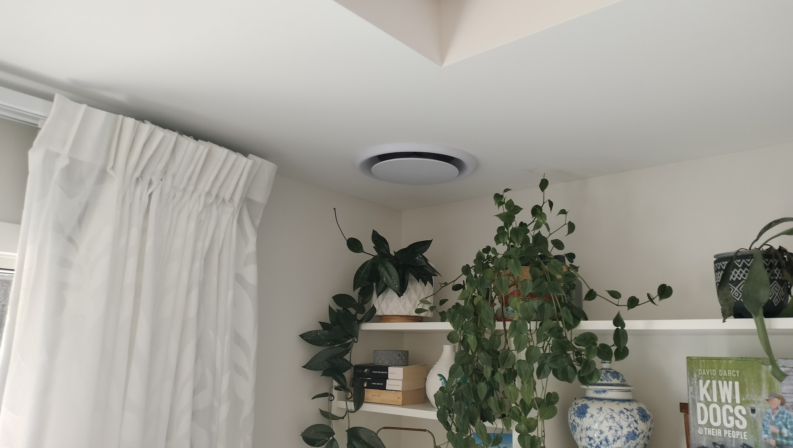
_No big wall units; these vents in the ceiling do all the cooling, heating and ventilation in the whole house._

I had the infrared receiver for the heat pump - the thing you’d normally point the heat pump remote at - installed inside the data rack in the garage. Using the same infrared blaster that controls the sound system, we can fully control the heat pump smartly. It works really well, and the integration with the smart panels and Alexa is exceptional. 

This also pairs well with the temperature sensors I’ve dotted around the home - if the sensors detect that it’s too hot or cold, it can adjust the heat pump. Having the temperature sensors throughout the house means no room ends up a sauna or freezer.

#### Gardening

While my wife is taking the lead on all things green and gardeny, I've managed to “smartify” it. First, we have soil testers. Stab these in the ground or a pot and they measure a whole range of things to make sure your plants are happy. Soil humidity is the main thing; it can alert you when your prize rose is getting too dry. It also measures how much sunlight a plant gets and the ambient temperature and humidity in the air.
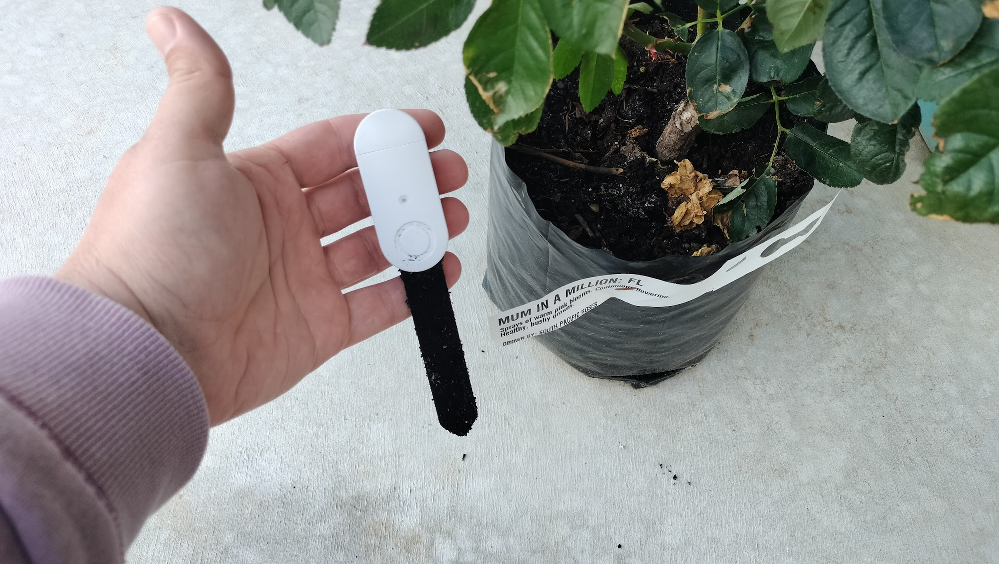
_Soil tester. Just poke it in the soil!_

You can use the soil tester just to send you alerts when things happen, but we've been using it with another smart home feature: smart irrigation! I sourced some Tuya smart valves that “smartify” watering the garden. With the soil sensor, we set it up to water the garden when it detects the soil is getting dry. We also use them with sprinklers on the lawn as it’s getting established. You can just use these on a simple timer, but you can also link it with live weather reports. That means it’ll adjust the watering schedule depending on how much rain the weather report states has fallen.

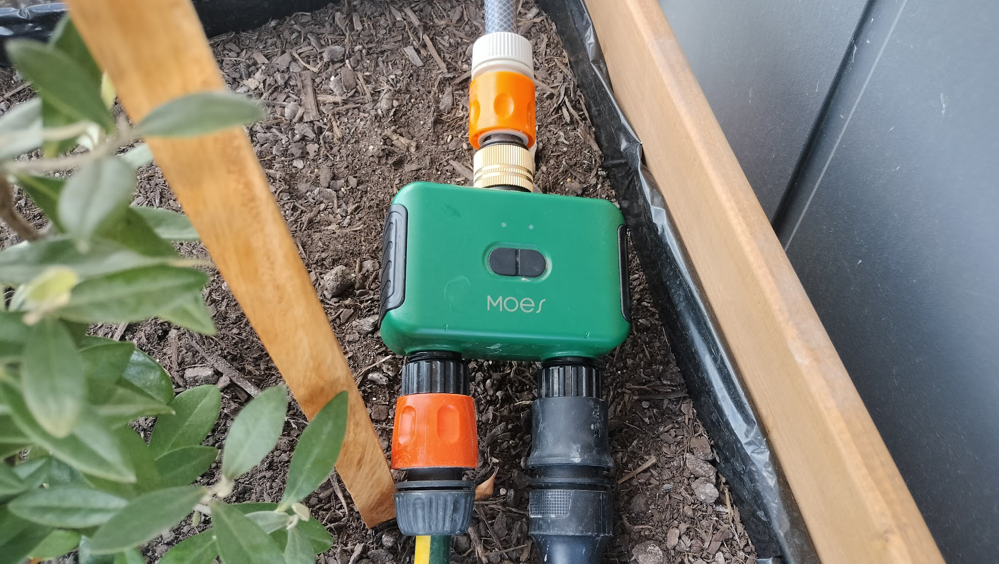
_The smart water valves. Who knew gardening could be smart!_

#### Smoke Alarms

The smoke alarms are also smart. They function exactly like normal smoke alarms, but also send alerts to your phone if a fire is detected. You can even pay a small fee to get an old fashioned phone call if they ever go off.

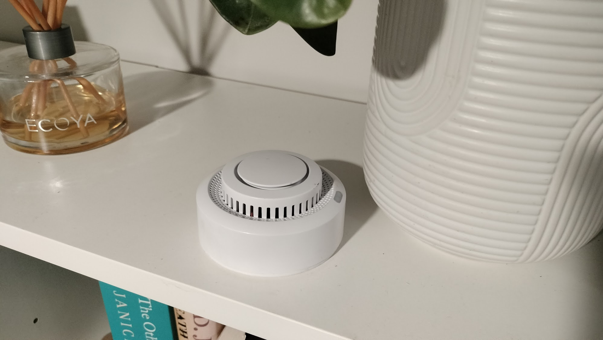
_Smart smoke alarm._

#### Bath level sensor
Excitingly, there is also a bath level sensor! It sends an alert to the smart panels when the bath is full and ready. I think it’s cool, but my wife thinks it’s overwhelmingly ugly and she feels like she’s charging in the bath, with the wire dangling in.

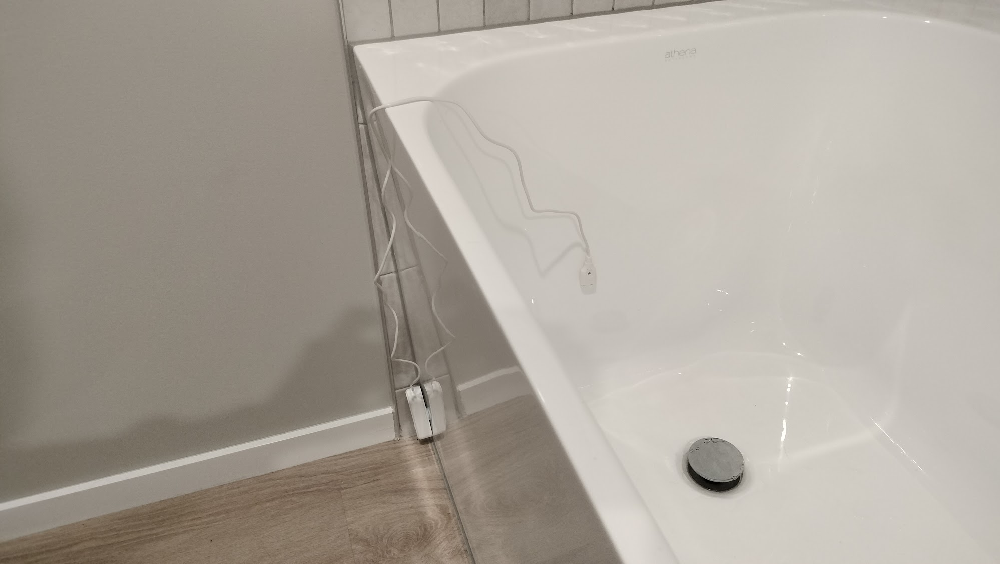
_"The wire in the water makes it feel like you're recharging in the bath." - Rachel_

### The Products
For those interested, here is a run down of the products and brands I used:
<ul>
<li>The <a href="https://www.andelismart.com/product/ams-d-smart-dimmer-module">Wi-Fi light dimmer modules are all from Andeli</a>. The manual button dimmers are the <a href="https://detaelectrical.com.au/en-nz/collections/smart-switch-mechanisms/products/deta-grid-connect-smart-dimmer-mechanism"> DETA Grid Connect Smart Dimmer Mechanism.</a> They’re a Bunning’s Warehouse brand, but unfortunately they’re not sold in New Zealand so I imported them from Bunning’s Australia.</li>

<li>A vast number of things are from <a href="https://moeshouse.com/">MOES</a> - they’re a very popular brand that I’ve found to have great quality and after-sales support. This includes:</li>
<ul>
<li><a href="https://moeshouse.com/products/moes-tuya-smart-home-control-panel-max-10-1-inch-screen-with-bluetooth-zigbee-gateway-built-in-building-intercom-compatible?variant=46922325918011">10.1-inch Smart Control Panel Max</a></li>
<li><a href="https://moeshouse.com/products/smart-home-5-inch-touchscreen-control-in-wall-smart-panel-with-alexa-built-in?variant=49163944132923">5-inch Smart Control Panel</a></li>
<li><a href="https://moeshouse.com/products/wifi-smart-door-lock-fingerprint-remote-unlock-antihijack-tamper-alarm-multiple-unlocking?variant=50559999902011">Smart Door Lock</a></li>
<li><a href="https://www.aliexpress.com/item/1005009363481753.html">2 Outlet Water Timer</a></li>
<li><a href="https://moeshouse.com/products/smart-bluetooth-fingerbot?variant=50831128527163">Smart Fingerbot Plus</a></li>
<li><a href="https://moeshouse.com/products/smart-pir-sensor-human-body-motion-detector-home-security-and-scene-linkage-automation?variant=49412367188283">Motion sensors</a></li>
<li><a href="https://moeshouse.com/products/tuya-zigbee-door-window-contact-sensor?variant=50411657396539">Door sensors</a></li>
</ul>

<li>The Smart CT clamp for integrating devices with the solar is from <a href="https://earu-electric.com/">EARU Electrical</a>.</li>

<li>All smart curtain tracks and blinds were from <a href="http://www.wintom.net/en/">Wintom Blinds</a>, via <a href="https://wintomblinds.en.alibaba.com/">Alibaba</a>.</li>

<li>The <a href="https://support.lenovo.com/nz/en/accessories/acc500189-overview-lenovo-smart-ir-controller-lenovo-se-741c">infrared remote blaster is from Lenovo</a> - I already had this from many years ago, and can’t find it for sale anywhere, but there are many Tuya-compatible IR blasters available.</li>

<li>The <a href="https://brilliantlighting.com.au/en-nz/products/brilliant-white-ireland-smart-wifi-plug-with-usb-charger">smart plug is from the brand Brilliant</a>, purchased at Bunning’s Warehouse.</li>

<li>The smart hot water cylinder is a <a href="https://rinnai.co.nz/water-heating/hot-water-heat-pumps/hot-water-heat-pump-range/enviroflo-gr-series">Rinnai Enviroflo GR Series</a>. We got the giant 300 litre one.</li>

<li>The <a href="https://www.aliexpress.com/item/1005006826040824.html">EV Charger is from AFVEEV</a> - a very unknown brand, but I find it’s solid and working very well. The 16 amp charger I got came with a European style socket, so I had to change that to a AU/NZ style 20 amp one.</li>

<li>I also got some other <a href="https://www.thewarehouse.co.nz/p/tech.inc-smart-pir-motion-sensor/R2932195.html">Tech.Inc motion sensors</a> and <a href="https://www.thewarehouse.co.nz/p/tech.inc-smart-window-and-door-sensor/R2932196.html">door sensors</a> from The Warehouse. They're on clearance at the time of writing, so may not be available anymore.</li>

<li>Finally, some other things were unbranded that I found on Aliexpress: <a href="https://www.aliexpress.com/item/1005008889323332.html">security cameras</a>, more <a href=
"https://www.aliexpress.com/item/1005006997105364.html">motion sensors</a>, <a href="https://www.aliexpress.com/item/32773680214.html">smart video doorbell</a>, <a href="https://www.aliexpress.com/item/1005008238455377.html">bath level sensor</a> and <a href="https://www.aliexpress.com/item/1005010417954475.html">soil tester.</a></li>
</ul>

### Acknowledgements 
There are a few people and teams that made this possible:

First, Haydon Christian - the head honcho at [Jennian Homes Manawatu](https://jennian.co.nz/franchises/jennian-homes-manawatu). He both shared and encouraged my passion for this smart home project. It made it a lot more fun, and gave me reassurances in this endeavour. Just having our whole building team in the loop and supporting the smart home idea was crucial in making it all come together.

_Want to build? Give him a call!_

Our electrical team, [Couchmans Electrical](https://couchmans.co.nz/), were fantastic. I must have burned several hours of the head electrician's time just discussing the wiring needs of the smart home. I learned a lot! When the roller blinds hadn’t arrived by the time the cladding was being put up, they were able to guesstimate where the wiring would need to be based on some photos. When the blinds eventually arrived? It was perfect!

Big thanks to my good friend [Mark Honeychurch](https://mark.honeychurch.org/) - I’ve talked with him a lot about smart home stuff, and he also proofreads everything I’ve written about it. Including this.

Finally, my wife! Rachel has been… patient. I have talked about this smart home with her a lot, and she has endured listening to all my ramblings. We spent one tiresome weekend just laying hundreds of meters of ethernet cable throughout the house. She is also enjoying the smart home, and has taken the time to not only learn how to use it, but also understand how it works. Her support was essential.
