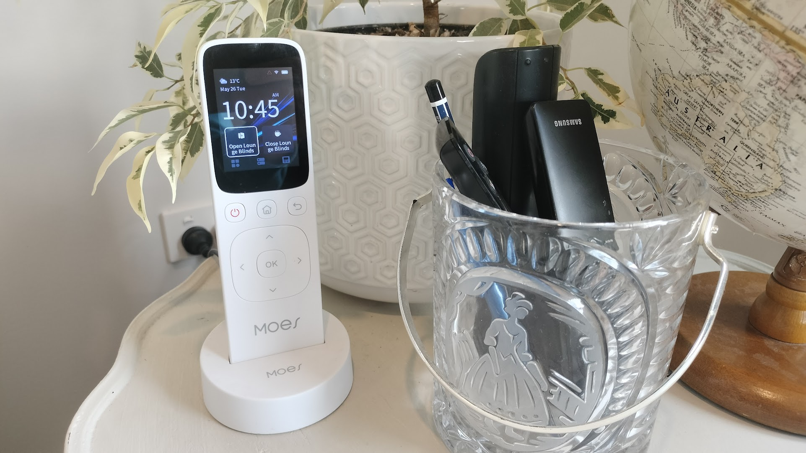
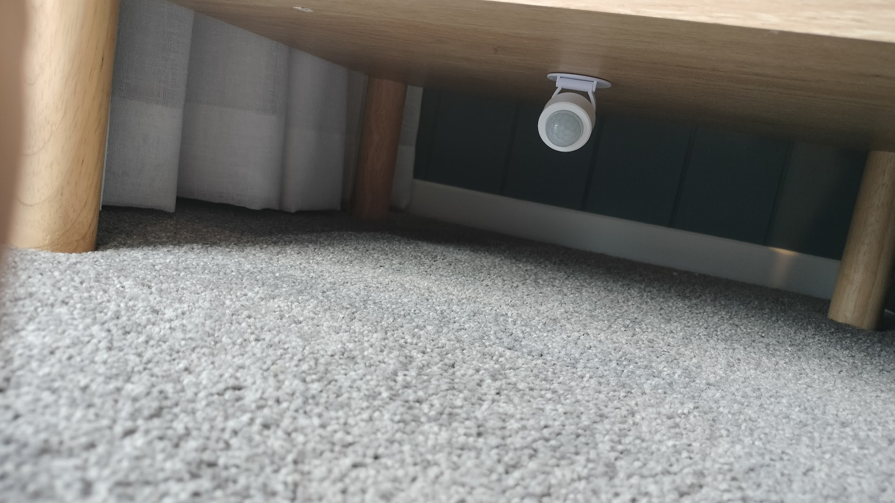
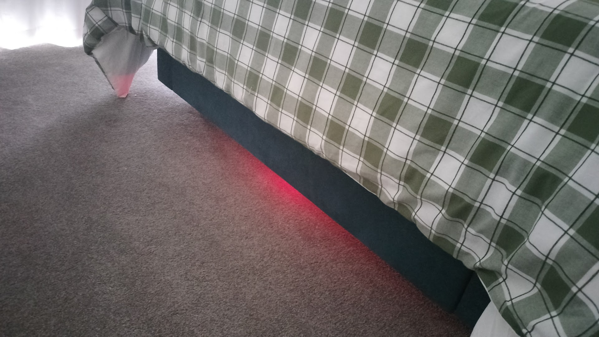
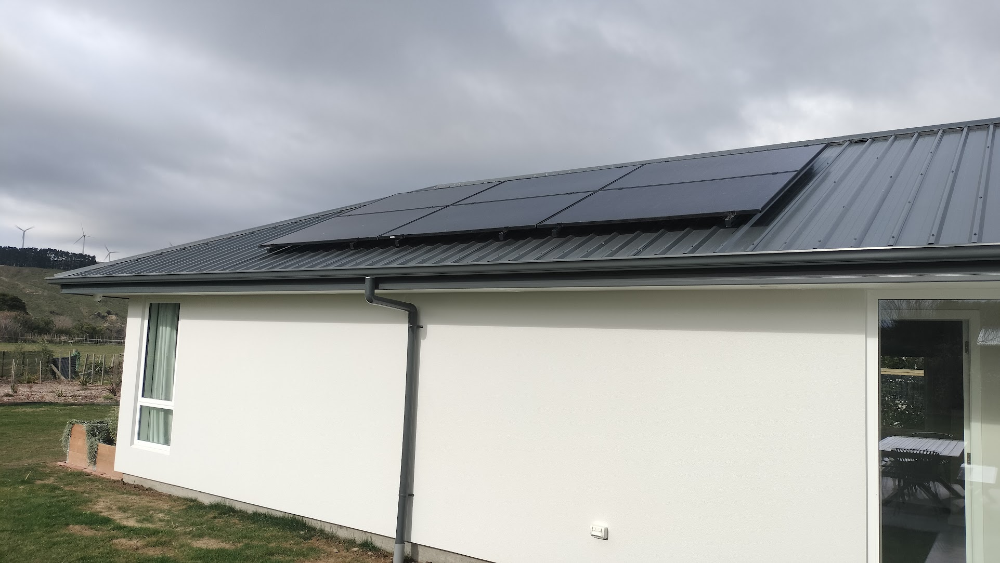
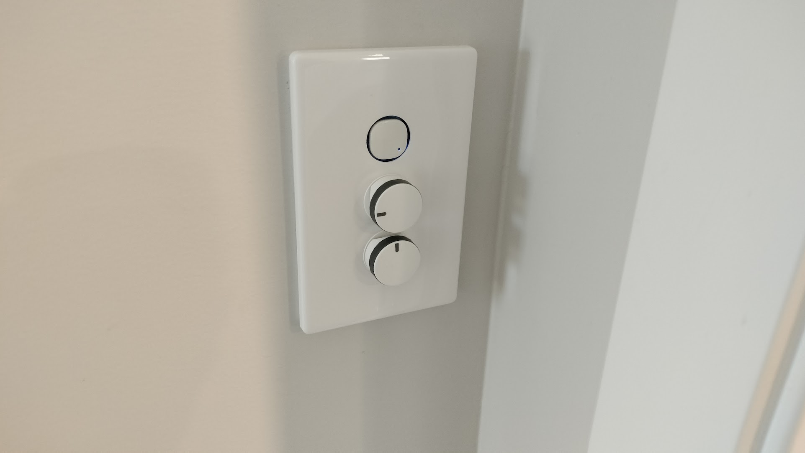

I know — it seemed like it was all finished. But inspiration strikes at odd moments, and after a bit of research (and a few “what if…” ideas), the smart home has levelled up again. Here are the latest additions.

#### The Smart Remote 
Smart remotes have existed for years, but this one is on a different level.

It's from [MOES](https://moeshouse.com), just like many other smart home products in this project. From the lounge, you can control the entire smart home — lights, blinds, curtains, everything. It even shows alerts: when someone rings the doorbell, you can look at the tiny screen on the remote to check who’s there. Sure, it works as a TV remote too, but it also integrates the lounge TV into the whole smart ecosystem.

“Alexa, pause the lounge TV” has officially become the household phrase for toilet breaks.

#### Under‑Bed Lighting
We’ve added a smart LED strip under the master bed — and no, it’s not for bizarre reasons. It’s brilliant!

A motion sensor tucked beneath the bedside table detects when someone gets up during the night. Instead of blasting the room with overhead lights, the LED strip glows gently, guiding you around without waking anyone else. 

Since my wife is an incredibly light sleeper, I’ve set the lights to pure red. With its short wavelength, red light is the least disruptive colour in the visible spectrum, making it perfect for late‑night navigation.

#### Solar‑Powered Smarts
One of the things I’m most proud of is how tightly integrated our rooftop solar system is with the smart home. It already manages the hot water, dryer, and EV charger to maximise the use of pure sunshine. But now there’s a new twist.

We’ve got motion sensors throughout the house — inside and out — normally set to trigger lights only at night. But I realised they could be smarter.

Using smart power meters, I can monitor exactly how much solar energy is being generated at any moment. That effectively tells the system how bright the day is. So I configured a rule:

* If the solar meter shows it’s a bright, sunny day - motion detectors won’t turn the lights on.
* If it’s gloomy and the solar output drops - motion dectectors will turn lights on to brighten the space.

Since every light in the house is dimmable, their default brightness also adjusts based on how much sunshine is coming in. It’s like the house has its own super accurate and real time sense of weather and responds accordingly.

#### Controlling the blinds
A smart home is great, but sometimes you just want a physical button you can reach out and press. Our place is packed with smart blinds, yet relying solely on voice commands or touch panels never felt quite right. The blinds did ship with remote controls, but they were enormous — and honestly, pretty ugly.

Each blind really only needs three actions: open, close, and pause. My first attempt was wiring a standard light switch to handle open and close, but that left no way to stop the blind mid‑travel. Not ideal.

The better solution turned out to be a rotary dial: 180 degrees of rotation with three clear positions. Twist left to open, straight up to pause, and right to close. The dial itself is a standard Legrand keystone insert I picked up from the local electrical wholesaler (shout‑out to [J.A. Russell](https://www.jarussell.co.nz/)!). I wired it into a multi‑gang dummy switch module, and from there each position on the dial simply triggers a Tuya scene to control the blinds.

Smart where it counts, tactile where it matters.

And that’s it! For now, at least. Right now we are hours away from judging for the Master Builders House of the Year competition. Thanks to a huge effort from a lot of people, the house is looking absolutely amazing. Now I just have to hope the… monumental effort that I’ve put into this smart home enterprise holds up!
