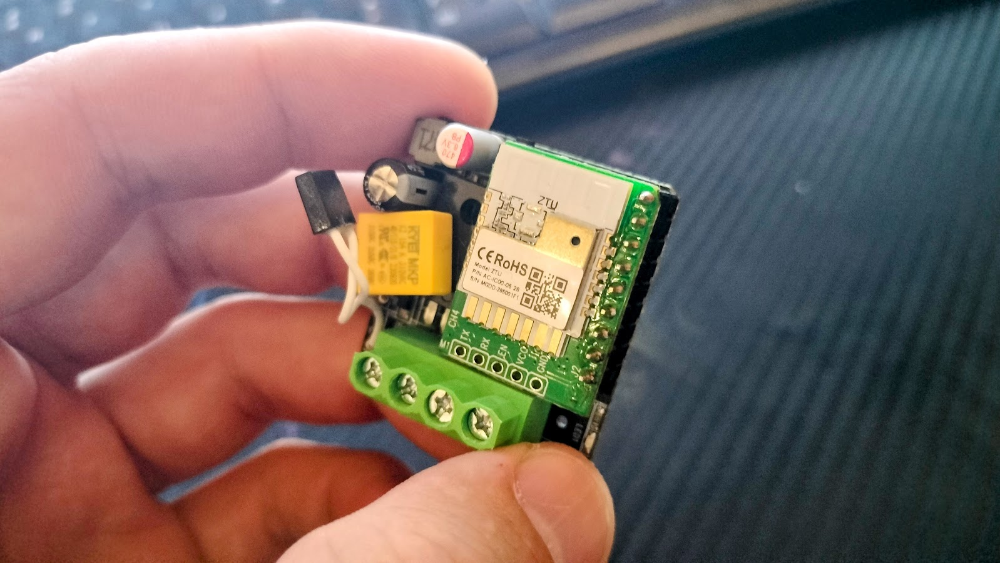
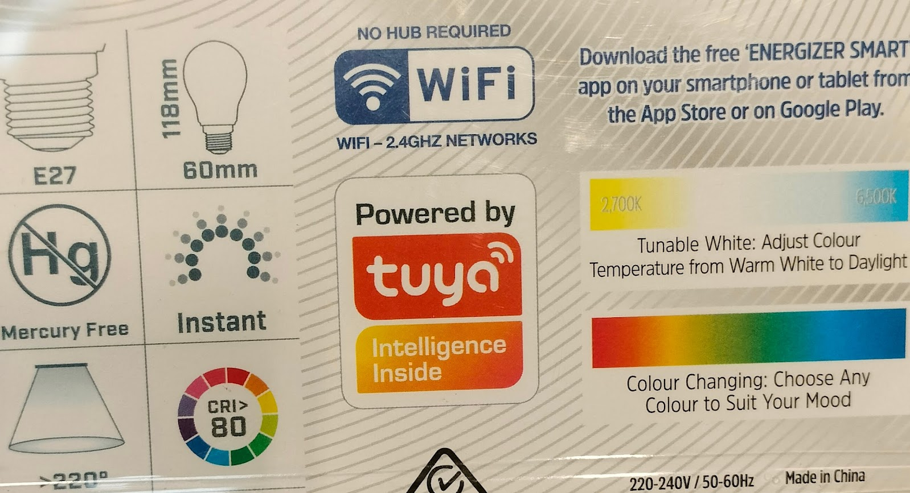

Well, we are building. The hold up now is just waiting on the council to give consent to our plans. Local government fun! Thankfully, the team at [Jennian Manawatū](https://jennian.co.nz/franchises/jennian-homes-manawatu) deals with that. We’ve got bigger issues, like choosing the master bedroom feature wall colour. I was eagerly wanting a bold orange, but convincing Rachel she could sleep with that on the wall proved to be too hard.

_I like to photobomb the office when I'm in the area._

As I alluded to before, I’m planning how to make this house the best Smart Home possible. I’ve been researching extensively. It’s a massive project, with a lot of curveballs and hidden traps along the way.

The first step in this process is to pick a smart home platform. Here I had a big goal: The whole house must run on a single platform, and all on a single app. I did not want to have the lights, curtains and doors to all use different systems. Sounds like a simple requirement, but it did mean having to research all hardware options and platform features to ensure the platform I selected had everything that we would want.

Broadly speaking, there are two main types of home automation platforms: Local server and Cloud based.

A local server is having a computer server to manage and run all the hardware and automations, whereas a cloud based platform uses an online service to do this. Each option has pros and cons.

Running a local server can let your smart home function without an internet connection (with a few large caveats). If you know what you’re doing it’s a lot more flexible, with heaps of options for modding and tinkering. However, you need to maintain and run a small computer server 24/7, keeping it up to date and secure. You’ll also need to keep backups of all the configuration and automation scenes, just in case the server hardware fails. Remember, with storage media failure it’s not a matter of if, but when! All drives die, some are just made redundant before they do.

The two most popular local server platforms for smart homes are [Home Assistant](https://www.home-assistant.io/) and [OpenHAB](https://www.home-assistant.io/), both free and open source software packages with big fan bases and development communities - passionate communities. Deciding which one is better is well above my pay grade, but searching OpenHAB vs Home Assistant comes up with oceans of community posts often advocating for one over the other. 

[Hubitat](https://hubitat.com/) is a more novice-friendly option that sells you a prebuilt mini server that you just plug in and configure, whereas most other local server options require flashing and configuring a server on BYO hardware like a Raspberry Pi. There are many services that offer premade Home Assistant or OpenHAB machines of all different sizes and capabilities, but these do come at a cost.

There are many, many cloud based options:
* [eWeLink](https://ewelink.cc/) - Cloud platform run by the China based hardware manufacturer Sonoff.
* [Netatmo](https://www.netatmo.com/) - Smart home brand now owned by electrical supplier Legrand. Makes all their own hardware.
* [Aqara](https://www.aqara.com/en/) - Another China based one, but works with a small handful of other manufacturers like Xiaomi and Sonos
* [Tapo](https://www.tapo.com/en/) - From the router manufacturer TP Link. Very good hardware, but range isn’t great.
* [Tuya](https://www.tuya.com/) - Massive brand that doesn’t make finished products, but smart modules other manufacturers use and implement into hardware
* [Shelly](https://www.shelly.com/) - An almost artisanal hardware manufacturer and platform, based out of Europe.
* [Philips](https://www.philips-hue.com/) - Solely for smart lighting with the Philips Hue range.

And that is nowhere near an exhaustive list! Some strive to have everything you’d want, but others just focus on specific parts of a smart home. For example, some smart curtains require you to use a specific curtain control app, but others integrate with another more multi-purpose app. This rules out some options from the start, due to my requirement of having a single platform for all devices and automations.

You might be wondering why Alexa or Google Assistant aren’t included in these platform comparisons. Well, they are not really smart home platforms in their own right. They work by linking other smart platforms to them. An Alexa command wouldn’t talk directly to any of your smart light switches - it would talk, using the cloud, to the smart home platform, and then that platform would talk to your hardware. There are exceptions to this, and with new protocols these might become fully integrated platforms in the future. In the here and now, though, for managing a smart home and configuring hardware, Alexa or Google Home are not the right tool for the job. 

I’m not even going to pretend to consider Apple's HomeKit. Just… no.

It was a lot of research and pondering to decide on what option to use. I could run a server. But realistically, I might well lose enthusiasm to keep it maintained and updated. Instead I’m opting for a cloud-based solution. It may be dependent on an online service, but it’s just that much easier. But which one? Given my want for a single platform, after far too much research and consideration, I’ve selected the one…

Tuya!

Tuya has a very interesting business model where they don’t sell finished products, but just smart modules that other manufactures buy and implement. If you’re a toaster company, you don’t design a smart toaster and the whole online infrastructure from scratch - you buy modules from Tuya, and integrate them into your product. All the smart connectivity and online functionality is baked in. Because of this, Tuya likely has by far the biggest range of product options out of all the platforms. You can get 100 different varieties of everything that run on Tuya, from light switches to eBikes. There is a lot of competition too, so prices tend to be a bit better compared to other platforms. 

_The white Tuya module integrated into this relay controller._

Many manufacturers use Tuya with their own branding. You can have a custom version of the Tuya app rebranded to make it seem like it's a bespoke app for that brand. Some brands acknowledge their Tuya-ness, but others make no mention of it. It can be a hassle to research in order to find out just what stuff is running Tuya under the hood! Go into an electrical store and there is a good chance that the smart products run on Tuya. A few examples here in New Zealand are [the Grid Connect range](https://www.bunnings.co.nz/search/products?page=1&q=grid+connect&sort=BoostOrder) sold at Bunnings, [Genio lighting](https://www.kmart.co.nz/category/home-and-living/smart-lighting/) sold at Kmart, the lighting brand [Brilliant](https://brilliantlighting.com.au/en-nz/collections/smart-home), [Kogan SmarterHome](https://www.kogan.com/au/smarter-home/) and [Tech.Inc stuff](https://www.thewarehouse.co.nz/c/electronics-gaming/lifestyle-technology/smart-home?prefn1=marketplaceItem&prefv1=The%20Warehouse) from The Warehouse. 

_Found this on a box at Mitre 10. It's everywhere!_

It’s also a fully-featured platform with scenes and schedules. It’s very similar to a scripting or programming language, with loops, preconditions and if/then statements all available for tweaking how you’d want things to be automated and behave.

Something running on Tuya doesn’t automatically guarantee any kind of quality control. Any cheapo manufacturer can pop a Tuya module in unsafe and low quality hardware, so you still have to do some research and make sure you get the right hardware for the job.

But does using a cloud based platform mean your smart house is dead without an Internet connection? What protocol should be used for all these smart home devices to communicate over? What fun stuff will this smart home do? We’ll learn about all that next time! The suspense of this cliffhanger must be unbearable.
