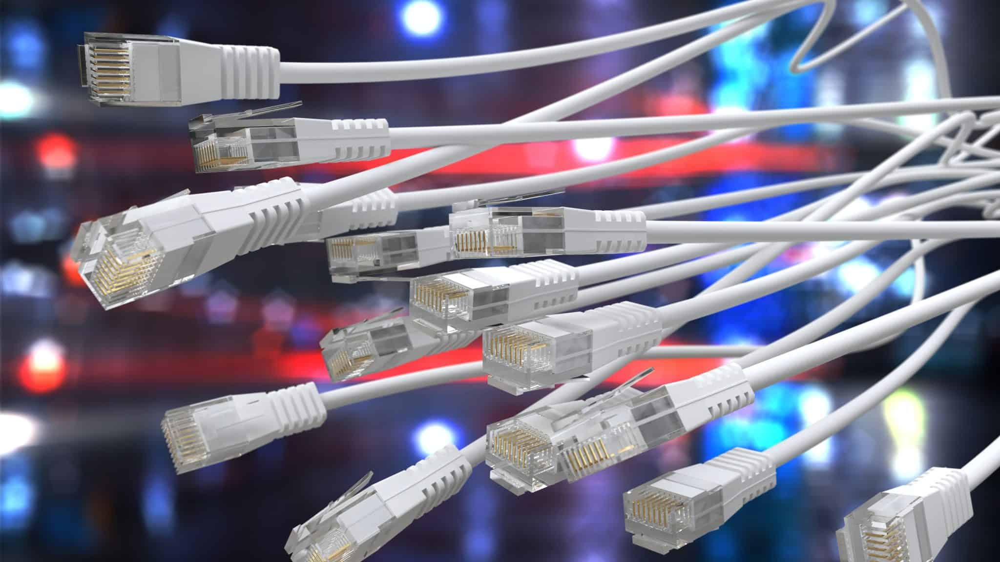
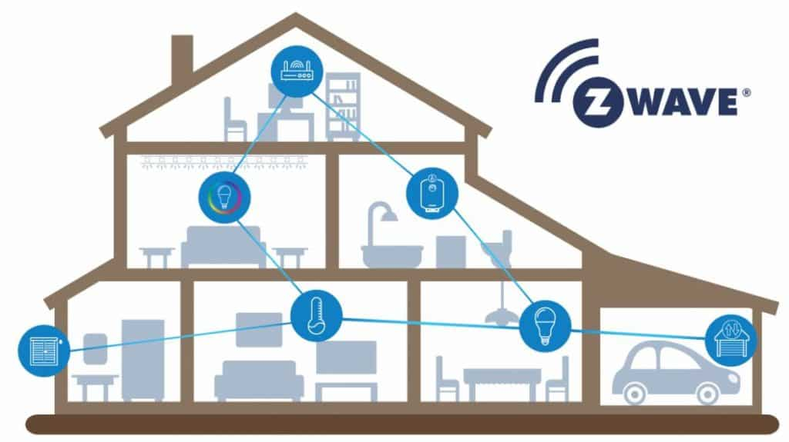
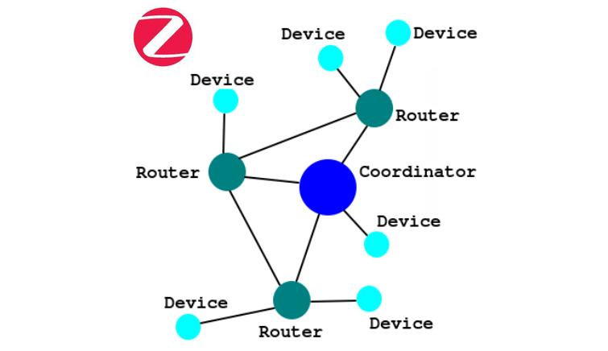
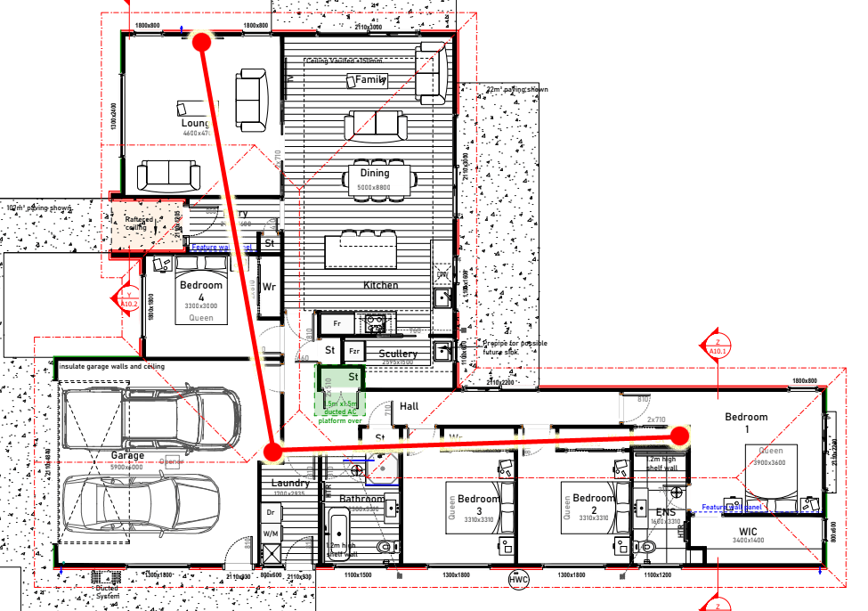
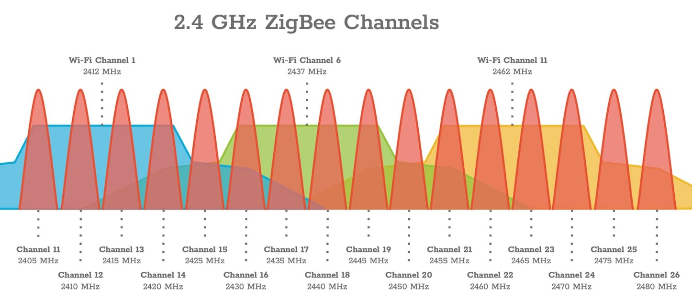

Last time here, we went through the process of choosing a smart home platform to use. Now we’re back again for another important decision:

Protocols!

I’ve locked in Tuya as my platform of choice, but the protocol is a lower level decision. It’s all about talking (something I’m very good at). How will all the smart things in the house talk to each other, talk to apps and, most importantly, talk to us?

Bear with me here, this gets a little technical…
#### Wired
Building a new house comes with so much opportunity for setting things up perfectly. Ideally I’d put data cables in the wall to all the different smart devices in the house. Wired is nearly always more reliable than any kind of wireless communication.

I found three wired protocols that could be used for a smart home: RS-485, C-bus and X10. These are all used for remotely controlling critical electrical devices in industrial applications. RS-485 dates from 1983, and is a serial communication protocol that is mainly used for industrial building control - but also other things, from model railways to internal device communications in commercial aircraft cabins. C-bus is a protocol that was created by electrical brand Clipsal in Australia, using standard UTP cables to link all the devices together. X10 is a bit unique, as it piggybacks its signal transmission on the normal electrical wiring already present in a home.

Unfortunately, none of these are a viable option for me. They’re all very limited in what hardware is available, and are hugely expensive. Based on all the research I could do, it would be impossible to achieve what I wanted in a smart home using any of these protocols. Somewhat surprisingly, I couldn’t find many smart home devices that use standard ethernet networking protocols either. 

_Wired will not be the way to go._

If wireless will be the way to go, then I have two important requirements: reliability and responsiveness.

Here are the candidates, in no particular order…
#### Z-Wave
This is a wireless mesh protocol, designed from the outset for smart home devices. It's the only wireless protocol here not to use the 2.4GHz spectrum, instead using the 900MHz range. This makes it much less prone to interference. Unfortunately, due to spectrum licensing regulations, it is forced to use different bands in different parts of the world. You have to stick with Z-Wave devices specifically made for your region, and given that the Australia/New Zealand region is rather small, it hugely limits what devices you can get in this part of the world.

_Are you reading it Zee Wave or Zed Wave?._

It is also heavily proprietary, with all devices having to go through an extensive (and expensive) certification process. It's great for compatibility, but makes this protocol one of the most expensive options.
#### Bluetooth
It's not just for headphones. Bluetooth can also be used for smart home hardware. Specifically, a Bluetooth Low Energy mesh is what smart home Bluetooth devices would use. The big advantage here is your smart phone can interact directly with the hardware, not needing to go through a router or gateway hub. Unfortunately, in the real world the range for Bluetooth just doesn't cut it - indoors it can be just a few metres before the signal degrades. A mesh setup can help here, but it has to be a rather dense mesh, and that isn't always practical in some home layouts. It also can have big latency issues with waking devices from sleep, resulting in very poor responsiveness.
#### Thread + Matter
Now this is the upcoming hot thing! Thread is a smart home protocol that is designed to be the “ultimate”. It has a self-healing mesh layout, meaning you can have backup hubs and gateways that let your network recover if a device fails. It was designed alongside Matter - a smart home standard that is meant to allow for cross compatibility across a huge range of platforms. Nearly every tech hardware company has signed on, from Tuya to even Apple. This is also the way that Alexa or Google assistant can become a whole smart home platform, with their latest Alexa and Google Nest Hub devices having Thread and Matter built in.

Unfortunately, it's just not there yet. There has been fast iteration of the standard since it was first released, and most manufacturers aren't doing a good job of keeping up with the latest bug fixes and versions. The compatibility utopia of all devices working with every platform is still facing huge teething issues. It's also new enough that the hardware range isn't extensive enough to have a solution for everything I'd want in a smart home.

In 5 years time it might be ideal, but right now it's got a way to go.
#### Zigbee
Zigbee is one of the leaders in the smart home area. It’s a wide and fairly open standard that uses a static mesh to communicate.

I’ve mentioned this mesh thing before, so this time I’ll elaborate…

In the context of Zigbee, it all starts with a little hub that manages communication of all the wireless Zigbee devices. Individual devices can either be a router or an endpoint device. A router will take in wireless commands and repeat them to one further away. The goal here is to allow the Zigbee mesh to propagate throughout a whole house, with signals repeated until they get to the intended device. This is also intended to help with the rather limited signal range of Zigbee.

Generally, things that are wired into mains power (like light switches or heaters) function as repeaters, while anything battery powered is an end point. This helps extend the battery life of those devices. And that battery life can be impressive! For devices like motion, temperature and door sensors you can expect a year or two of usual operation before needing to swap out the single AAA or coin cell battery.

A Zigbee mesh is static, meaning it doesn’t automatically change and reconfigure itself based on changes in signal strength or device availability. When a device is added to a Zigbee network, the route it takes through the mesh network is decided and it never changes. It’s also not manually configurable, so you’ve got no way to override what routes a signal takes. This has a big downside of introducing multiple points of failure. If a lightswitch in a hallway goes down, it can knock out half the Zigbee devices in your house.  This reliance on repeating across a number of hops can have a notable impact on latency, and responsiveness too.

_The sprawling Zigbee mesh protocol._

Zigbee is huge, with a massive variety of devices available. Unfortunately, the standard isn’t exactly managed well, and compatibility of platforms, hubs and devices varies wildly. Community pages like the [Zigbee Device Compatibility Repository](https://zigbee.blakadder.com/) try to maintain just which Zigbee things are compatible with each other, but this barely scratches the surface of the huge number of devices that are available.

Many brands use Zigbee, and some secretly use Zigbee without saying so. Philips Hue, Legrand Excel Smart Life, IKEA and Xiaomi all use it, even if you have to dig deep into the fine print for it to actually say that.
#### Wi-Fi
Yep, Wi-Fi! There is a good chance that you’re reading this on a phone or laptop that is using Wi-Fi, and it’s what’s used in many smart devices. Everyone, from grandmas to toddlers has probably heard of Wi-Fi, and there are estimated to be 42 billion total Wi-Fi devices worldwide!

In terms of using Wi-Fi in a smart home, each device like a light switch or curtain rail can connect to a wireless router or access point, just like every other Wi-Fi thing you use. Having a solid, fast and dependable Wi-Fi network is a top priority in our new home. I think it makes a lot of sense to take advantage of it for the communication backbone for this smart home adventure.

Unlike every other protocol we’ve looked at here, Wi-Fi does not need a special hub or coordinator to run devices. Everything goes through whatever Wi-Fi access point you have running, so it’s important to have a solid and reliable one. Often the ones you get from your ISP are budget ones that can’t handle having a large number of devices connecting to it, and don't have a great range.

Wi-Fi does have the downside of not being as low power as some of the other protocols here. In terms of a power bill it would be a few cents over a year, but battery powered devices might suffer from having less longevity.
#### And the winner is…
After diving head first into this research, and changing my mind far too often, I'm going with Wi-Fi - with an exception. 

We will have a few battery operated sensor devices in the house. Just some motion, door and temperature sensors used to trigger automation routines. To help with battery life, these will be Zigbee devices rather than Wi-Fi. There will be no Zigbee mesh network, as these are all endpoint devices, and they'll all have a hub in a very short range from them.
#### Check your frequency
All these protocols, with the sole exception to Z-Wave, use the 2.4GHz spectrum. Wi-Fi can use other frequencies, but very few smart home devices are compatible with them. This makes it very unwise to use several different protocols in the one location, as this will increase the chance of signal interference issues. If you search online you can find many people having issues where their home Wi-Fi causes issues with other wireless devices. Keeping the number of Zigbee sensors low, close to a hub, and not using a Zigbee mesh will help minimise this issue.

I have a plan here, to give rock solid performance to both smart home and other Wi-Fi devices. 

It's a mesh, but another kind. I can dot a few Wi-Fi access points around the house, and those access points can have a wired connection between themselves. This is the way big buildings like hotels or schools can have one big wireless network. The current Wi-Fi mesh standard means if you're walking around on your phone, you'll seamlessly move between the different access points. It's also going to give excellent signal integrity to all the smart devices in the house.

_The current planned Wi-Fi mesh layout!_

I will also put all my smart home devices on the 2.4ghz band, and every other Wi-Fi device can use the 5ghz and 6ghz bands. Generally, higher frequencies give greater bandwidth, while lower frequencies give further range. No smart home devices need more than what the 2.4ghz spectrum offers, so it's an ideal trade-off, and will help keep crosstalk interference to a minimum.

_The overlapping Wi-Fi and Zigbee channels can clash!_

Reliable and responsive! Congratulations on making it this far. I’ve already purchased a whole bunch of hardware to test out, and have my shopping list nearly ready to go! Next time, I’ll go into the specifics of what features my smart home will have.
