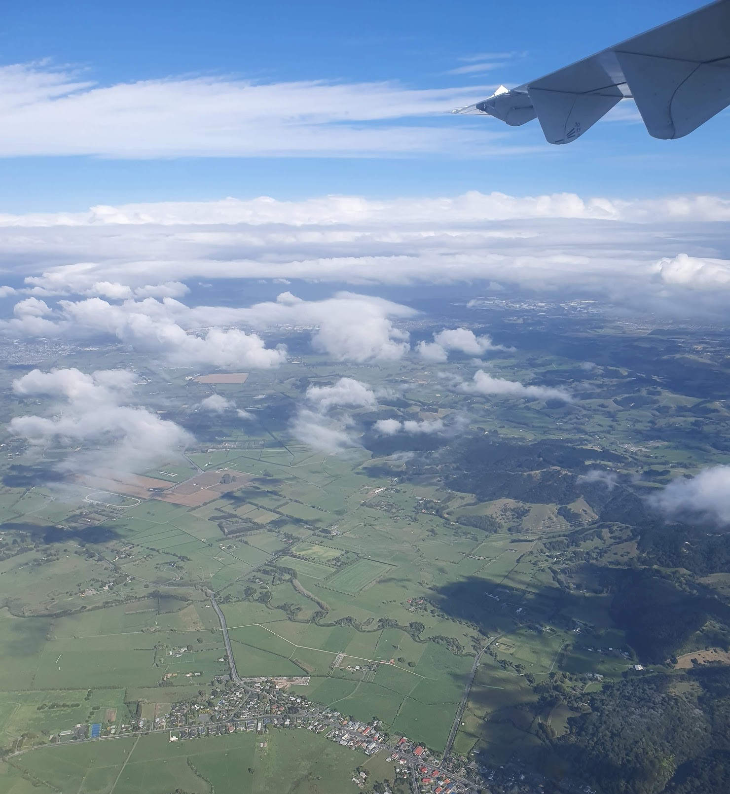
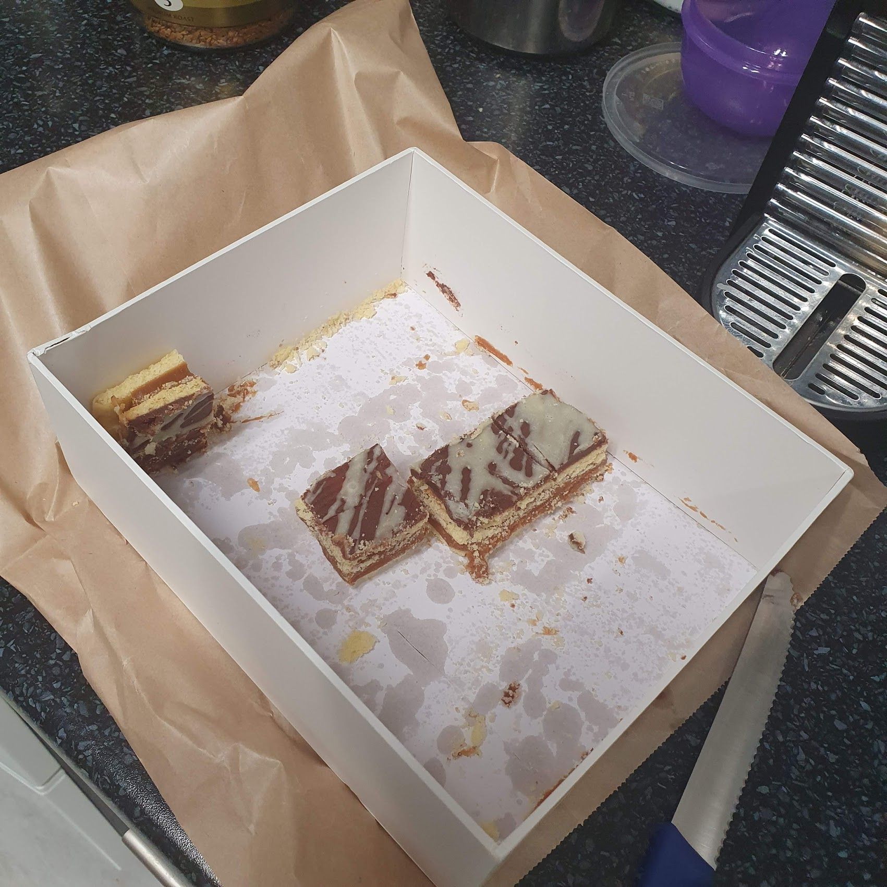
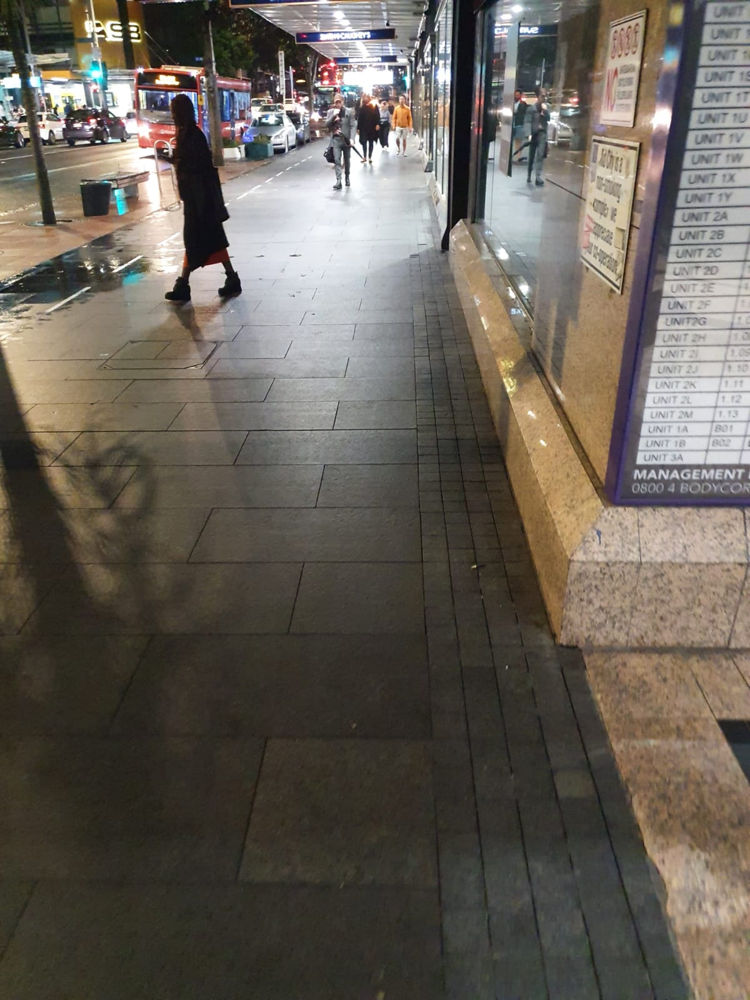

What a fun start to the week.

_Soaring, Flying, Breaking Free!_

Right now I'm flying back home after another visit to Auckland for training. I seem to be up here more and more frequently these days! It's really nice. I enjoy heading into the office and being able to see all the awesome people I normally only email or phone.

No drunken shenanigans this time; I didn't get locked out of the hotel room in my undies.

That caramel slice I made? I took it to the office and it all went! I was pleased at how well it survived transport in my carry-on bag. My boss, my boss’s boss, my boss’s boss’s boss and Karl all liked it! The secret is all in the caramel. Maybe my ego is just getting too big, but I'm very proud.

_And those last four pieces were gone before I left._

Speaking of bosses, I realised just how much the management at my work really goes into bat for me. I work hard and scarcely get any feedback, but when I asked about how it was looking for me to get a full time salaried job, he showed me a PowerPoint presentation he was going to present to international senior management basically stating how they'd better hire me and a few other contractors before we jump ship!

Someone loves me, even if my ex doesn't.

I also spoke to another boss about my hours - he's asked me to come up with a working roster for after-hours work. He's really given me the freedom to choose what hours I want to do (within reason!). I absolutely want to keep doing the late shift - sometimes when I get home early, I get bored sitting there eagerly waiting for jobs to come in of an evening. I'm just not sure if I want to keep doing five days a week 8 till 11, or if I want to transition to alternating weeks on call. I'll have to think about it.

The CBD area around the office and the hotel I stay at has become so familiar to me. It's entrenched with memories - not of Auckland, but of what has been happening in my life when I've been here.

_Written on these streets are the stories that I can't explain._

The first time I was up here? I was on top of the world! I felt amazing. I remember places where I bought Christmas presents, and where I was when I was on the phone to a certain someone. I remember feeling guilty that I was away yet having such a good time up here.

The second time I was here I was at an all time low, struggling to recover and having booze for the first time in 10,000 years. Yeah, I’m still embarrassed about what happened, especially when I found out that everyone in the office knows! Does it count as office gossip if everyone already knows what happened?

This time? I'm good. I mean, I'm not great! But I can't complain about how stuff is going right now. I still have a massive empty hole in me, but somehow I seem okay to not be in a rush to fill it. Everyone says it will happen, from my skepical best friend Mark to my kick ass colleague Jazz. Thank you! You empower me heaps.

Being around myself every day, I don't really have a view on how I've progressed, but having these semi-annual trips away acts as a kind of checkpoint. It gives me an opportunity to reflect on who I am, where I've come from and maybe even where I'm going.

I might be moving forward. I might be moving sideways. Heck, I might just be staying in one place dancing really awkwardly! But right now I can absolutely say I'm not moving backwards.

And that's an achievement worth unlocking.
