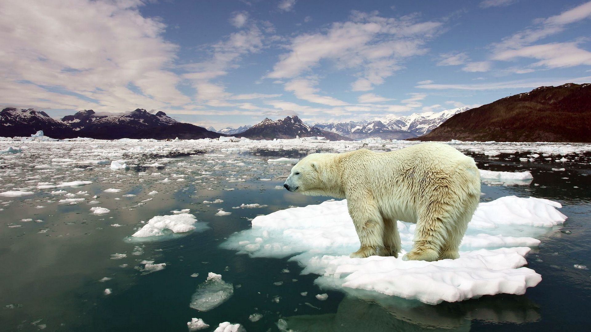

Nuclear power has always been very controversial, but since the disaster in Japan at the Fukushima Daiichi power plant the topic has come under more scrutiny than ever.

At a guess I would assume that most people don't really understand how a nuclear power plant works, but many people strongly believe that the technology is dangerous and should be avoided. In my country of New Zealand the idea has been so demonised that even mentioning it in discussion can summon dread and terror into people. Is this fair? Given the issues the world is now facing nuclear power may be needed as a tool to push economies forward and even lift demographics out of poverty.

I'm purely an amateur that has just read way too many books on the topic, but this is just a short run down on nuclear technology. How it works, the problems with it and where it is going in the future.

_Nuclear Fission._

The basic principle of all nuclear technology is one word: fission. You take a very large atom, such as certain Uranium isotopes, and knock it with neutrons. These atoms are so big that nuclear force can barely hold them together. That knock causes them to split into two smaller atoms – along with releasing a tremendous amount of energy that was contained within the binding force of the nucleus. Also released in these reactions are more neutrons, and these impact neighbouring atoms to cause them to undergo fission. The resulting cascade enables a continuous release of energy without any external intervention.

The most common type of nuclear power station in use today is the [Pressurised Light Water Reactor](http://large.stanford.edu/courses/2015/ph241/zarubin1/). This is based on a design developed by the US Navy in the 1960's.

Fissionable material, most commonly the isotope Uranium-235, is embedded into ceramic pellets that are grouped together then placed into long zirconium metal tubes. These solid fuel rods are then group together into bundles and are then ready to be inserted into a reactor.

_A Fuel Rod Bundle._

When a fission reaction occurs most of the energy is released as heat. Heat exchangers inside the reactor pump water around the fuel rod bundles so it can absorb all the heat being produced. This heat is exchanged into a separate reservoir of water that turns into steam. The pressure behind the steam is used to rotate a turbine that spins a generator producing electrical power.

The original style of power plant had large cooling towers to vent all the steam out, but modern designs use a condenser manifold to turn the steam back into liquid water to start the process all over again.

_Reality is no longer like The Simpsons._

So how do you turn this style of nuclear power plant off?

In the layout of fuel rods there are always gaps left where another kind of rod can be inserted. These are called control rods, and when they are inserted they absorb all the neutron emissions that the nuclear reaction is making. After doing this there are no longer any free neutrons available to keep fission from occurring and all nuclear reaction immediately stops.

But these fuel rods don't stop there. They continue to produce extreme levels of heat energy for days or even weeks after all nuclear reaction has ceased. If the heat exchangers are still working or there is another power source available to actively cool the fuel rods down there isn't a problem. After the rods become cool enough to handle they can be removed from the reactor and placed into long term storage.

However if there is a failure in the cooling systems, the heat produced is enough to melt the Uranium fuel and the metal casing the rods are constructed of. Left unchecked this molten metal liquid can continue to get hotter until the increased pressure can no longer be contained and the entire reactor breaches and potentially explodes. It is also possible for the liquid to get so hot that it can melt down through the iron and concrete housing the reactor is build out of.

That is how a nuclear meltdown occurs.

Since the initial reactors were developed in the 1960's many advancements have been done to improve the safety. The thing any reactor design strives towards is called passive or “walk away” safety. This generally refers to a reactors ability to cool its fuel down without any outside power or even human intervention.

Currently the most advanced nuclear power station is the [AP1000 model designed by Westinghouse](http://www.westinghousenuclear.com/New-Plants/AP1000-PWR). The first commercial build of this model is due to come online later this year. The focus on this design was removing complexity and implementing strong passive safety mechanisms. An advanced rapid condenser design is capable of cooling the fuel rods down to a safe level without any external power source. The principles of circulation – hot gas rises and cold gas falls – is enough to ensure the flow of coolant around the hot fuel. This means in a disaster situation there would be no need for access to a power grid or backup generators to keep the reactor safe.

And that is just the beginning. The AP1000 is still a pressurised water reactor, but many more advanced alternatives are being developed.

14 countries including China, Australia, Canada and the USA have joined together in the [Generation IV International Forum](http://www.gen-4.org/index.html). To quote their front page:

_The Generation IV International Forum (GIF) is a co-operative international endeavour which was set up to carry out the research and development needed to establish the feasibility and performance capabilities of the next generation nuclear energy systems._

[There are currently six reactor designs currently being developed](https://www.gen-4.org/gif/jcms/c_40465/generation-iv-systems), all alternatives to a pressurised water reactor.

One design is the [Molten Salt Reactor](https://www.gen-4.org/gif/jcms/c_42150/molten-salt-reactor-msr). Rather than having a solid fuel rod, this design embeds the nuclear fuel into a liquid made out of molten fluoride based salt. Rather than having water in pipes to exchange heat, the fuel itself can be circulated in the reactor. Having the fuel in liquid form also significantly reduces the danger of meltdown.

There are also other advances.

* Generation IV reactor designs have the potential to reduce the storage time for nuclear waste from several millennium to just 300 years.
* Rather than needing Uranium fuel, Breeder reactors can take the more abundant element Thorium and breed or convert that into fissionable material.
* Certain reactor designs would use the current stockpile of nuclear waste as fuel rather than needing newly mined products out of the ground.
* Some designs are almost set and forget – A large amount of fuel can be built into the reactor making it capable of running for many decades without the need to swap out any fuel.

These are hugely simplified summaries of extremely complex and detailed systems that are being developed.

Climate change could be classed as the biggest problem the world currently faces. We are burning fossil fuels and releasing huge quantities of carbon, nitrogen oxides and even soot into the atmosphere. Renewable sources of energy are improving, but still face obstacles. Rain can become rare, winds can calm down and overcast days occur. All these options also can't scale to demand. If more energy is required on a calm and cold night, you can't tell the wind to speed up! It also requires significant modification and long term use of vast landscapes. In a country like mine there isn't much suitable land that people would be willing to give up for this use.

_\#savethepolarbears_

Is nuclear a viable option now? For New Zealand it might not be. But technology is moving forward very quickly. My biggest concern is it will become a fully viable and even factually preferable option, yet the stigma and demonising around it that people are almost indoctrinated with might prevent it from being adopted. As we push forward with lifting people out of poverty and expanding the economy we may require it – lest we stagnate as others pass us.
