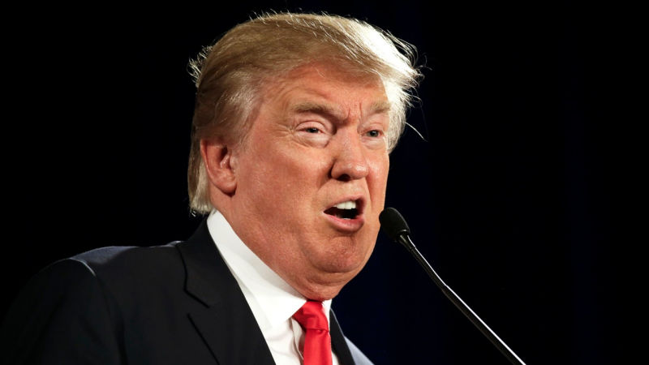

Things generally devalue with age.

Look at music, movies, people and hairstyles from generations ago and it will often give the impression of being dated and out of place. But a scarce few things improve over the ages and can even be more notable now than in their original time.

In 1964 Bob Dylan released The Times They Are a-Changin'. It's clearly a commentary on the turbulent times of change that the 60's were facing, but today those old lyrics might be more relevant than ever before.

https://www.youtube.com/embed/BfFZ9FyB6rs

* _Admit that the waters around you have grown_

That was undoubtedly written as a metaphor to represent general difficulties in people's lives and in the economy. It's astounding how litreal this can be taken today. The waters around us are growing, and if we don't admit it to ourselves immediately our situation will only get much worse – we'll be sinking like a stone.

* _Come writers and critics who prophecise with your pen_

Journalism has come under hostile accusations recently, mainly by only a handful of powerful but crazy people. While that is done with hostile intentions, these pundits that prophecise with their written word or on video should tread with caution and need to be held accountable.

Predictions shouldn't be done on a whim when in a position of addressing a large audience. That can be potentially dangerous. Saying something like “Hillary will definitely win” doesn't benefit anyone, it takes away from the empowerment that citizens in a democracy should have. It also can influence future events by detrimentally skewing a reader's perspective based on no evidence of any substance.

Part of this responsibility lies with the readers and viewers – if an outlet is making far fetched predictions and failing time and time again then it is your responsibility to vote with your time. But this can be hard. Often these predictions can be cases of preaching to the choir, making your audience feel good by saying what they want to hear. But to quote the late Carl Sagan, “Better a hard truth than a reassuring fable”.

* _Come senators, congressmen please heed the call_

Today it is possible to ascertain the wants and demands of a population faster and more accurate than any other time in history. It does take effort to filter out noise and cast aside any extremists, but compared to centuries and even decades ago we have an indulgence of ways to listen.

Lately politics in a democracy seems to be all about stumbling and stalling the opposition rather than constructively progressing forward. We don't have the luxury of spending time standing in doorways and blocking up halls. Moving forward needs to happen. That might be the only thing everyone would agree on. But stalling is the antithesis of progression. Senators, congressmen and other leaders don't make rules; they are ruled by the will of the people.

* _Don't criticise what you can't understand_

Science is real and everywhere. From the transistor array in a computer, electrical solar arrays, the website you read this on and the advances in agriculture and horticulture without which most of us would starve. Science works, and everything new revealed by science – both what it is and how to use it – demands criticism. Criticising from an uneducated perspective is not only the highest form of arrogance but it is also dangerous.

I often get worked up in heated debates around aspects of science and reality, but in recent years I've had to learn the discipline of biting my tongue when the conversation strays into an area that I don't have the appropriate level of knowledge in. There should be no shame in admitting you don't know something, especially if you are eager to learn.

Criticising of science comes from all perspectives. It can be related to things such as the use of fossil fuels, space exploration, global warming and nuclear power. How is it reasonable to criticise the use of nuclear power plants if the only thing you know is, very casually, that “they are dangerous”. Nuclear energy might be a significant force to counter climate change. It is something that needs strong debate to reach a consensus, but doing that from an uneducated point of view based on scare tactics and a history of demonising the concept is not a good way to reach any reasonable conclusion.

* _For the loser now will be later to win_

For what seems like an eternity I haven't exactly been doing much winning. It isn't fun, and I can't figure out the why and how. But maybe – just maybe – sometime in the far future that could turn around. And that's the only thing I can grab onto, so I'm forced to grasp that possibility with both hands lest I fully yield to despair and the consequences that come with it.

The opposite is also true. Those currently winning and are on top of the world will eventually fall and fail.

_Hopefully some sooner than most._

\- [@aaronights](http://twitter.com/aaronights)
