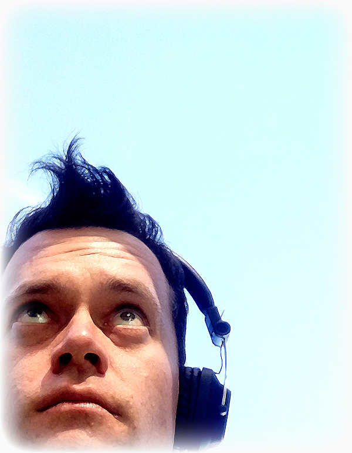

I am still sick.

At least I'm no longer in a constant state of feeling horrible. Now it's just a case of feeling sweaty and tired all the time. I'm half way through my antibiotics and it's definitely working, but no one said it was going to be an easy ride. I have now managed to sleep a whole night without waking up in a pool of cold sweat, so there's progress now where there once was none.

I miss work! Being sore and tired all day is flipping boring. I'm adamantly hoping that I can get back into it on Monday. I'm also hoping I can go out and visit friends tomorrow, that'd be very uplifting - but I don't want to be a cesspit of sweat and disease.

In my newly found spare time I've been catching up with some shows. Oddly, the time just disappears when you're sitting around being sick, so I haven't been binging much, but here are a few things I'm tuning into:

* #### For All Mankind

Hard science fiction, maybe? It's an alternate history TV series based on the idea that the Soviet Union made it to the moon first, and this let the space race escalate in crazy ways. It seems to be trying to be scientifically accurate, but it's just a facade. The most frustrating thing is how it seems to paint all the astronauts as highly emotionally unstable people, turning it into a soap opera. The affairs and personal lives have become more of a focus than boldly going. Still, it's nice to see long forgotten concepts like the Sea Dragon and nuclear propulsion realised.

* #### Taskmaster

This is the best show on TV right now. Get some mediocre comedians to do obscure and specific tasks against the clock! It seems like a low budget concept, but the amount of planning and time that goes into this show would be way more than you'd expect. The highlight of the most recent series has been moustached contestant Mike Wozniak. I've never heard of him before, but he's the most strange and eccentric personality I've ever seen.

* #### The Falcon and the Winter Soldier

This is a buddy cop show, and it only works due to the actors in the lead roles. They're awesome! They hate each other in the best way. It might be a full on, intense action show but the best part of it so far has been the two main super heroes renovating a fishing boat.

Plus there's another thing I've been sweating bullets over in my spare time: an online dating profile. Tinder is still the hot stuff, right? I should wait til I'm feeling a bit… healthier, but I don't want to wait around. I've so far had advice from two very unlikely people: my friend that's been married for nearly 23 years, and my ex ex-girlfriend that I dated many moons ago. They've both been super nice, and I'll take all the help I can get. Having that kind of support means a lot, especially when you've had your heart crushed and burned.

_Now what way would you swipe?_

Don't worry, I still have some secrets. My personal life isn't an open book! That'll happen when I'm offered six figures for my memoirs.

Still, I bet all the coolest people around are reading this post and follow me on Facebook. Tell a friend? Wait, I don't think that's how matching on Tinder works.

Send all advice my way! I'll take anything anyone is willing to offer.
